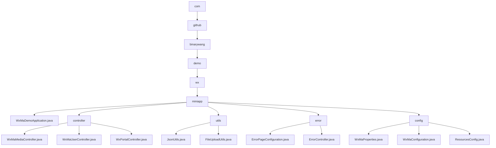

# Basic Information

|      |      |
|------|------|
| Name | com |
| Language | .java |
| Code Path | weixin-java-miniapp-demo/src/main/java/com |
| Package Name | docs.src.main.java.com |
| Brief Description | This is a demonstration backend project for a WeChat Mini Program based on Spring Boot. The project includes a main startup class, controllers, utility classes, error handling, and configuration modules. Controllers handle WeChat API requests, such as user login and file upload. Utility classes provide JSON processing and file storage functionalities. The error handling module customizes HTTP error pages. The configuration module centrally manages Mini Program settings and message routing. The overall architecture is clear and covers the core backend functionalities for a Mini Program. |

# Description

## Overview
This is a backend service module for a WeChat Mini Program based on Spring Boot. Its core responsibility is to provide a unified API proxy for interacting with official WeChat services and encapsulate key business logic such as media file management, user identity authentication, and message/event handling. It acts as a bridge between business applications and the WeChat ecosystem.

The module adheres to RESTful interface specifications, offering a series of HTTP endpoints. In terms of design patterns, it dynamically loads the corresponding configuration based on the `appid` before processing each request. Its key data structures include configuration objects encapsulating Mini Program connection properties, the `media_id` returned by WeChat, session information containing `openid`, and encrypted data packets. These data flow between controllers. External dependencies mainly include the Spring Boot Web framework, the WeChat Java SDK (`weixin-java-miniapp`), and libraries such as Jackson and MinIO.

Specific implementation examples are abundant, such as: receiving and uploading files to the WeChat server via the `POST /media/upload` interface; using code to exchange for user session via `GET /user/login`; configuring `ObjectMapper` with the utility class `JsonUtils` for JSON serialization; and the `FileUploadUtils` validating file extensions and renaming before uploading.

## Main Business Scenarios
The module's business covers three major processes: file resource management, user identity data management, and server message/event handling. It forms a complete view from receiving requests to calling WeChat services and returning responses. Its interaction pattern is uniformly "dynamic loading of configuration → calling WeChat API → processing returned data → cleaning thread context," similar to a configuration-aware routing layer.

Functional completeness is reflected in providing the core backend interfaces required for Mini Program development, including temporary media upload, user login information decryption, server configuration validation, and message distribution. A typical application pattern is: after the Mini Program frontend completes user login, user information can be obtained; the management backend can upload media; the WeChat server communicates with the backend via the validation interface for events.

The API types are mainly HTTP interfaces and utility class static methods. Integration examples include: `WxMaMessageRouter` automatically routing messages to handlers based on message type; the error handling module mapping 404/500 errors to customized pages; the configuration module centrally managing properties for multiple Mini Programs and initializing core service Beans.

### Package Internal Structure View

This flowchart illustrates the main directory structure of the Java source code for the WeChat Mini Program Demo project. Starting from the root node `com`, it expands level by level according to the package path down to the core module `miniapp`. The `miniapp` module contains the main application file and four subdirectories: controllers (`controller`), utility classes (`utils`), error handling (`error`), and configuration (`config`). Each subdirectory includes its respective concrete implementation class files, clearly presenting the hierarchical organization of the project's functional modules.

# File List

| Name   | Type  | Description |
|-------|------|-------------|
| [github](github/_module.md) | package | This is a Spring Boot-based backend demonstration project for WeChat Mini Program. The project includes a main startup class, controllers, utility classes, error handling, and configuration modules. The controllers handle WeChat API requests, such as user login and file uploads. The utility classes provide JSON processing and file storage functionality. The error handling module customizes HTTP error pages. The configuration module centrally manages Mini Program settings and message routing. The overall architecture is clear and covers the core backend functionalities of the Mini Program. |

