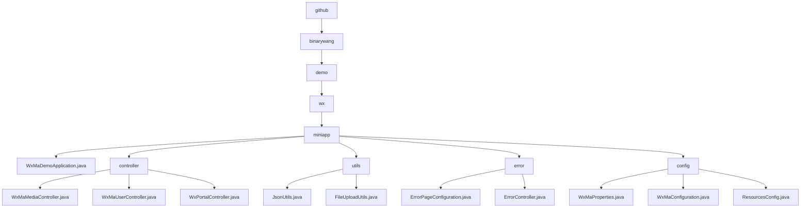

# Basic Information

|      |      |
|------|------|
| Name | github |
| Language | .java |
| Code Path | weixin-java-miniapp-demo/src/main/java/com/github |
| Package Name | docs.src.main.java.com.github |
| Brief Description | This is a Spring Boot-based backend demonstration project for WeChat Mini Program. The project includes a main startup class, controllers, utility classes, error handling, and configuration modules. The controllers handle WeChat API requests, such as user login and file uploads. The utility classes provide JSON processing and file storage functionality. The error handling module customizes HTTP error pages. The configuration module centrally manages Mini Program settings and message routing. The overall architecture is clear and covers the core backend functionalities of the Mini Program. |

# Description

## Overview
This is a backend service module for a WeChat Mini Program based on Spring Boot. Its core responsibility is to provide a unified API proxy for interacting with official WeChat services and encapsulate key business logic such as media file management, user identity authentication, and message/event processing. It acts as a bridge between the business application and the WeChat ecosystem.

The module adheres to RESTful interface specifications, providing a series of HTTP endpoints. In terms of design patterns, it dynamically loads the corresponding configuration based on the `appid` before processing each request. Its key data structures include configuration objects encapsulating Mini Program connection properties, the `media_id` returned by WeChat, session information containing `openid`, and encrypted data packets, which flow between controllers. External dependencies mainly include the Spring Boot Web framework, the WeChat Java SDK (`weixin-java-miniapp`), and libraries such as Jackson and MinIO.

Specific implementation examples are abundant. For instance: the `POST /media/upload` interface receives and uploads files to the WeChat server; `GET /user/login` uses a code to exchange for a user session; the utility class `JsonUtils` configures an `ObjectMapper` for JSON serialization; `FileUploadUtils` validates extensions and renames files before upload.

## Key Business Scenarios
The module's business covers three major processes: file resource management, user identity data management, and server message/event processing, forming a complete view from receiving requests to calling WeChat services and returning responses. Its interaction mode is uniformly "dynamically load configuration → call WeChat API → process returned data → clean thread context", similar to a configuration-aware routing layer.

Functional completeness is reflected in providing the core backend interfaces required for Mini Program development, including temporary material upload, user login information decryption, server configuration validation, and message distribution. A typical application pattern is: after the Mini Program frontend completes user login, user information can be obtained; the management backend can upload materials; the WeChat server communicates events with the backend through validation interfaces.

API types are primarily HTTP interfaces and utility class static methods. Integration examples include: `WxMaMessageRouter` automatically routes messages to handlers based on message type; the error handling module maps 404/500 errors to customized pages; the configuration module centrally manages multi-Mini Program properties and initializes core service Beans.

### Package Internal Structure View

This flowchart illustrates the core Java source code directory structure of the WeChat Mini Program demo project. The root node is the `github` directory, followed sequentially by `binarywang`, `demo`, `wx`, and finally converging into the core package `miniapp`. The `miniapp` directory contains the main application class `WxMaDemoApplication.java` and four submodules: `controller`, `utils`, `error`, and `config`. Each submodule further contains specific functional class files, clearly presenting the project's layered and modular organization.

# File List

| Name   | Type  | Description |
|-------|------|-------------|
| [binarywang](binarywang/_module.md) | package | This is a demonstration of a backend project for a WeChat Mini Program based on Spring Boot. The project includes the main startup class, controllers, utility classes, error handling, and configuration modules. The controllers handle WeChat API requests, such as user login and file uploads. The utility classes provide JSON processing and file storage functionality. The error handling module customizes HTTP error pages. The configuration module centrally manages Mini Program settings and message routing. The overall architecture is clear and covers the core backend functionalities of the Mini Program. |

