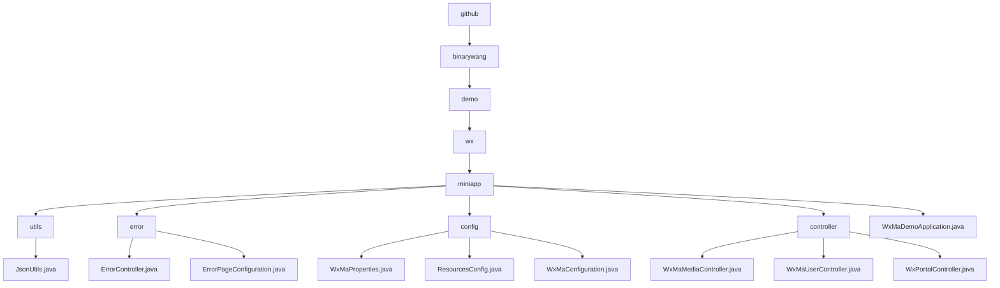

# Basic Information

|      |      |
|------|------|
| Name | github |
| Language | .java |
| Code Path | weixin-java-miniapp-demo/src/main/java/com/github |
| Package Name | docs.src.main.java.com.github |
| Brief Description | The JsonUtils utility class handles JSON conversion, configured to ignore null values and format the output. The error handling module uniformly manages 404/500 error redirections. The WeChat Mini Program configuration module integrates basic properties and message processing. The controller module manages media files, user sessions, and WeChat interactions. The application entry class WxMaDemoApplication launches the Spring Boot application. |

# Description

## Overview  
This module serves as a comprehensive backend system for WeChat Mini Programs, with core responsibilities including JSON data processing, unified error handling, multi-account configuration management, and interactions within the WeChat ecosystem (e.g., media/session handling). It adopts a layered architecture design, combining elements similar to a microservices configuration center and a gateway pattern. Interface specifications cover RESTful endpoints (e.g., `/error/404`), WeChat standard APIs (e.g., `code2session`), and file transfer protocols. Key data structures include `WxMaProperties.Config` (credential storage), `ErrorPageRegistry` (error mapping), and WeChat standard parameters (e.g., `media_id`). External dependencies include the Spring Boot framework, WeChat SDK, JSSDK, and message encryption/decryption libraries. For example, `JsonUtils` handles object serialization, while `ErrorController` manages error redirection.  

## Core Business Scenarios  
The module supports full lifecycle management of Mini Programs: loading multi-account configurations during initialization (similar to a configuration center), handling user authorization (OAuth 2.0 simplified flow), media resource hosting (similar to CDN), and exception interception (unified error pages) at runtime. It employs the chain-of-responsibility pattern to process WeChat messages (e.g., text/images), resembling an event bus distribution mechanism. Typical scenarios include server verification handshakes, temporary media management, and asynchronous message responses. For instance, the portal controller handles both GET/POST requests, while `WxMaConfiguration` dynamically routes message types. API integration cases cover standard WeChat scenarios from credential verification to file uploads.

### Package Internal Structure View

This flowchart illustrates the directory structure of the WeChat Mini Program Demo project, starting from the root directory 'github' and expanding hierarchically to 'binarywang', 'demo', 'wx', and 'miniapp' levels. Under 'miniapp', there are subdirectories such as 'utils' for utility classes, 'error' for error handling, 'config' for configurations, and 'controller' for controllers, along with the main program file 'WxMaDemoApplication.java'. Each subdirectory contains specific implementation class files like 'JsonUtils.java', 'ErrorController.java', etc., forming a complete project structure tree.

# File List

| Name   | Type  | Description |
|-------|------|-------------|
| [binarywang](binarywang/_module.md) | package | The JsonUtils utility class handles JSON conversion, configured to ignore null values and format the output. The error handling module uniformly manages 404/500 error redirections. The WeChat Mini Program configuration module integrates basic properties and message processing. The controller module manages media files, user sessions, and WeChat interactions. The application entry class WxMaDemoApplication launches the Spring Boot application. |

