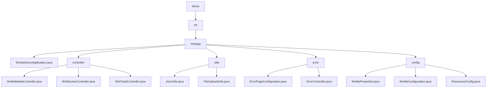

# Basic Information

|      |      |
|------|------|
| Name | demo |
| Language | .java |
| Code Path | weixin-java-miniapp-demo/src/main/java/com/github/binarywang/demo |
| Package Name | docs.src.main.java.com.github.binarywang.demo |
| Brief Description | This is a backend demonstration project for a WeChat Mini Program based on Spring Boot. The project includes a main startup class, controllers, utility classes, error handling, and configuration modules. The controllers handle WeChat API requests, such as user login and file uploads. The utility classes provide JSON processing and file storage functionalities. The error handling module customizes HTTP error pages. The configuration module centrally manages Mini Program settings and message routing. The overall architecture is clear and covers the core functionalities of a Mini Program backend. |

# Description

## Overview
This is a backend service module for a WeChat Mini Program based on Spring Boot. Its core responsibility is to provide a unified API proxy for interacting with official WeChat services and encapsulate key business logic such as media file management, user authentication, and message/event handling. It acts as a bridge between business applications and the WeChat ecosystem.

The module adheres to RESTful interface specifications, providing a series of HTTP endpoints. In terms of design patterns, it dynamically loads the corresponding configuration based on `appid` before processing each request. Its key data structures include a configuration object encapsulating Mini Program connection properties, the `media_id` returned by WeChat, session information containing `openid`, and encrypted data packets, which flow between controllers. External dependencies primarily include the Spring Boot Web framework, the WeChat Java SDK (`weixin-java-miniapp`), and libraries such as Jackson and MinIO.

There are numerous concrete implementation examples: for instance, receiving and uploading files to the WeChat server via the `POST /media/upload` interface; exchanging a code for a user session via `GET /user/login`; the utility class `JsonUtils` configuring an `ObjectMapper` for JSON serialization; `FileUploadUtils` validating file extensions and renaming them before upload.

## Main Business Scenarios
The module's business coverage spans three major processes: file resource management, user identity data management, and server message/event handling, forming a complete view from receiving a request to calling WeChat services and returning a response. Its interaction pattern uniformly follows "dynamic loading of configuration → calling the WeChat API → processing returned data → cleaning up thread context", resembling a configuration-aware routing layer.

Functional completeness is reflected in providing the core backend interfaces required for Mini Program development, including temporary media upload, decryption of user login information, server configuration validation, and message distribution. Typical application patterns are: after the Mini Program frontend completes user login, user information can be retrieved; the management backend can upload media; the WeChat server communicates events with the backend through the validation interface.

API types are primarily HTTP interfaces and static methods of utility classes. Integration examples include: `WxMaMessageRouter` automatically routes messages to handlers based on message type; the error handling module maps 404/500 errors to custom pages; the configuration module centrally manages properties for multiple Mini Programs and initializes core service Beans.

### Package Internal Structure View

This flowchart illustrates a typical layered structure within the `src/main/java` directory of the `weixin-java-miniapp-demo` project. The root node `demo` contains the `wx` sub-package, under which resides the core package `miniapp`. The `miniapp` package includes a main application class `WxMaDemoApplication.java` and four sub-packages: `controller` (holding various controllers), `utils` (utility classes), `error` (error handling classes), and `config` (configuration classes). Each sub-package contains specific functional implementation files, clearly presenting the code organization and hierarchical relationships between modules.

# File List

| Name   | Type  | Description |
|-------|------|-------------|
| [wx](wx/_module.md) | package | This is a demonstration project for a WeChat Mini Program backend based on Spring Boot. The project includes the main startup class, controllers, utility classes, error handling, and configuration modules. The controllers handle WeChat API requests, such as user login and file uploads. The utility classes provide JSON processing and file storage functionality. The error handling module customizes HTTP error pages. The configuration module centrally manages mini program settings and message routing. The overall architecture is clear and covers the core backend functionalities of a mini program. |

