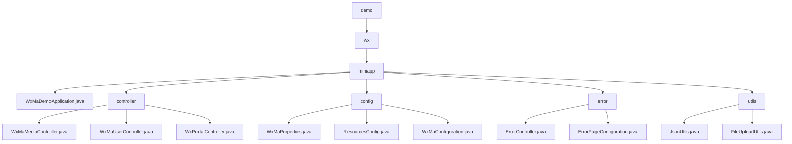

# Basic Information

|      |      |
|------|------|
| Name | demo |
| Language | .java |
| Code Path | weixin-java-miniapp-demo/src/main/java/com/github/binarywang/demo |
| Package Name | docs.src.main.java.com.github.binarywang.demo |
| Brief Description | Spring Boot WeChat Mini Program Demo, including startup class, controllers, configurations, error handling, and utility modules. Controllers handle WeChat interactions, configurations manage multiple accounts, and utility modules provide JSON and file processing capabilities. |

# Description

## Overview  
This module is a collection of backend services for WeChat Mini Programs, integrating WeChat ecosystem interactions, configuration management, error handling, and utility functions. Built on the Spring Boot framework, it communicates with WeChat servers via RESTful interfaces and file transfers, operating in a gateway-like mode to handle verification, authorization, and media management. Key data structures include WeChat standard parameters (media_id/appid), configuration properties (WxMaProperties.Config), and MinIO storage strategies. External dependencies include the WeChat JSSDK, Jackson library, MinIO service, and Spring MVC. For example, the media controller handles multi-file uploads, while JsonUtils implements object serialization.

## Core Business Scenarios  
The module covers the entire lifecycle of a Mini Program: server verification (similar to a handshake protocol), user login (OAuth2.0 simplified flow), media hosting (similar to CDN), and error interception. A typical workflow involves receiving parameters → verifying configurations → executing business logic → returning data, such as the user controller linking code2session with information decryption. Functional completeness is reflected in multi-account configuration loading, automatic error page redirection (e.g., 404 triggering /error/404), and file upload validation (limited to 50MB). Integration examples include message push processing, temporary media management, and JSON data interaction.

### Package Internal Structure View

This flowchart illustrates the directory structure of a WeChat Mini Program Demo project, starting from the root directory 'demo' and expanding hierarchically to 'wx' and 'miniapp' directories. The 'miniapp' directory contains the main application file 'WxMaDemoApplication.java' and four subdirectories: 'controller' (with three controller files), 'config' (with three configuration class files), 'error' (with two error-handling files), and 'utils' (with two utility class files). It fully presents the project's main components and their hierarchical relationships.

# File List

| Name   | Type  | Description |
|-------|------|-------------|
| [wx](wx/_module.md) | package | Spring Boot WeChat Mini Program Demo, including startup class, controllers, configurations, error handling, and utility modules. The controllers handle WeChat interactions, configurations manage multiple accounts, and the utility module provides JSON and file processing capabilities. |

