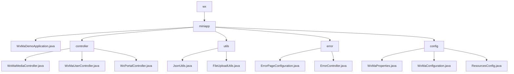

# Basic Information

|      |      |
|------|------|
| Name | wx |
| Language | .java |
| Code Path | weixin-java-miniapp-demo/src/main/java/com/github/binarywang/demo/wx |
| Package Name | docs.src.main.java.com.github.binarywang.demo.wx |
| Brief Description | This is a demonstration project for a WeChat Mini Program backend based on Spring Boot. The project includes the main startup class, controllers, utility classes, error handling, and configuration modules. The controllers handle WeChat API requests, such as user login and file uploads. The utility classes provide JSON processing and file storage functionality. The error handling module customizes HTTP error pages. The configuration module centrally manages mini program settings and message routing. The overall architecture is clear and covers the core backend functionalities of a mini program. |

# Description

## Overview
This is a backend service module for a WeChat Mini Program based on Spring Boot. Its core responsibility is to provide a unified API proxy for interacting with official WeChat services and encapsulate key business logic such as media file management, user identity authentication, and message event handling. It serves as a bridge between business applications and the WeChat ecosystem.

The module adheres to the RESTful interface specification, providing a series of HTTP endpoints. The design pattern involves dynamically loading corresponding configurations based on the `appid` before processing each request. Its key data structures include configuration objects encapsulating mini program connection properties, the `media_id` returned by WeChat, session information containing the `openid`, and encrypted data packets, which flow between controllers. External dependencies primarily include the Spring Boot Web framework, the WeChat Java SDK (`weixin-java-miniapp`), and libraries such as Jackson and MinIO.

The implementation includes various concrete examples. For instance: the `POST /media/upload` interface receives and uploads files to the WeChat server; the `GET /user/login` interface uses a code to exchange for a user session; the utility class `JsonUtils` configures `ObjectMapper` for JSON serialization; `FileUploadUtils` validates file extensions and renames files before uploading.

## Main Business Scenarios
The module's business covers three major workflows: file resource management, user identity data management, and server message event handling, forming a complete view from receiving requests to calling WeChat services and returning responses. Its interaction pattern is uniformly "dynamically load configuration → call WeChat API → process returned data → clean up thread context," akin to a configuration-aware routing layer.

Functional completeness is demonstrated by providing core backend interfaces required for mini program development, including temporary media upload, user login information decryption, server configuration validation, and message dispatching. Typical application patterns include: after a mini program frontend completes user login, it can obtain user information; management backends can upload media; the WeChat server communicates events with the backend through validation interfaces.

API types mainly consist of HTTP interfaces and static methods of utility classes. Integration examples include: `WxMaMessageRouter` automatically routes messages to handlers based on the message type; the error handling module maps 404/500 errors to custom pages; the configuration module centrally manages properties for multiple mini programs and initializes core service Beans.

### Package Internal Structure View

This flowchart illustrates the core Java source code structure of a WeChat Mini Program demo project. The root directory `wx` contains only one `miniapp` module. Within this module, there are five main directories: the main application class, controllers, utilities, error handling, and configuration. The controller, utility, error handling, and configuration directories each contain specific functional implementation files, clearly reflecting the project's layered organization by functional modules.

# File List

| Name   | Type  | Description |
|-------|------|-------------|
| [miniapp](miniapp/_module.md) | package | This is a demonstration project for a WeChat Mini Program backend based on Spring Boot. The project includes the main startup class, controllers, utility classes, error handling, and configuration modules. The controllers handle WeChat API requests, such as user login and file upload. The utility classes provide JSON processing and file storage functionalities. The error handling module customizes HTTP error pages. The configuration module centrally manages Mini Program settings and message routing. The overall architecture is clear, covering the core functionalities of a Mini Program backend. |

