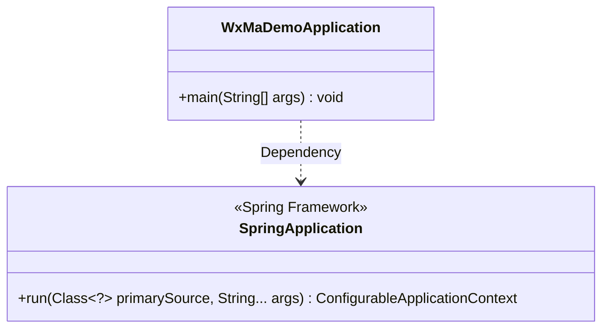
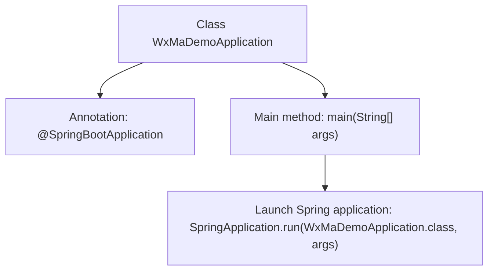

# Basic Information

|      |      |
|------|------|
| Name | WxMaDemoApplication |
| Language | .java |
| Code Path | weixin-java-miniapp-demo/src/main/java/com/github/binarywang/demo/wx/miniapp/WxMaDemoApplication.java |
| Package Name | com.github.binarywang.demo.wx.miniapp |
| Dependencies | ['org.springframework.boot.SpringApplication', 'org.springframework.boot.autoconfigure.SpringBootApplication'] |
| Brief Description | This is the main class of a Spring Boot application, marked with the @SpringBootApplication annotation, which starts the application via the main method. |

# Description

This is the entry class for a WeChat Mini Program Demo application based on the Spring Boot framework. The class is named WxMaDemoApplication and is marked with the @SpringBootApplication annotation, indicating that it is the main configuration class for a Spring Boot application. The class contains a standard main method, which starts the entire Spring Boot application by calling SpringApplication.run, passing the current class name and command-line arguments as parameters. As the application's startup entry point, this class is responsible for initializing the Spring container and launching the embedded server.

# Class Summary

| Name   | Type  | Description |
|-------|------|-------------|
| WxMaDemoApplication | class | SpringBoot application startup class, containing the main method to run the Spring application. |

## Class WxMaDemoApplication

|      |      |
|------|------|
| Access Modifier | @SpringBootApplication;public |
| Type | class |
| Name | WxMaDemoApplication |
| Description | SpringBoot application startup class, containing the main method to run the Spring application. |

### UML Class Diagram

This class diagram illustrates the dependency relationship between WxMaDemoApplication and SpringApplication. WxMaDemoApplication is a Spring Boot application startup class that invokes SpringApplication.run() via its main method to launch the application. SpringApplication is the core bootstrap class of the Spring Framework, providing the run method to initialize and start the Spring application context. The diagram clearly demonstrates the typical startup process of a Spring Boot application and the core component dependencies.

### Internal Method Call Graph

This code represents a standard Spring Boot application launcher class, where the main configuration class is marked with the @SpringBootApplication annotation, and the SpringApplication.run() method is invoked in the main method to start the embedded web server and Spring application context. The flowchart illustrates the class structure, annotations, and the invocation relationship of the startup logic, with the core focus being Spring Boot's auto-configuration and startup process.

### Field List

| Name  | Type  | Description |
|-------|-------|------|

### Method List

| Name  | Type  | Description |
|-------|-------|------|
| main | void | Java main method to launch the Spring Boot application WxMaDemoApplication. |

