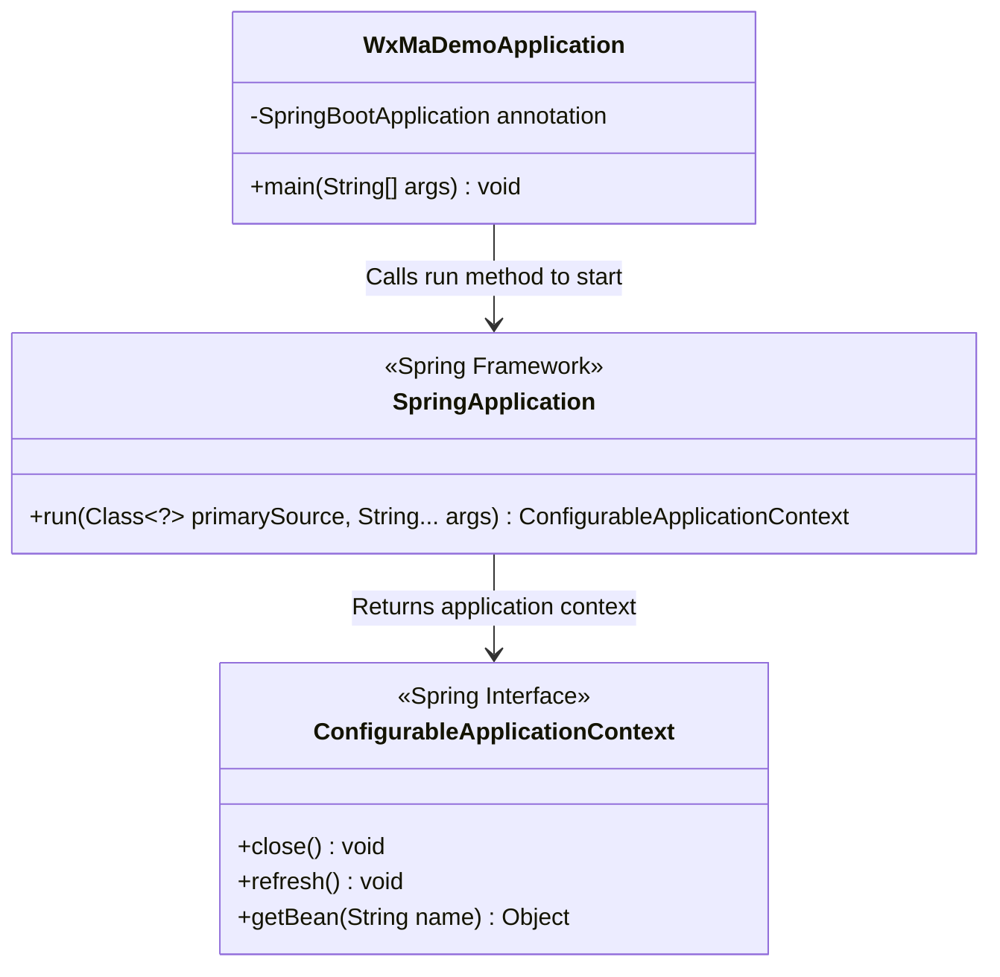
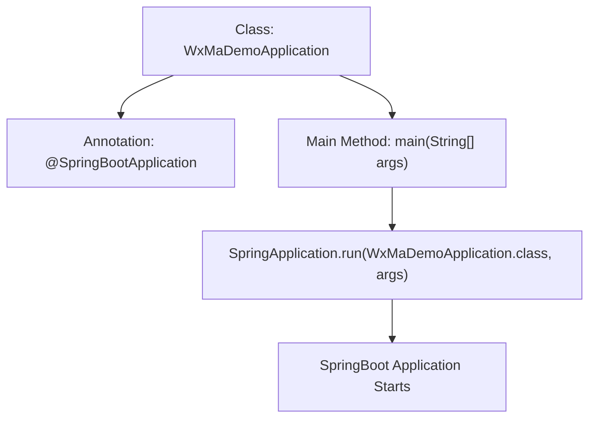

# Basic Information

|      |      |
|------|------|
| Name | WxMaDemoApplication |
| Language | .java |
| Code Path | weixin-java-miniapp-demo/src/main/java/com/github/binarywang/demo/wx/miniapp/WxMaDemoApplication.java |
| Package Name | com.github.binarywang.demo.wx.miniapp |
| Dependencies | ['org.springframework.boot.SpringApplication', 'org.springframework.boot.autoconfigure.SpringBootApplication'] |
| Brief Description | This is the main class of a Spring Boot application, using the @SpringBootApplication annotation and defining the main method as the entry point to launch the application. |

# Description

This is the main startup class of a Java application named `WxMaDemoApplication`. It utilizes the Spring Boot framework's `@SpringBootApplication` annotation, which combines configuration, component scanning, and enabling auto-configuration. The class defines a standard `main` method as the application entry point. This method starts the entire Spring Boot application by calling `SpringApplication.run`, passing the current class `WxMaDemoApplication` and the `main` method's arguments `args`. This simple structure is a typical way to start a Spring Boot-based WeChat Mini Program related demonstration project.

# Class Summary

| Name   | Type  | Description |
|-------|------|-------------|
| WxMaDemoApplication | class | This is the main entry class of a Spring Boot application. It is marked as the startup class using the @SpringBootApplication annotation. The main method starts the application via SpringApplication.run. |

## Class WxMaDemoApplication

|      |      |
|------|------|
| Access Modifier | @SpringBootApplication;public |
| Type | class |
| Name | WxMaDemoApplication |
| Description | This is the main entry class of a Spring Boot application. It is marked as the startup class using the @SpringBootApplication annotation. The main method starts the application via SpringApplication.run. |

### UML Class Diagram

This code represents the startup class of a Spring Boot application, marked with the @SpringBootApplication annotation on the main class. It launches the application via the SpringApplication.run() method, which creates the Spring application context and initializes all configured beans. This startup process encompasses core functionalities such as auto-configuration, component scanning, and the launch of an embedded web server, serving as the entry point for the entire Spring Boot application.

### Internal Method Call Graph

This is the main class for a WeChat Mini Program demo application using the Spring Boot framework. The code marks the main class with the @SpringBootApplication annotation and calls SpringApplication.run() within the main method to start the Spring Boot application. This annotation combines @Configuration, @EnableAutoConfiguration, and @ComponentScan, enabling automatic configuration and component scanning. The startup process initializes the Spring container, loads configurations, and starts the embedded web server.

### Field List

| Name  | Type  | Description |
|-------|-------|------|

### Method List

| Name  | Type  | Description |
|-------|-------|------|
| main | void | This code serves as the main entry method of a Java program, launching a Spring-based WeChat mini program sample application by calling SpringApplication.run. |

