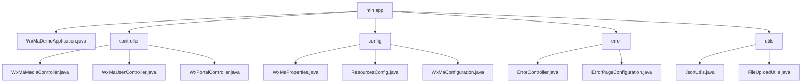

# Basic Information

|      |      |
|------|------|
| Name | miniapp |
| Language | .java |
| Code Path | weixin-java-miniapp-demo/src/main/java/com/github/binarywang/demo/wx/miniapp |
| Package Name | docs.src.main.java.com.github.binarywang.demo.wx.miniapp |
| Brief Description | Spring Boot WeChat Mini Program Demo, including startup class, controllers, configurations, error handling, and utility modules. The controllers handle WeChat interactions, configurations manage multiple accounts, and the utility module provides JSON and file processing functionalities. |

# Description

## Overview  
This module is a collection of backend services for WeChat Mini Programs, integrating WeChat ecosystem interactions, configuration management, error handling, and utility functions. Built on the Spring Boot framework, it communicates with WeChat servers via RESTful interfaces and file transfers, operating in a gateway-like mode to handle verification, authorization, and media management. Key data structures include WeChat standard parameters (media_id/appid), configuration properties (WxMaProperties.Config), and MinIO storage policies. External dependencies include WeChat JSSDK, Jackson library, MinIO service, and Spring MVC. For example, the media controller handles multi-file uploads, while JsonUtils implements object serialization.  

## Core Business Scenarios  
The module covers the entire lifecycle of a Mini Program: server verification (similar to a handshake protocol), user login (OAuth2.0 simplified flow), media hosting (similar to CDN), and error interception. A typical workflow involves receiving parameters → verifying configurations → executing business logic → returning data, such as the user controller linking code2session with information decryption. Functional completeness is reflected in multi-account configuration loading, automatic error page redirection (e.g., 404 triggering /error/404), and file upload validation (limited to 50MB). Integration examples include message push processing, temporary media management, and JSON data interaction.

### Package Internal Structure View

This flowchart illustrates the directory structure of a WeChat Mini Program Demo project, with the root node "miniapp" encompassing five submodules: the main application file, controllers, configurations, error handling, and utility classes. The controller module includes three WeChat-related controllers, the config module contains three configuration class files, the error module comprises two error-related classes, and the utils module consists of JSON processing and file upload utility classes. The entire structure clearly demonstrates the layered architecture typical of a Spring Boot project.

# File List

| Name   | Type  | Description |
|-------|------|-------------|
| [WxMaDemoApplication.java](WxMaDemoApplication.md) | file | This is the main class of a Spring Boot application, marked with the @SpringBootApplication annotation, which starts the application via the main method. |
| [controller](controller/_module.md) | package | Three controller classes in WeChat Mini Program: The Media Controller handles file uploads and downloads; the User Controller manages login, user information, and phone numbers; the Backend Controller handles WeChat server authentication and message push. All include configuration cleanup functionality. |
| [config](config/_module.md) | package | WeChat Mini Program Java configuration classes: WxMaProperties binds Mini Program configuration items; ResourcesConfig handles file uploads and cross-origin; WxMaConfiguration initializes services and configures message handlers. |
| [error](error/_module.md) | package | The ErrorController class handles 404 and 500 errors under the /error path, returning a unified error page. The ErrorPageConfiguration class implements error page configuration, mapping the 404 and 500 status codes to their corresponding paths. |
| [utils](utils/_module.md) | package | The JsonUtils utility class handles JSON data conversion, configured to ignore null values and format output, providing a toJson method. The FileUploadUtils utility class manages file uploads, with default limits of 50MB file size and 100-character filenames, supporting MinIO bucket management and policy configuration. |

