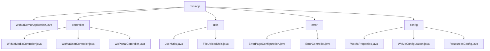

# Basic Information

|      |      |
|------|------|
| Name | miniapp |
| Language | .java |
| Code Path | weixin-java-miniapp-demo/src/main/java/com/github/binarywang/demo/wx/miniapp |
| Package Name | docs.src.main.java.com.github.binarywang.demo.wx.miniapp |
| Brief Description | This is a demonstration project for a WeChat Mini Program backend based on Spring Boot. The project includes the main startup class, controllers, utility classes, error handling, and configuration modules. The controllers handle WeChat API requests, such as user login and file upload. The utility classes provide JSON processing and file storage functionalities. The error handling module customizes HTTP error pages. The configuration module centrally manages Mini Program settings and message routing. The overall architecture is clear, covering the core functionalities of a Mini Program backend. |

# Description

## Overview
This is a backend service module for WeChat Mini Programs based on Spring Boot. Its core responsibility is to provide a unified API proxy for interacting with official WeChat services, while encapsulating key business logic such as media file management, user identity authentication, and message/event handling. It serves as a bridge between business applications and the WeChat ecosystem.

The module adheres to RESTful interface specifications, offering a series of HTTP endpoints. Its design pattern involves dynamically loading the corresponding configuration based on the `appid` before processing each request. Key data structures include configuration objects encapsulating Mini Program connection properties, `media_id` returned by WeChat, session information containing `openid`, and encrypted data packets, all of which flow between controllers. External dependencies primarily include the Spring Boot Web framework, the WeChat Java SDK (`weixin-java-miniapp`), and libraries such as Jackson and MinIO.

Specific implementation examples are abundant. For instance: files are received and uploaded to the WeChat server via the `POST /media/upload` interface; user sessions are obtained using a code via the `GET /user/login` endpoint; the utility class `JsonUtils` configures `ObjectMapper` for JSON serialization; `FileUploadUtils` validates file extensions and renames files before upload.

## Main Business Scenarios
The module's business covers three major processes: file resource management, user identity data management, and server message/event handling, forming a complete view from receiving requests, calling WeChat services, to returning responses. Its interaction pattern is unified as "dynamically load configuration → call WeChat API → process returned data → clean thread context," functioning like a configuration-aware routing layer.

Functional completeness is reflected in providing the core backend interfaces required for Mini Program development, including temporary media upload, user login information decryption, server configuration validation, and message distribution. Typical application patterns are: after a Mini Program frontend completes user login, user information can be obtained; management backends can upload media; the WeChat server communicates events with the backend through validation interfaces.

The API types are mainly HTTP interfaces and utility class static methods. Integration examples include: `WxMaMessageRouter` automatically routes messages to handlers based on message type; the error handling module maps 404/500 errors to customized pages; the configuration module centrally manages properties for multiple Mini Programs and initializes core service Beans.

### Package Internal Structure View

This flowchart shows the core Java source code structure of a WeChat Mini Program backend project. The root node `miniapp` represents the main package, which contains four submodules: the application startup class, controllers, utilities, error handling, and configuration. The controller module has three controllers handling different business areas (media, user, and portal). The utilities module includes JSON processing and file upload utilities. The error handling module has error page and error controllers. The configuration module manages WeChat configuration, main configuration, and resource configuration.

# File List

| Name   | Type  | Description |
|-------|------|-------------|
| [config](config/_module.md) | package | WeChat Mini Program backend configuration class: WxMaProperties stores core configuration of the Mini Program such as appid and secret; WxMaConfiguration initializes multi-configuration Mini Program services and message routing, handles logging and various message responses; ResourcesConfig maps local resource access paths and supports cross-origin. |
| [error](error/_module.md) | package | The code defines two Spring components. ErrorPageConfiguration configures 404 and 500 errors to point to custom paths. ErrorController provides endpoints to handle these error paths and returns error views. Implements custom HTTP error handling. |
| [utils](utils/_module.md) | package | The JsonUtils tool class provides a static toJson method to convert Java objects into formatted JSON strings, ignoring null values. The FileUploadUtils tool class handles file uploads, supports size and extension validation, generates new file names, and also includes methods for MinIO bucket management. |
| [controller](controller/_module.md) | package | WeChat Mini Program Spring Boot Demo includes three controllers. The WxMaMediaController handles the upload and download of media files. The WxMaUserController is responsible for user login, information retrieval, and phone number processing. The WxPortalController is used for WeChat server verification and user message handling. Each controller validates configurations before executing the corresponding business logic and clears thread data. |
| [WxMaDemoApplication.java](WxMaDemoApplication.md) | file | This is the main class of a Spring Boot application, using the @SpringBootApplication annotation and defining the main method as the entry point to start the application. |

