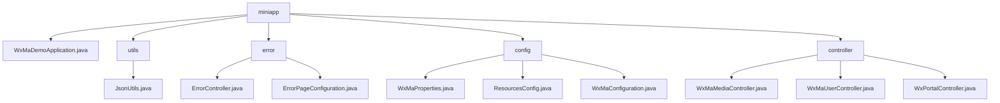

# Basic Information

|      |      |
|------|------|
| Name | miniapp |
| Language | .java |
| Code Path | weixin-java-miniapp-demo/src/main/java/com/github/binarywang/demo/wx/miniapp |
| Package Name | docs.src.main.java.com.github.binarywang.demo.wx.miniapp |
| Brief Description | The JsonUtils utility class handles JSON conversion, configured to ignore null values and format the output. The error handling module uniformly manages 404/500 error redirections. The WeChat Mini Program configuration module integrates basic properties and message processing. The controller module manages media files, user sessions, and WeChat interactions. The application entry class, WxMaDemoApplication, launches the Spring Boot application. |

# Description

## Overview  
This module serves as a comprehensive backend system for WeChat Mini Programs, with core responsibilities including JSON data processing, unified error handling, multi-account configuration management, and interactions within the WeChat ecosystem (e.g., media/session handling). It adopts a layered architecture design, combining elements of a microservices configuration center with a gateway pattern. Interface specifications encompass RESTful endpoints (e.g., `/error/404`), WeChat standard APIs (e.g., `code2session`), and file transfer protocols. Key data structures include `WxMaProperties.Config` (credential storage), `ErrorPageRegistry` (error mapping), and WeChat standard parameters (e.g., `media_id`). External dependencies include the Spring Boot framework, WeChat SDK, JSSDK, and message encryption/decryption libraries. For example, `JsonUtils` handles object serialization, while `ErrorController` manages error redirection.  

## Core Business Scenarios  
The module supports full lifecycle management of Mini Programs: loading multi-account configurations during initialization (similar to a configuration center), handling user authorization (OAuth 2.0 simplified flow), media resource hosting (similar to CDN), and exception interception (unified error pages) during runtime. It employs the chain-of-responsibility pattern to process WeChat messages (e.g., text/images), resembling an event bus distribution mechanism. Typical scenarios include server verification handshakes, temporary media management, and asynchronous message responses. For instance, the portal controller handles both GET/POST requests, while `WxMaConfiguration` dynamically routes message types. API integration examples cover standard WeChat scenarios ranging from credential verification to file uploads.

### Package Internal Structure View

This flowchart illustrates the core structure of a WeChat Mini Program Demo project, with `miniapp` as the root node encompassing five main modules: the main application class, utility classes, error handling classes, configuration classes, and controller classes. Each module is further divided into specific functional files. For example, the configuration class includes files for WeChat Mini Program property settings, resource configuration, etc., while the controller classes handle media, user, and portal-related requests. The clear structure reflects the layered design typical of a Spring Boot application.

# File List

| Name   | Type  | Description |
|-------|------|-------------|
| [WxMaDemoApplication.java](WxMaDemoApplication.md) | file | This is the main class of a Spring Boot application, marked with the @SpringBootApplication annotation, which starts the application via the main method. |
| [controller](controller/_module.md) | package | Three controller classes in WeChat Mini Program: Media Controller handles file uploads and downloads; User Controller manages login, user information, and phone numbers; Backend Controller handles WeChat server authentication and message push. All include configuration cleanup functionality. |
| [config](config/_module.md) | package | WeChat Mini Program Java Configuration Classes: WxMaProperties binds Mini Program configuration items; ResourcesConfig handles file uploads and cross-origin requests; WxMaConfiguration initializes services and configures message handlers. |
| [error](error/_module.md) | package | The ErrorController class handles 404 and 500 errors under the /error path, returning a unified error page. The ErrorPageConfiguration class implements error page configuration, mapping the 404 and 500 status codes to their corresponding paths. |
| [utils](utils/_module.md) | package | The JsonUtils class provides a static method `toJson`, which uses ObjectMapper to convert an object into a JSON string, automatically ignoring null values and formatting the output. Returns null if an exception occurs. |

