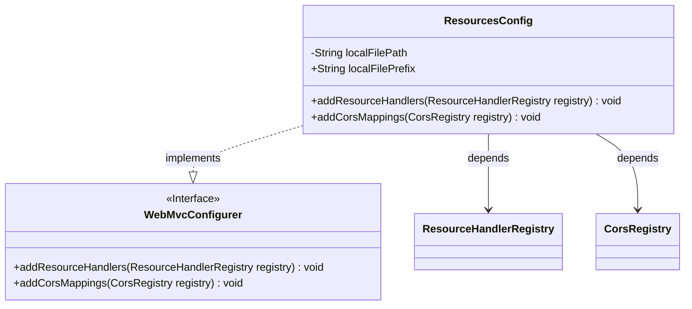
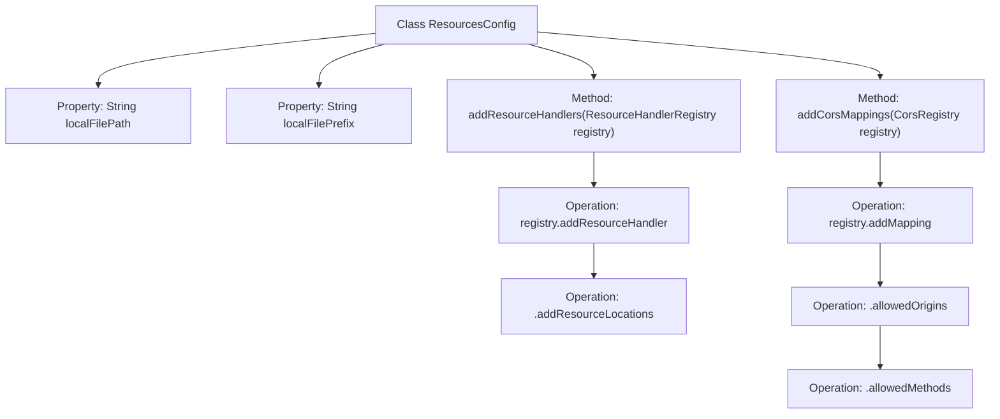

# Basic Information

|      |      |
|------|------|
| Name | ResourcesConfig |
| Language | .java |
| Code Path | weixin-java-miniapp-demo/src/main/java/com/github/binarywang/demo/wx/miniapp/config/ResourcesConfig.java |
| Package Name | com.leaniss.file.config |
| Dependencies | ['java.io.File', 'org.springframework.beans.factory.annotation.Value', 'org.springframework.context.annotation.Configuration', 'org.springframework.web.servlet.config.annotation.CorsRegistry', 'org.springframework.web.servlet.config.annotation.ResourceHandlerRegistry', 'org.springframework.web.servlet.config.annotation.WebMvcConfigurer'] |
| Brief Description | Java configuration class implements local file path mapping and cross-origin support, sets file storage path and prefix, and allows GET requests for cross-origin access. |

# Description

This is a Spring Boot configuration class designed to handle file uploads and cross-origin requests. The class defines two configuration properties: the root path for file storage and the prefix for resource mapping paths. By overriding the `addResourceHandlers` method, it maps local file paths to web-accessible resource paths. Additionally, it overrides the `addCorsMappings` method to configure cross-origin access permissions for file resource paths, allowing all domains to access resources under this path via the GET method. The entire configuration implements the foundational functionality for file upload storage and web access.

# Class Summary

| Name   | Type  | Description |
|-------|------|-------------|
| ResourcesConfig | class | Java configuration class implements file resource mapping and cross-origin support, sets local storage path and URL prefix, and allows GET requests for cross-origin access. |

## Class ResourcesConfig

|      |      |
|------|------|
| Access Modifier | @Configuration;public |
| Type | class |
| Name | ResourcesConfig |
| Description | Java configuration class implements file resource mapping and cross-origin support, sets local storage path and URL prefix, and allows GET requests for cross-origin access. |

### UML Class Diagram

Class diagram description:
The ResourcesConfig class is a Spring configuration class that implements the WebMvcConfigurer interface, primarily used for configuring resource handling and cross-origin requests. It contains two main methods: addResourceHandlers for mapping local file paths to URL prefixes, and addCorsMappings for configuring cross-origin access rules. The class includes two properties injected from configuration files: the path prefix (localFilePrefix) and the local file path (localFilePath).

### Internal Method Call Graph

This code represents a Spring Boot configuration class that primarily implements two functionalities: 1) Configuring local file upload paths and resource mapping rules by mapping URL requests with specified prefixes to local filesystem paths through the `addResourceHandlers` method; 2) Configuring cross-origin access rules by allowing GET requests for specific routes to access across domains through the `addCorsMappings` method. The flowchart clearly illustrates the class structure, property injection, and method invocation relationships, where the resource handler and cross-origin configuration form independent branches, achieving functional configuration through Spring's Registry mechanism.

### Field List

| Name  | Type  | Description |
|-------|-------|------|
| localFilePath | String | The code snippet defines a private string variable `localFilePath`, whose value is injected from the configuration property `file.path` via the `@Value` annotation. |
| localFilePrefix | String | The code defines a string variable `localFilePrefix`, whose value is injected from the `file.prefix` property in the configuration file. |

### Method List

| Name  | Type  | Description |
|-------|-------|------|
| addResourceHandlers | void | This method is used to configure the local file upload path, mapping the specified URL pattern to a local file system path. |
| addCorsMappings | void | This method configures cross-origin requests, allowing all domains to access the specified route via the GET method. |

