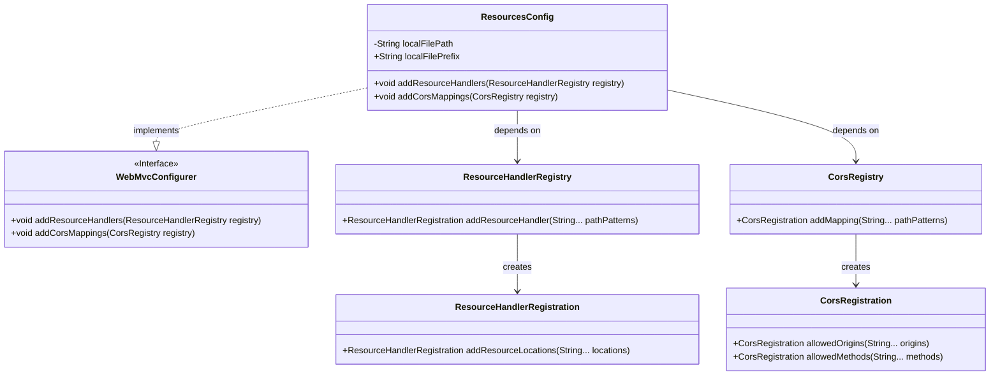
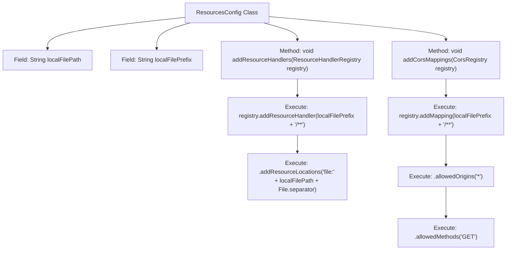

# Basic Information

|      |      |
|------|------|
| Name | ResourcesConfig |
| Language | .java |
| Code Path | weixin-java-miniapp-demo/src/main/java/com/github/binarywang/demo/wx/miniapp/config/ResourcesConfig.java |
| Package Name | com.leaniss.file.config |
| Dependencies | ['java.io.File', 'org.springframework.beans.factory.annotation.Value', 'org.springframework.context.annotation.Configuration', 'org.springframework.web.servlet.config.annotation.CorsRegistry', 'org.springframework.web.servlet.config.annotation.ResourceHandlerRegistry', 'org.springframework.web.servlet.config.annotation.WebMvcConfigurer'] |
| Brief Description | Configuration file class implements WebMvc configuration, mapping the local file upload path as static resources, and enabling cross-origin support, allowing all domains to access resources under this path via the GET method. |

# Description

The ResourcesConfig class is a Spring Boot configuration class that implements the WebMvcConfigurer interface. It primarily accomplishes two tasks: first, it configures the access path mapping for local file upload resources by reading the path prefix and local storage root path from the configuration file, thereby mapping specific URL requests to the server's local file system directory; second, it configures cross-origin access support for the aforementioned resource paths, allowing domain names from all origins to perform cross-origin access via the GET method, thus enabling the frontend to successfully retrieve uploaded files from the server.

# Class Summary

| Name   | Type  | Description |
|-------|------|-------------|
| ResourcesConfig | class | This is a Spring Boot configuration class that implements the WebMvcConfigurer interface. It maps a specified local directory into a web-accessible static resource path by reading the path and prefix from the configuration file. Additionally, it configures cross-origin access rules for this resource path, allowing GET requests from all origin domains. |

## Class ResourcesConfig

|      |      |
|------|------|
| Access Modifier | @Configuration;public |
| Type | class |
| Name | ResourcesConfig |
| Description | This is a Spring Boot configuration class that implements the WebMvcConfigurer interface. It maps a specified local directory into a web-accessible static resource path by reading the path and prefix from the configuration file. Additionally, it configures cross-origin access rules for this resource path, allowing GET requests from all origin domains. |

### UML Class Diagram

**Class Diagram Description**:  
This code defines a Spring Boot configuration class `ResourcesConfig`, which implements the `WebMvcConfigurer` interface. The class contains two properties injected from configuration files: `localFilePath` (local file storage path) and `localFilePrefix` (resource mapping prefix). By overriding the `addResourceHandlers` method, it maps specific URL paths to the local file system, enabling access to static resources. Simultaneously, by overriding the `addCorsMappings` method, it configures cross-origin access policies for these resource paths, allowing GET requests from all domains. The overall design achieves flexible configuration of resource paths and cross-origin support.

### Internal Method Call Graph

This code is a Spring Boot configuration class used for configuring static resource handling and CORS settings. It maps a specified directory on the local filesystem to a web-accessible static resource path by injecting path and prefix parameters from configuration files. Simultaneously, it enables cross-origin access permissions for GET requests on this path. This configuration is commonly used for displaying files after uploading, ensuring the frontend can properly load and display file resources from the server.

### Field List

| Name  | Type  | Description |
|-------|-------|------|
| localFilePath | String | The code annotation @Value reads the file.path property from the configuration file and assigns it to the string variable localFilePath. |
| localFilePrefix | String | The code snippet uses the @Value annotation to inject the configuration property file.prefix, and assigns its value to the string-type variable localFilePrefix. |

### Method List

| Name  | Type  | Description |
|-------|-------|------|
| addResourceHandlers | void | This method configures the local file upload path by mapping a specific URL prefix to a server's local file directory through a resource handler, allowing direct access to uploaded files. |
| addCorsMappings | void | This code snippet configures cross-origin resource sharing (CORS) for a Spring Boot application, allowing all domain names to access resources under a specific local file path prefix via the GET method. |

