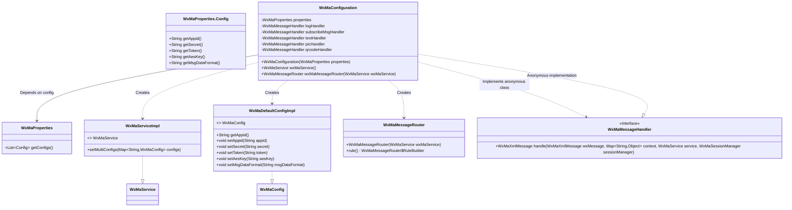
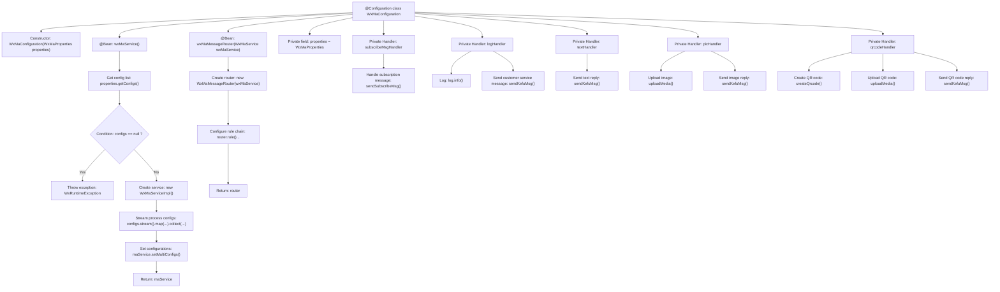

# Basic Information

|      |      |
|------|------|
| Name | WxMaConfiguration |
| Language | .java |
| Code Path | weixin-java-miniapp-demo/src/main/java/com/github/binarywang/demo/wx/miniapp/config/WxMaConfiguration.java |
| Package Name | com.github.binarywang.demo.wx.miniapp.config |
| Dependencies | ['cn.binarywang.wx.miniapp.api.WxMaService', 'cn.binarywang.wx.miniapp.api.impl.WxMaServiceImpl', 'cn.binarywang.wx.miniapp.bean.WxMaKefuMessage', 'cn.binarywang.wx.miniapp.bean.WxMaSubscribeMessage', 'cn.binarywang.wx.miniapp.config.impl.WxMaDefaultConfigImpl', 'cn.binarywang.wx.miniapp.config.impl.WxMaRedisConfigImpl', 'cn.binarywang.wx.miniapp.message.WxMaMessageHandler', 'cn.binarywang.wx.miniapp.message.WxMaMessageRouter', 'com.google.common.collect.Lists', 'lombok.extern.slf4j.Slf4j', 'me.chanjar.weixin.common.bean.result.WxMediaUploadResult', 'me.chanjar.weixin.common.error.WxErrorException', 'me.chanjar.weixin.common.error.WxRuntimeException', 'org.springframework.beans.factory.annotation.Autowired', 'org.springframework.boot.context.properties.EnableConfigurationProperties', 'org.springframework.context.annotation.Bean', 'org.springframework.context.annotation.Configuration', 'redis.clients.jedis.JedisPool', 'java.io.File', 'java.util.List', 'java.util.stream.Collectors'] |
| Brief Description | This code configures the WeChat Mini Program service. It defines two core beans: one for configuring the multi-instance service of the Mini Program (WxMaService), which is initialized based on the configuration list in the property file; the other defines message routing rules (WxMaMessageRouter), which dispatches messages to corresponding handlers according to the content type (such as text, images). The handlers are responsible for handling specific business logic like processing subscription messages, logging, replying with text, sending images or QR codes. |

# Description

This is a Spring configuration class named `WxMaConfiguration`, which is used to configure and integrate services related to WeChat Mini Programs. The class automatically injects the `WxMaProperties` configuration properties through its constructor. It defines two core Beans. The first Bean is `WxMaService`, which initializes a multi-configuration WeChat Mini Program service instance based on the list of multiple Mini Program configurations provided in `WxMaProperties`. If the configuration list is empty, it will throw a runtime exception. The second Bean is `WxMaMessageRouter`, a message router whose rules define how to handle different types of user messages: all messages first pass through a logging handler, and then are routed to corresponding handlers based on the message content (such as "subscribe message," "text," "image," "QR code"). These handlers perform specific operations, such as sending customer service messages, subscription messages, or uploading and replying with media files. The entire configuration completes the setup of the basic process for receiving and responding to messages on the WeChat Mini Program backend.

# Class Summary

| Name   | Type  | Description |
|-------|------|-------------|
| WxMaConfiguration | class | This code configures WeChat Mini Program services, including setting up multi-program configurations and defining a message router to handle different types of messages. |


## Class WxMaConfiguration

|      |      |
|------|------|
| Access Modifier | @Slf4j;@Configuration;@EnableConfigurationProperties(WxMaProperties.class);public |
| Type | class |
| Name | WxMaConfiguration |
| Description | This code configures WeChat Mini Program services, including setting up multi-program configurations and defining a message router to handle different types of messages. |


### UML Class Diagram



This code is a Spring Boot configuration class primarily used for configuring WeChat Mini Program services. The `WxMaConfiguration` class obtains configuration properties through dependency injection. In the `wxMaService()` method, it creates and configures a WeChat Mini Program service instance, mapping multiple mini-program configurations into configuration objects. In the `wxMaMessageRouter()` method, it creates a message router and configures multiple message handling rules, including the logic for processing log records, subscription messages, text messages, image messages, and QR code messages. The entire configuration class implements the initialization of the WeChat Mini Program service and the configuration of message routing.

```mermaid
sequenceDiagram
    participant SpringContainer
    participant Config as WxMaConfiguration
    participant Properties as WxMaProperties
    participant MaService as WxMaServiceImpl
    participant Configs as WxMaDefaultConfigImpl
    participant Router as WxMaMessageRouter
    
    SpringContainer->>Config: Create WxMaConfiguration
    Config->>Properties: Dependency inject WxMaProperties
    SpringContainer->>Config: Call wxMaService()
    Config->>Properties: getConfigs()
    Properties-->>Config: Return configs list
    alt configs == null
        Config-->>SpringContainer: Throw WxRuntimeException
    else configs are valid
        Config->>MaService: Create WxMaServiceImpl
        loop For each config
            Config->>Configs: Create WxMaDefaultConfigImpl
            Config->>Configs: Set appid/secret/token etc.
        end
        Config->>MaService: setMultiConfigs(configMap)
        Config-->>SpringContainer: Return WxMaService instance
    end
    
    SpringContainer->>Config: Call wxMaMessageRouter(wxMaService)
    Config->>Router: Create WxMaMessageRouter
    Router->>Router: Configure message handling rules
    Config-->>SpringContainer: Return WxMaMessageRouter
```

This sequence diagram illustrates the complete process of the Spring container initializing the `WxMaConfiguration` configuration class. First, the container creates the configuration class and injects property configurations. Then it calls the `wxMaService()` method to create a WeChat Mini Program service instance. During this process, it validates the configuration's effectiveness and creates configuration objects one by one. Finally, it calls the `wxMaMessageRouter()` method to create a message router and configure handling rules. The entire process demonstrates the dependency injection and bean creation lifecycle, ensuring the correct initialization of the WeChat Mini Program service and the establishment of the message processing chain.


### Internal Method Call Graph



This is a WeChat Mini Program configuration class, primarily used for initializing the WeChat Mini Program service and message router. It injects configuration properties via the constructor, creates an instance of the WeChat Mini Program service and configures multiple Mini Program settings, then creates a message router and sets up various message handling rules. Each message handler processes subscription messages, log recording, text messages, image messages, and QR code messages respectively, implementing a complete WeChat Mini Program message handling flow.

### Field List

| Name  | Type  | Description |
|-------|-------|------|
| textHandler = (wxMessage, context, service, sessionManager) -> {        service.getMsgService().sendKefuMsg(WxMaKefuMessage.newTextBuilder().content("回复文本消息")            .toUser(wxMessage.getFromUser()).build());        return null;    } | WxMaMessageHandler | This code is a private message handler that automatically replies to the user who sent the message with a preset text content upon receiving a text message. |
| qrcodeHandler = (wxMessage, context, service, sessionManager) -> {        try {            final File file = service.getQrcodeService().createQrcode("123", 430);            WxMediaUploadResult uploadResult = service.getMediaService().uploadMedia("image", file);            service.getMsgService().sendKefuMsg(                WxMaKefuMessage                    .newImageBuilder()                    .mediaId(uploadResult.getMediaId())                    .toUser(wxMessage.getFromUser())                    .build());        } catch (WxErrorException e) {            e.printStackTrace();        }        return null;    } | WxMaMessageHandler | This code is a WeChat Mini Program message handler designed to generate QR codes and send them to users. Upon receiving a message, it calls a service to create a QR code image, uploads it to the WeChat server to obtain a media ID, and finally sends the image back to the user as a customer service message. The entire process includes exception handling. |
| logHandler = (wxMessage, context, service, sessionManager) -> {        log.info("收到消息：" + wxMessage.toString());        service.getMsgService().sendKefuMsg(WxMaKefuMessage.newTextBuilder().content("收到信息为：" + wxMessage.toJson())            .toUser(wxMessage.getFromUser()).build());        return null;    } | WxMaMessageHandler | This code segment defines a WeChat mini-program message handler named `logHandler`, which is used to log the content of received messages and reply to the sender with a text message containing the JSON of the original message via the customer service interface. |
| subscribeMsgHandler = (wxMessage, context, service, sessionManager) -> {        service.getMsgService().sendSubscribeMsg(WxMaSubscribeMessage.builder()            .templateId("此处更换为自己的模板id")            .data(Lists.newArrayList(                new WxMaSubscribeMessage.MsgData("keyword1", "339208499")))            .toUser(wxMessage.getFromUser())            .build());        return null;    } | WxMaMessageHandler | This is a message handler for a WeChat Mini Program. When a user sends a message, it sends a subscription message to that user. The message uses a specified template and includes a keyword data. |
| picHandler = (wxMessage, context, service, sessionManager) -> {        try {            WxMediaUploadResult uploadResult = service.getMediaService()                .uploadMedia("image", "png",                    ClassLoader.getSystemResourceAsStream("tmp.png"));            service.getMsgService().sendKefuMsg(                WxMaKefuMessage                    .newImageBuilder()                    .mediaId(uploadResult.getMediaId())                    .toUser(wxMessage.getFromUser())                    .build());        } catch (WxErrorException e) {            e.printStackTrace();        }        return null;    } | WxMaMessageHandler | This code defines a WeChat Mini Program message handler designed to receive image messages and automatically reply with a pre-configured image. The specific process is as follows: when a user message is received, an image is loaded from system resources and uploaded to the WeChat server. The obtained media ID is then sent back to the user via the customer service message interface, thereby achieving the function of automatically replying with an image. If any exceptions occur during the process, errors will be printed. |
| properties | WxMaProperties | Declare a private immutable property of type WxMaProperties. |

### Method List

| Name  | Type  | Description |
|-------|-------|------|
| wxMaService | WxMaService | Define the Bean for the WeChat Mini Program service. Check if the configuration list is empty; if it is, throw a runtime exception. Based on the configuration list, create service instances, set multiple configuration items, map each configuration's appid, secret, token, aesKey, and msgDataFormat, and finally return the configured service object. |
| wxMaMessageRouter | WxMaMessageRouter | This code defines the routing rules for WeChat Mini Program messages. It calls corresponding handlers based on the different content sent by users (such as "subscribe message", "text", etc.). The configuration includes synchronous processing and logging. |


