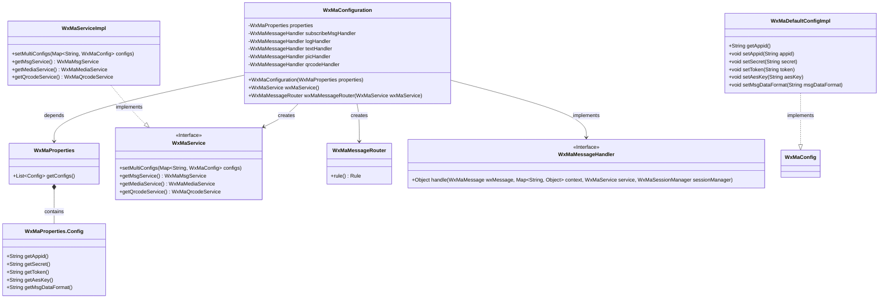
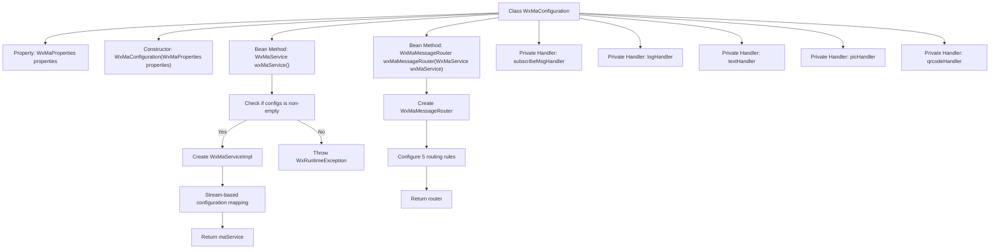
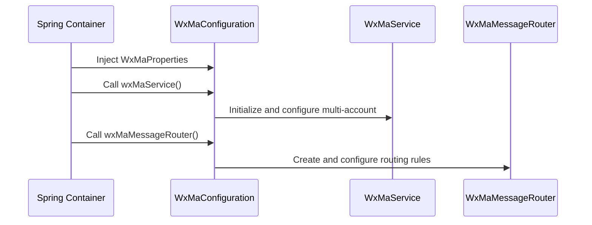

# Basic Information

|      |      |
|------|------|
| Name | WxMaConfiguration |
| Language | .java |
| Code Path | weixin-java-miniapp-demo/src/main/java/com/github/binarywang/demo/wx/miniapp/config/WxMaConfiguration.java |
| Package Name | com.github.binarywang.demo.wx.miniapp.config |
| Dependencies | ['cn.binarywang.wx.miniapp.api.WxMaService', 'cn.binarywang.wx.miniapp.api.impl.WxMaServiceImpl', 'cn.binarywang.wx.miniapp.bean.WxMaKefuMessage', 'cn.binarywang.wx.miniapp.bean.WxMaSubscribeMessage', 'cn.binarywang.wx.miniapp.config.impl.WxMaDefaultConfigImpl', 'cn.binarywang.wx.miniapp.config.impl.WxMaRedisConfigImpl', 'cn.binarywang.wx.miniapp.message.WxMaMessageHandler', 'cn.binarywang.wx.miniapp.message.WxMaMessageRouter', 'com.google.common.collect.Lists', 'lombok.extern.slf4j.Slf4j', 'me.chanjar.weixin.common.bean.result.WxMediaUploadResult', 'me.chanjar.weixin.common.error.WxErrorException', 'me.chanjar.weixin.common.error.WxRuntimeException', 'org.springframework.beans.factory.annotation.Autowired', 'org.springframework.boot.context.properties.EnableConfigurationProperties', 'org.springframework.context.annotation.Bean', 'org.springframework.context.annotation.Configuration', 'redis.clients.jedis.JedisPool', 'java.io.File', 'java.util.List', 'java.util.stream.Collectors'] |
| Brief Description | WeChat Mini Program configuration class, initializes services and message routing, handles subscription, text, image, and QR code messages. |

# Description

This is a configuration class for a WeChat Mini Program backend service, primarily responsible for initializing the WeChat Mini Program service and multi-account configuration, as well as message routing. The class injects configuration properties through its constructor, verifies the validity of the configurations, and then creates an instance of the WeChat Mini Program service. It also configures corresponding handlers for different message types (such as subscription messages, text, images, and QR codes). Each handler is responsible for processing specific types of messages, such as logging, sending customer service messages, uploading images, or generating QR codes. The configuration class ensures that the service can correctly process various WeChat Mini Program messages and provide appropriate responses.

# Class Summary

| Name   | Type  | Description |
|-------|------|-------------|
| WxMaConfiguration | class | This is a WeChat Mini Program configuration class that includes Bean definitions for WxMaService and WxMaMessageRouter, handling message types such as subscription messages, text, images, and QR codes. |

## Class WxMaConfiguration

|      |      |
|------|------|
| Access Modifier | @Slf4j;@Configuration;@EnableConfigurationProperties(WxMaProperties.class);public |
| Type | class |
| Name | WxMaConfiguration |
| Description | This is a WeChat Mini Program configuration class that includes Bean definitions for WxMaService and WxMaMessageRouter, handling message types such as subscription messages, text, images, and QR codes. |

### UML Class Diagram

This code represents a backend configuration class for WeChat Mini Programs, primarily responsible for initializing the WeChat Mini Program service (WxMaService) and message router (WxMaMessageRouter). The WxMaConfiguration class, annotated with @Configuration, indicates it is a configuration class that reads properties from WxMaProperties to initialize WxMaService and creates a message router to handle different types of WeChat messages (e.g., subscription messages, text, images, QR codes). The class diagram illustrates core classes and their relationships, including configuration classes, property classes, service interfaces and their implementations, message handler interfaces, etc., demonstrating the integration approach between Spring configuration classes and the WeChat SDK.

### Internal Method Call Graph

This code represents a Spring Boot configuration class for WeChat Mini Program backend, primarily accomplishing two core functions: 1) Initializing multi-account mini-program services (WxMaService) by streaming configurations into internal data structures; 2) Building message routing (WxMaMessageRouter) with five handlers to process different message types including subscription messages, logs, text, images, and QR codes. The code adopts builder pattern for message configuration and ensures configuration validity through exception handling, clearly demonstrating Spring's dependency injection features in its structure.

### Field List

| Name  | Type  | Description |
|-------|-------|------|
| logHandler = (wxMessage, context, service, sessionManager) -> {        log.info("收到消息：" + wxMessage.toString());        service.getMsgService().sendKefuMsg(WxMaKefuMessage.newTextBuilder().content("收到信息为：" + wxMessage.toJson())            .toUser(wxMessage.getFromUser()).build());        return null;    } | WxMaMessageHandler | Define WeChat Mini Program message handling logic: Record received message content and return message JSON to the sender via the customer service interface. |
| textHandler = (wxMessage, context, service, sessionManager) -> {        service.getMsgService().sendKefuMsg(WxMaKefuMessage.newTextBuilder().content("回复文本消息")            .toUser(wxMessage.getFromUser()).build());        return null;    } | WxMaMessageHandler | This code defines a WeChat Mini Program message handler for replying to user text messages. Upon receiving a user message, it sends a preset text reply to the user via the customer service interface. |
| picHandler = (wxMessage, context, service, sessionManager) -> {        try {            WxMediaUploadResult uploadResult = service.getMediaService()                .uploadMedia("image", "png",                    ClassLoader.getSystemResourceAsStream("tmp.png"));            service.getMsgService().sendKefuMsg(                WxMaKefuMessage                    .newImageBuilder()                    .mediaId(uploadResult.getMediaId())                    .toUser(wxMessage.getFromUser())                    .build());        } catch (WxErrorException e) {            e.printStackTrace();        }        return null;    } | WxMaMessageHandler | Define a WeChat Mini Program image message handler to upload temporary images and send customer service messages to users, printing errors when exceptions occur. |
| subscribeMsgHandler = (wxMessage, context, service, sessionManager) -> {        service.getMsgService().sendSubscribeMsg(WxMaSubscribeMessage.builder()            .templateId("此处更换为自己的模板id")            .data(Lists.newArrayList(                new WxMaSubscribeMessage.MsgData("keyword1", "339208499")))            .toUser(wxMessage.getFromUser())            .build());        return null;    } | WxMaMessageHandler | This is a WeChat Mini Program message handling code, used for sending subscription messages. It constructs messages using template IDs and keyword data, then sends them to specified users. |
| properties | WxMaProperties | A private immutable configuration property object for WeChat Mini Programs. |
| qrcodeHandler = (wxMessage, context, service, sessionManager) -> {        try {            final File file = service.getQrcodeService().createQrcode("123", 430);            WxMediaUploadResult uploadResult = service.getMediaService().uploadMedia("image", file);            service.getMsgService().sendKefuMsg(                WxMaKefuMessage                    .newImageBuilder()                    .mediaId(uploadResult.getMediaId())                    .toUser(wxMessage.getFromUser())                    .build());        } catch (WxErrorException e) {            e.printStackTrace();        }        return null;    } | WxMaMessageHandler | Processing WeChat Mini Program messages, generating QR codes and uploading them as images, then sending them to users via customer service messages. Print errors when exceptions occur. |

### Method List

| Name  | Type  | Description |
|-------|-------|------|
| wxMaService | WxMaService | Create a WeChat Mini Program service instance, check the configuration, and initialize multi-account settings including parameters such as appid and secret key. If not configured, throw an exception prompt. |
| wxMaMessageRouter | WxMaMessageRouter | Create a WeChat Mini Program message router, configure handlers for subscription, text, image, and QR code messages, process synchronously, and return the router instance. |

