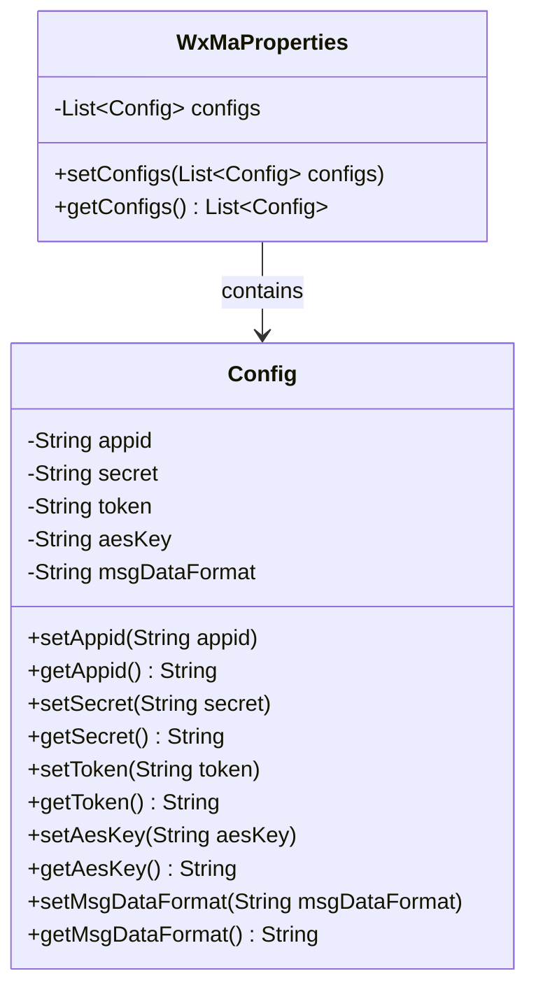
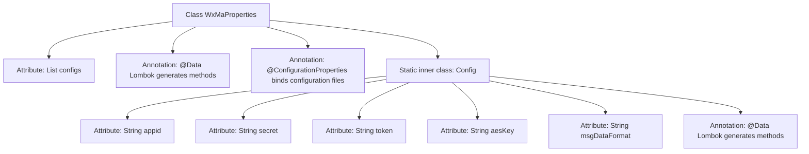

# Basic Information

|      |      |
|------|------|
| Name | WxMaProperties |
| Language | .java |
| Code Path | weixin-java-miniapp-demo/src/main/java/com/github/binarywang/demo/wx/miniapp/config/WxMaProperties.java |
| Package Name | com.github.binarywang.demo.wx.miniapp.config |
| Dependencies | ['java.util.List', 'org.springframework.boot.context.properties.ConfigurationProperties', 'lombok.Data'] |
| Brief Description | The WxMaProperties class defines configuration properties for the WeChat Mini Program, including key configuration items such as appid, secret, token, aesKey, and msgDataFormat. |

# Description

This code defines a Java class named WxMaProperties, which is a configuration property class with the prefix "wx.miniapp". It contains a list named configs, whose elements are of the inner class Config. The Config class defines the core configuration properties for the WeChat Mini Program, including the mini program's appid, secret key, server verification token, message encryption key aesKey, and message data format msgDataFormat. These properties are used to configure the connection and message processing with the WeChat Mini Program server.

# Class Summary

| Name   | Type  | Description |
|-------|------|-------------|
| WxMaProperties | class | WeChat Mini Program configuration property class, including fields such as appid, secret, token, aesKey, and msgDataFormat, supporting multiple configuration items. |

## Class WxMaProperties

|      |      |
|------|------|
| Access Modifier | @Data;@ConfigurationProperties(prefix = "wx.miniapp");public |
| Type | class |
| Name | WxMaProperties |
| Description | WeChat Mini Program configuration property class, including fields such as appid, secret, token, aesKey, and msgDataFormat, supporting multiple configuration items. |

### UML Class Diagram

This class diagram illustrates the class structure for WeChat Mini Program configuration in a Java Spring Boot application. The `WxMaProperties` class serves as the main configuration class, containing a list of `Config` type for storing multiple mini program configurations. The `Config` class, acting as a static inner class, encapsulates core configuration parameters for a WeChat Mini Program, including `appid`, `secret`, `token`, etc. The `@Data` annotation automatically generates getter and setter methods, simplifying property access. This design supports multi-mini-program configuration management and integrates with Spring's `@ConfigurationProperties` mechanism, facilitating property value injection from external configuration files.

### Internal Method Call Graph

This is a WeChat Mini Program configuration properties class that uses the @ConfigurationProperties annotation to bind configuration file properties prefixed with "wx.miniapp" to this class. The class contains a list of Config static inner classes, with each Config object storing configuration information for the Mini Program such as appid, secret, etc. The @Data annotation from Lombok automatically generates getter, setter, and other methods, simplifying code writing.

### Field List

| Name  | Type  | Description |
|-------|-------|------|
| configs | List<Config> | Private variable configs, type is a list of Config objects. |

### Method List

| Name  | Type  | Description |
|-------|-------|------|

