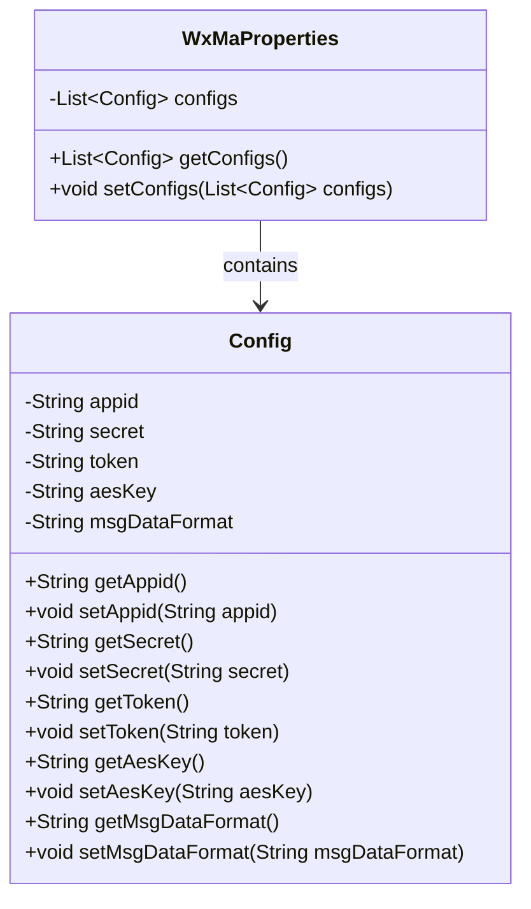
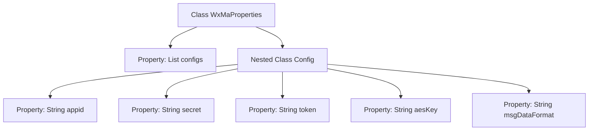

# Basic Information

|      |      |
|------|------|
| Name | WxMaProperties |
| Language | .java |
| Code Path | weixin-java-miniapp-demo/src/main/java/com/github/binarywang/demo/wx/miniapp/config/WxMaProperties.java |
| Package Name | com.github.binarywang.demo.wx.miniapp.config |
| Dependencies | ['java.util.List', 'org.springframework.boot.context.properties.ConfigurationProperties', 'lombok.Data'] |
| Brief Description | The WxMaProperties class contains a list of WeChat Mini Program configurations, with each configuration item including fields such as appid, secret, token, aesKey, and msgDataFormat. |

# Description

This is a Java class definition for configuring properties of a WeChat Mini Program. The main class `WxMaProperties` uses the `@ConfigurationProperties` annotation to bind configurations prefixed with "wx.miniapp" and contains a list of `Config` type named `configs`. The inner class `Config` defines Mini Program-related configuration items: `appid` (Mini Program ID), `secret` (Mini Program secret key), `token` (message server token), `aesKey` (message encryption key), and `msgDataFormat` (message format, supporting XML or JSON). All fields automatically generate getter/setter methods via Lombok's `@Data` annotation.

# Class Summary

| Name   | Type  | Description |
|-------|------|-------------|
| WxMaProperties | class | The WxMaProperties class defines the configuration properties for WeChat Mini Programs, containing multiple Config objects. Each Config object includes fields such as appid, secret, token, aesKey, and msgDataFormat. |

## Class WxMaProperties

|      |      |
|------|------|
| Access Modifier | @Data;@ConfigurationProperties(prefix = "wx.miniapp");public |
| Type | class |
| Name | WxMaProperties |
| Description | The WxMaProperties class defines the configuration properties for WeChat Mini Programs, containing multiple Config objects. Each Config object includes fields such as appid, secret, token, aesKey, and msgDataFormat. |

### UML Class Diagram

This code defines a WeChat Mini Program configuration class WxMaProperties, which includes a nested Config class. WxMaProperties uses the @ConfigurationProperties annotation to bind configurations with the "wx.miniapp" prefix, with its core functionality being to maintain a list of Config objects. Each Config object stores key configuration items such as appid, secret, token, aesKey, and msgDataFormat for the mini program, with getter/setter methods automatically generated via Lombok's @Data annotation. The class diagram clearly illustrates the aggregation relationship between WxMaProperties and Config, reflecting the hierarchical structure of the configuration information.

### Internal Method Call Graph

This code defines a Spring Boot configuration class WxMaProperties for managing multi-account configurations of WeChat Mini Programs. The core is the nested Config class containing key authentication fields such as appid, secret, and token, which are bound to the "wx.miniapp" prefix configuration via @ConfigurationProperties. The flowchart illustrates the hierarchical relationship between the main class and nested class, as well as the composition structure of the five string-type configuration items within the Config class.

### Field List

| Name  | Type  | Description |
|-------|-------|------|
| configs | List<Config> | Private configuration list. |

### Method List

| Name  | Type  | Description |
|-------|-------|------|

