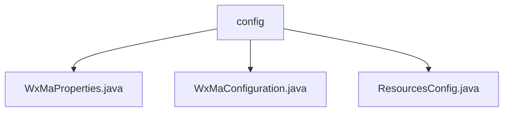

# Basic Information

|      |      |
|------|------|
| Name | config |
| Language | .java |
| Code Path | weixin-java-miniapp-demo/src/main/java/com/github/binarywang/demo/wx/miniapp/config |
| Package Name | docs.src.main.java.com.github.binarywang.demo.wx.miniapp.config |
| Brief Description | WeChat Mini Program backend configuration class: WxMaProperties stores core configuration of the Mini Program such as appid and secret; WxMaConfiguration initializes multi-configuration Mini Program services and message routing, handles logging and various message responses; ResourcesConfig maps local resource access paths and supports cross-origin. |

# Description

## Overview
This module is a Spring Boot integration configuration module for WeChat Mini Program backends. It is responsible for centrally managing the multi-configuration information of mini programs, initializing core services, handling user message routing, and providing resource access support. Its interface specification is primarily based on Spring configuration classes to expose core beans externally, and utilizes property classes with agreed prefixes for centralized configuration.

Key data structures include the `WxMaProperties.Config` inner class, which encapsulates connection and security attributes for a single mini program, such as `appid`, `secret`, `token`, `aesKey`, and `msgDataFormat`. External dependencies mainly include Spring Boot, WebMvc, and the WeChat Mini Program Java SDK. For example, `WxMaService` provides multi-mini-program instance management.

## Main Business Scenarios
The module integrates the business processes of mini program configuration loading, message routing, and resource services, forming a complete processing view from reception to response. The interaction pattern resembles an event bus, where the message router dispatches user requests to corresponding handlers based on type (e.g., text, image).

Functional completeness is reflected in stages such as configuration validation, message logging, customer service replies, and media file processing. Typical applications include integrating multi-mini-program backend services and accessing frontend resource files. API types encompass configuration beans and MVC resource mappings. Integration examples include implementing automatic replies for subscription messages through `WxMaMessageRouter` rules.

### Package Internal Structure View

This flowchart illustrates the structural relationship of the configuration file directory within the WeChat Mini Program Demo project. The top-level node is the "config" directory, which contains three specific configuration files: WxMaProperties.java, WxMaConfiguration.java, and ResourcesConfig.java. These three files are at the same hierarchical level, all directly subordinate to the config directory, together forming the project's foundational configuration module.

# File List

| Name   | Type  | Description |
|-------|------|-------------|
| [WxMaProperties.java](WxMaProperties.md) | file | The WxMaProperties class defines configuration properties for WeChat Mini Programs, including key configuration items such as appid, secret, token, aesKey, and msgDataFormat. |
| [WxMaConfiguration.java](WxMaConfiguration.md) | file | This code configures the WeChat Mini Program service. It defines two core Beans: one for setting up the multi-instance service for the Mini Program (WxMaService), initialized based on the configuration list in the properties file; the other defines message routing rules (WxMaMessageRouter), which routes messages to corresponding handlers based on the message content type (such as text, images). The handlers are responsible for processing subscription messages, logging, replying with text, sending images or QR codes, and other specific business logic. |
| [ResourcesConfig.java](ResourcesConfig.md) | file | Configuration file class implements WebMvc configuration, mapping the local file upload path as a static resource, and enabling cross-domain support to allow access to resources under this path from all domains via the GET method. |

