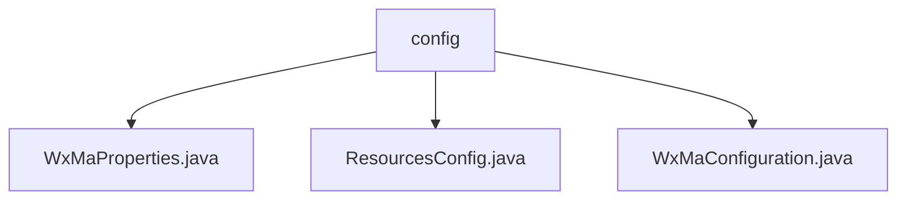

# Basic Information

|      |      |
|------|------|
| Name | config |
| Language | .java |
| Code Path | weixin-java-miniapp-demo/src/main/java/com/github/binarywang/demo/wx/miniapp/config |
| Package Name | docs.src.main.java.com.github.binarywang.demo.wx.miniapp.config |
| Brief Description | WeChat Mini Program Java configuration classes: WxMaProperties binds Mini Program configuration items; ResourcesConfig handles file uploads and cross-origin; WxMaConfiguration initializes services and configures message handlers. |

# Description

## Overview  
This module serves as the core configuration system for the WeChat Mini Program backend, responsible for integrating basic Mini Program attributes, file resource management, and message processing functionalities. Through Spring Boot configuration property binding, it supports multi-account configurations (e.g., AppID/Secret) in a manner similar to a microservices configuration center. Key data structures include WxMaProperties.Config (for storing Mini Program credentials) and resource path mapping pairs. External dependencies include the Spring Boot configuration system, WeChat SDK, and Lombok. For example, WxMaProperties loads YML configurations via @ConfigurationProperties.

## Primary Business Scenarios  
The module primarily handles two types of scenarios: loading configurations for multiple Mini Programs and establishing message routing during the initialization phase, and managing file uploads and cross-origin access during runtime. It adopts a "configuration as a service" model, such as ResourcesConfig mapping local paths to web resources. Message processing follows the chain-of-responsibility pattern, where WxMaConfiguration assigns handlers for different message types (e.g., text/image). Typical applications include credential validation, media file management, and asynchronous message responses, featuring a message distribution mechanism akin to an event bus.

### Package Internal Structure View

This flowchart illustrates the structure of three configuration files under the config directory in the WeChat Mini Program demo project. The files WxMaProperties.java, ResourcesConfig.java, and WxMaConfiguration.java are all directly subordinate to the config directory, clearly presenting the file organization of the project's configuration module. This structure helps developers quickly locate the implementation classes for WeChat Mini Program-related configurations.

# File List

| Name   | Type  | Description |
|-------|------|-------------|
| [WxMaProperties.java](WxMaProperties.md) | file | The WxMaProperties class contains a list of WeChat Mini Program configurations, with each configuration item including the fields appid, secret, token, aesKey, and msgDataFormat. |
| [ResourcesConfig.java](ResourcesConfig.md) | file | Java configuration class implements local file path mapping and cross-origin support, sets file storage path and prefix, and allows GET requests for cross-origin access. |
| [WxMaConfiguration.java](WxMaConfiguration.md) | file | WeChat Mini Program configuration class, initializes services and message routing, handles subscription, text, image, and QR code messages. |

