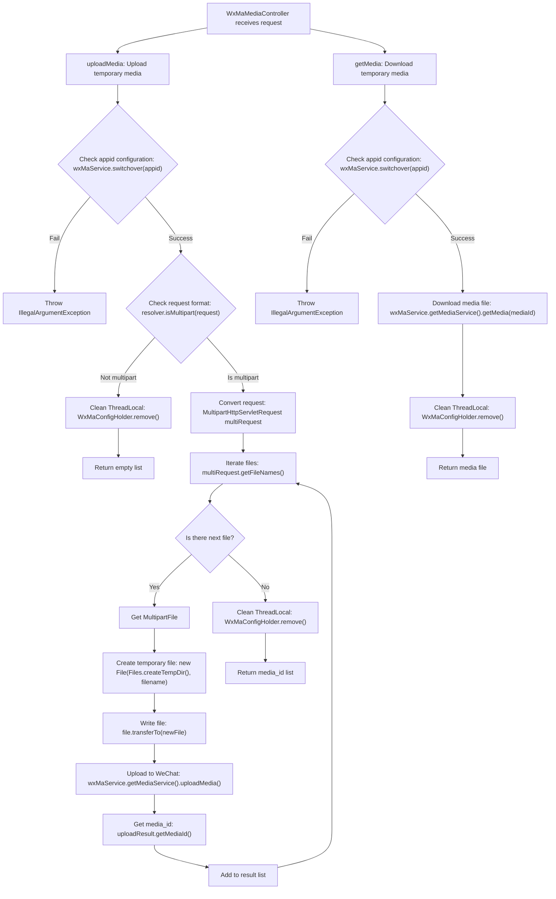

# Basic Information

|      |      |
|------|------|
| Name | WxMaMediaController |
| Language | .java |
| Code Path | weixin-java-miniapp-demo/src/main/java/com/github/binarywang/demo/wx/miniapp/controller/WxMaMediaController.java |
| Package Name | com.github.binarywang.demo.wx.miniapp.controller |
| Dependencies | ['cn.binarywang.wx.miniapp.api.WxMaService', 'cn.binarywang.wx.miniapp.constant.WxMaConstants', 'cn.binarywang.wx.miniapp.util.WxMaConfigHolder', 'com.google.common.collect.Lists', 'com.google.common.io.Files', 'lombok.AllArgsConstructor', 'lombok.extern.slf4j.Slf4j', 'me.chanjar.weixin.common.bean.result.WxMediaUploadResult', 'me.chanjar.weixin.common.error.WxErrorException', 'org.springframework.web.bind.annotation', 'org.springframework.web.multipart.MultipartFile', 'org.springframework.web.multipart.MultipartHttpServletRequest', 'org.springframework.web.multipart.commons.CommonsMultipartResolver', 'javax.servlet.http.HttpServletRequest', 'java.io.File', 'java.io.IOException', 'java.util.Iterator', 'java.util.List'] |
| Brief Description | This is a WeChat Mini Program temporary media management controller. It includes two interfaces: uploading and downloading media. The upload interface handles multiple files and returns a list of media IDs; the download interface retrieves files based on media IDs. Before and after execution, Mini Program configuration switching and cleanup are performed. |

# Description

This is a media file management controller for WeChat Mini Program based on Spring Boot. It includes two core interfaces. The first interface uploads temporary materials via an HTTP POST request. It receives the Mini Program identifier appid and an HTTP request containing a file. It first verifies whether the appid configuration exists, then processes the multipart form data, saves the received file as a temporary file, calls the WeChat service to upload it, and finally returns a list containing the uploaded media_id. The second interface downloads temporary materials via an HTTP GET request. Based on the incoming Mini Program identifier appid and media file ID mediaId, it performs configuration verification, then calls the WeChat service to retrieve the corresponding media file and returns it. Both interfaces clean up the configuration information in the current thread after execution.

# Class Summary

| Name   | Type  | Description |
|-------|------|-------------|
| WxMaMediaController | class | This is a WeChat Mini Program multimedia controller that provides the functionality to upload and download temporary media. Uploading supports multi-file processing, verifies app configurations, uploads through the WeChat API, and returns a media_id. Downloading retrieves files via media_id. Thread storage is cleared after operations. |


## Class WxMaMediaController

|      |      |
|------|------|
| Access Modifier | @RestController;@AllArgsConstructor;@Slf4j;@RequestMapping("/wx/media/{appid}");public |
| Type | class |
| Name | WxMaMediaController |
| Description | This is a WeChat Mini Program multimedia controller that provides the functionality to upload and download temporary media. Uploading supports multi-file processing, verifies app configurations, uploads through the WeChat API, and returns a media_id. Downloading retrieves files via media_id. Thread storage is cleared after operations. |


### UML Class Diagram

```mermaid
classDiagram
    class WxMaMediaController {
        -WxMaService wxMaService
        +List~String~ uploadMedia(String appid, HttpServletRequest request) WxErrorException
        +File getMedia(String appid, String mediaId) WxErrorException
    }
    
    class WxMaService {
        +boolean switchover(String appid)
        +WxMaMediaService getMediaService()
    }
    
    class <<Interface>> WxMaMediaService {
        +WxMediaUploadResult uploadMedia(WxMaConstants.KefuMsgType type, File file) WxErrorException
        +File getMedia(String mediaId) WxErrorException
    }
    
    class WxMediaUploadResult {
        -String mediaId
        +String getMediaId()
    }
    
    class WxMaConstants {
        class KefuMsgType {
            <<enumeration>>
            IMAGE
            VOICE
            VIDEO
            THUMB
        }
    }
    
    class WxMaConfigHolder {
        +static void remove()
    }
    
    class CommonsMultipartResolver {
        +boolean isMultipart(HttpServletRequest request)
    }
    
    WxMaMediaController --> WxMaService : depends on
    WxMaMediaController --> CommonsMultipartResolver : uses
    WxMaMediaController --> WxMaConfigHolder : calls
    WxMaService --> WxMaMediaService : associates
    WxMaMediaService --> WxMediaUploadResult : returns
    WxMaMediaController --> WxMaConstants : references
```

This class diagram illustrates the controller class structure for managing media files in a WeChat Mini Program. WxMaMediaController, as a REST controller, depends on WxMaService to handle WeChat-related business logic. The controller provides interfaces for uploading and downloading temporary media assets, obtaining the media service through WxMaService to perform the specific upload and download operations. It uses CommonsMultipartResolver to handle multipart requests during upload, and directly calls the media service for downloads. Throughout the process, WxMaConfigHolder manages ThreadLocal configurations and cleans up resources after operations are complete.


### Internal Method Call Graph



This flowchart illustrates the complete process for a WeChat Mini Program media controller handling the upload and download of temporary media. The upload process includes configuration verification, request format checking, multi-file iteration processing, and WeChat API calls, concluding with ThreadLocal cleanup and result return. The download process is relatively simpler, primarily involving configuration verification and WeChat API calls. Both processes incorporate exception handling and resource cleanup mechanisms to ensure system stability and security.

### Field List

| Name  | Type  | Description |
|-------|-------|------|
| wxMaService | WxMaService | This code defines a private, immutable WeChat Mini Program service instance variable `wxMaService`. |

### Method List

| Name  | Type  | Description |
|-------|-------|------|
| uploadMedia | List<String> | This code is a Java method for handling file uploads. It first checks if the configuration is correct, then parses the uploaded files, uploads each file to the WeChat Media service, and collects the returned media IDs. After processing, it cleans up the configuration information and finally returns the list of media IDs. |
| getMedia | File | This Java method is a GET request interface used to download WeChat Mini Program media files based on appid and mediaId. First, it checks whether the appid configuration exists. If it exists, the corresponding media file is obtained. Finally, it cleans up the thread-local storage and returns the file. |


