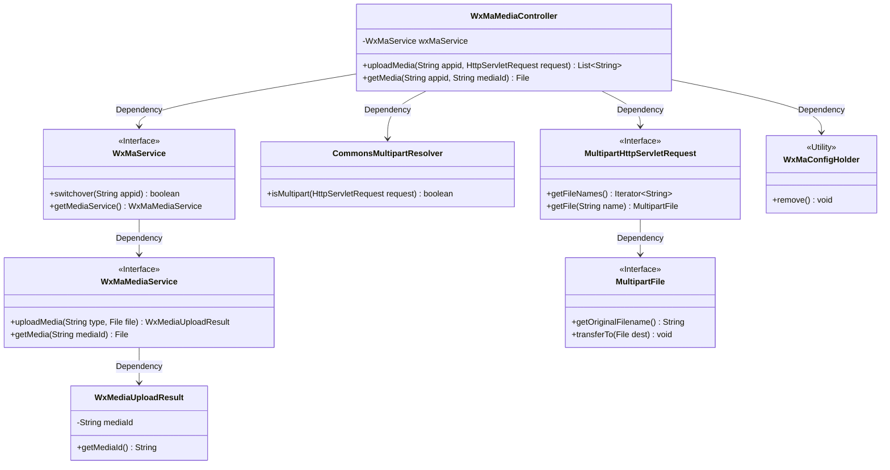
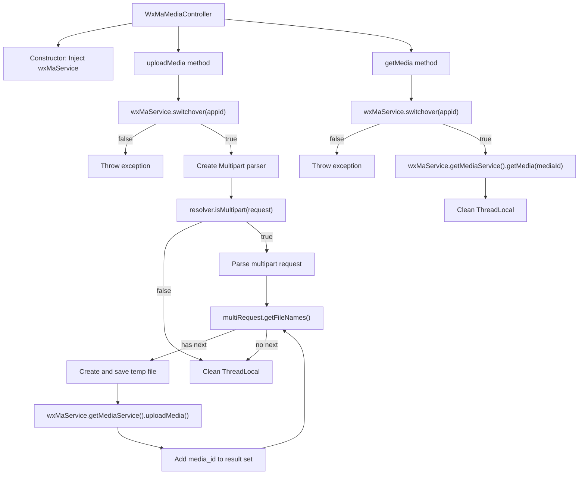
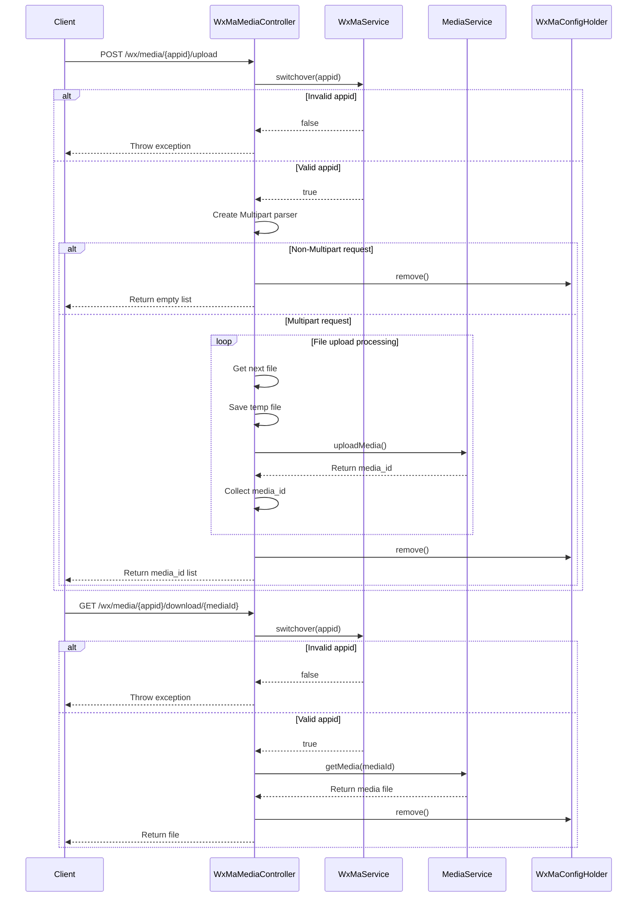

# Basic Information

|      |      |
|------|------|
| Name | WxMaMediaController |
| Language | .java |
| Code Path | weixin-java-miniapp-demo/src/main/java/com/github/binarywang/demo/wx/miniapp/controller/WxMaMediaController.java |
| Package Name | com.github.binarywang.demo.wx.miniapp.controller |
| Dependencies | ['cn.binarywang.wx.miniapp.api.WxMaService', 'cn.binarywang.wx.miniapp.constant.WxMaConstants', 'cn.binarywang.wx.miniapp.util.WxMaConfigHolder', 'com.google.common.collect.Lists', 'com.google.common.io.Files', 'lombok.AllArgsConstructor', 'lombok.extern.slf4j.Slf4j', 'me.chanjar.weixin.common.bean.result.WxMediaUploadResult', 'me.chanjar.weixin.common.error.WxErrorException', 'org.springframework.web.bind.annotation', 'org.springframework.web.multipart.MultipartFile', 'org.springframework.web.multipart.MultipartHttpServletRequest', 'org.springframework.web.multipart.commons.CommonsMultipartResolver', 'javax.servlet.http.HttpServletRequest', 'java.io.File', 'java.io.IOException', 'java.util.Iterator', 'java.util.List'] |
| Brief Description | WeChat Mini Program Material Controller, providing upload and download functions for temporary materials. Upload requires appid verification and handles multiple files, returning a list of media_ids; download requires appid verification and returns the material file. |

# Description

This is a WeChat Mini Program media file management controller class, which includes functions for uploading and downloading temporary materials. The upload interface receives the appid and HTTP request, processes multi-file uploads after validating configurations, and returns a list of media_ids. The download interface retrieves media files based on the appid and mediaId. Both operations will clear the configuration information stored in ThreadLocal. The upload process involves temporary file creation and exception handling, while the download process directly returns the file object.

# Class Summary

| Name   | Type  | Description |
|-------|------|-------------|
| WxMaMediaController | class | The WxMaMediaController handles the uploading and downloading of temporary media files for WeChat Mini Programs, including returning a list of media_ids from uploads and retrieving files from downloads, while verifying the validity of the appid. |

## Class WxMaMediaController

|      |      |
|------|------|
| Access Modifier | @RestController;@AllArgsConstructor;@Slf4j;@RequestMapping("/wx/media/{appid}");public |
| Type | class |
| Name | WxMaMediaController |
| Description | The WxMaMediaController handles the uploading and downloading of temporary media files for WeChat Mini Programs, including returning a list of media_ids from uploads and retrieving files from downloads, while verifying the validity of the appid. |

### UML Class Diagram

Class Diagram Description: This diagram illustrates the class structure of a WeChat Mini Program media management controller. WxMaMediaController handles media upload/download via WxMaService, depends on CommonsMultipartResolver for multipart request parsing, uses MultipartHttpServletRequest to retrieve uploaded files, and interacts with WeChat API through WxMaMediaService. WxMaConfigHolder clears thread-local variables, with each interface clearly separating responsibilities across different layers.

### Internal Method Call Graph

This code implements a WeChat Mini Program media file management controller, containing two core functionalities: uploading temporary materials and downloading temporary materials. The upload process validates the appid, parses multipart requests, handles multiple file uploads, and returns a media_id list. The download process similarly validates the appid before retrieving the media file via media_id. Both operations ultimately clean up configuration information stored in ThreadLocal to ensure thread safety. The code includes comprehensive error handling and logging mechanisms.

### Field List

| Name  | Type  | Description |
|-------|-------|------|
| wxMaService | WxMaService | WeChat Mini Program service instance, private and immutable. |

### Method List

| Name  | Type  | Description |
|-------|-------|------|
| uploadMedia | List<String> | This is an interface for handling file uploads. After verifying the appid, it receives multiple files, saves them as temporary files, uploads them to the WeChat server, and returns a list of media IDs. |
| getMedia | File | The code is a GET interface designed to download media files based on appid and mediaId. It first checks the validity of the appid, returning an error if invalid. If valid, it retrieves the corresponding file, cleans up the ThreadLocal, and then returns the result. |

