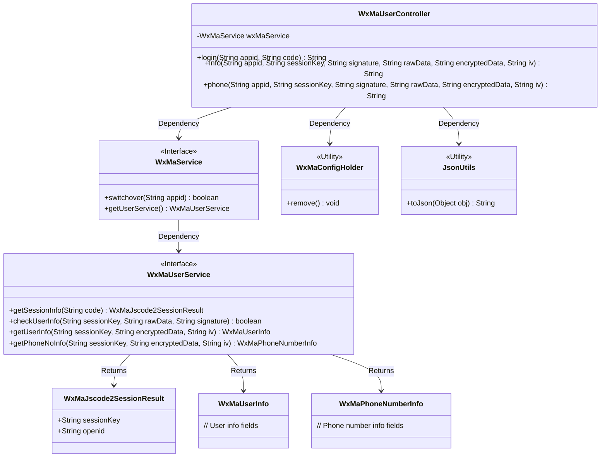
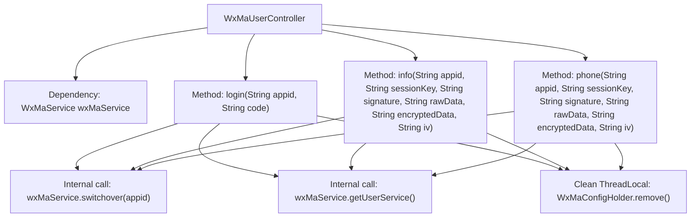
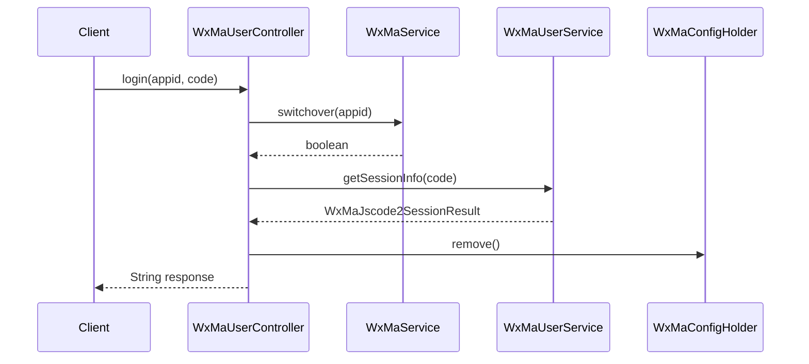

# Basic Information

|      |      |
|------|------|
| Name | WxMaUserController |
| Language | .java |
| Code Path | weixin-java-miniapp-demo/src/main/java/com/github/binarywang/demo/wx/miniapp/controller/WxMaUserController.java |
| Package Name | com.github.binarywang.demo.wx.miniapp.controller |
| Dependencies | ['cn.binarywang.wx.miniapp.api.WxMaService', 'cn.binarywang.wx.miniapp.bean.WxMaJscode2SessionResult', 'cn.binarywang.wx.miniapp.bean.WxMaPhoneNumberInfo', 'cn.binarywang.wx.miniapp.bean.WxMaUserInfo', 'cn.binarywang.wx.miniapp.util.WxMaConfigHolder', 'com.github.binarywang.demo.wx.miniapp.utils.JsonUtils', 'lombok.AllArgsConstructor', 'lombok.extern.slf4j.Slf4j', 'me.chanjar.weixin.common.error.WxErrorException', 'org.apache.commons.lang3.StringUtils', 'org.springframework.web.bind.annotation.GetMapping', 'org.springframework.web.bind.annotation.PathVariable', 'org.springframework.web.bind.annotation.RequestMapping', 'org.springframework.web.bind.annotation.RestController'] |
| Brief Description | WeChat Mini Program User Controller, providing interfaces for login, user information, and mobile number retrieval, verifying appid and user data, returning results in JSON format, and clearing ThreadLocal after each request. |

# Description

This is a WeChat Mini Program user management controller class that includes three interfaces: the login interface receives appid and code parameters, verifies them, and returns user session information; the user information interface receives parameters such as appid and sessionKey, performs validation, and returns decrypted user information; the phone number interface similarly receives parameters like appid, validates them, and returns decrypted phone number information. All interfaces will clear the configuration information stored in ThreadLocal after the operation is completed.

# Class Summary

| Name   | Type  | Description |
|-------|------|-------------|
| WxMaUserController | class | WeChat Mini Program User Controller, providing interfaces for login, user information, and mobile number retrieval, verifying appid and user data, returning JSON results, and cleaning up ThreadLocal after use. |

## Class WxMaUserController

|      |      |
|------|------|
| Access Modifier | @RestController;@AllArgsConstructor;@Slf4j;@RequestMapping("/wx/user/{appid}");public |
| Type | class |
| Name | WxMaUserController |
| Description | WeChat Mini Program User Controller, providing interfaces for login, user information, and mobile number retrieval, verifying appid and user data, returning JSON results, and cleaning up ThreadLocal after use. |

### UML Class Diagram

Class diagram description:
WxMaUserController is a WeChat Mini Program user-related REST controller that interacts with the WeChat backend through WxMaService, providing three core functionalities: login, retrieving user information, and obtaining phone numbers. The controller relies on the WxMaService interface to implement business logic, where WxMaService in turn depends on the WxMaUserService interface for specific user operations. Return results are serialized using the JsonUtils utility class, with WxMaConfigHolder managing thread-local variables. The overall design adheres to the Interface Segregation Principle, with clear responsibilities for each component and reduced coupling through interfaces.

### Internal Method Call Graph

This code represents a WeChat Mini Program user-related Spring Boot controller containing three core interfaces: login, fetch user info, and retrieve user phone number. All interfaces first validate appid validity through WxMaService for WeChat API interactions, and finally clean up ThreadLocal-stored configurations. The login interface exchanges JS code for session, the user info interface verifies and decrypts user data, while the phone number interface specifically handles encrypted phone number decryption. Each method follows a "validate-process-clean" workflow pattern to ensure thread safety and data consistency.

### Field List

| Name  | Type  | Description |
|-------|-------|------|
| wxMaService | WxMaService | Private immutable member variables of the WeChat Mini Program service instance (WxMaService). |

### Method List

| Name  | Type  | Description |
|-------|-------|------|
| login | String | This is a WeChat Mini Program login interface that receives the appid and code parameters, verifies the validity of the code, retrieves user session information, returns the session_key and openid, and returns error messages in case of exceptions, finally clearing the ThreadLocal. |
| info | String | The code is a backend interface for a WeChat Mini Program, designed to verify user information and decrypt returned user data. It first checks the appid configuration, then validates the user information signature, and finally decrypts the data to return the user information in JSON format. |
| phone | String | WeChat user phone number API: Verifies the appid and user information, then decrypts and returns the phone number data. Returns error message on failure. |

