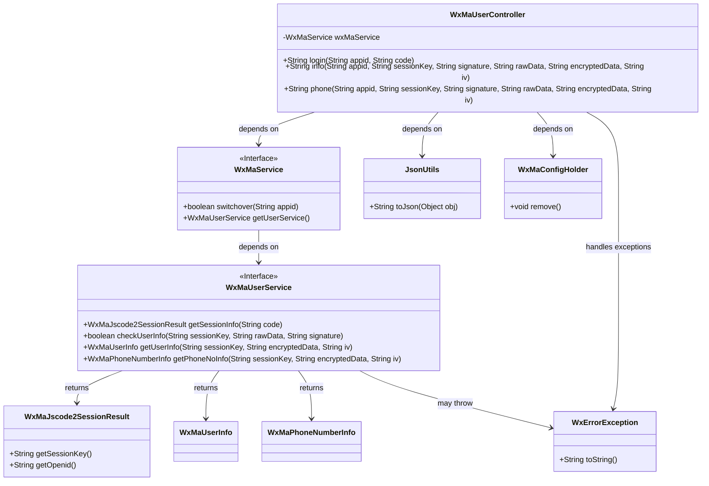
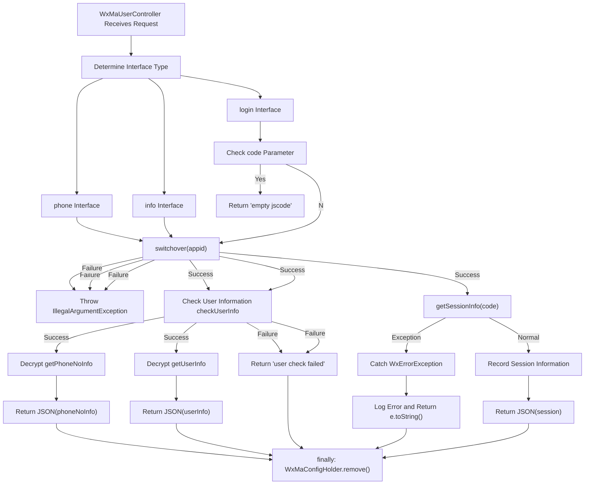

# Basic Information

|      |      |
|------|------|
| Name | WxMaUserController |
| Language | .java |
| Code Path | weixin-java-miniapp-demo/src/main/java/com/github/binarywang/demo/wx/miniapp/controller/WxMaUserController.java |
| Package Name | com.github.binarywang.demo.wx.miniapp.controller |
| Dependencies | ['cn.binarywang.wx.miniapp.api.WxMaService', 'cn.binarywang.wx.miniapp.bean.WxMaJscode2SessionResult', 'cn.binarywang.wx.miniapp.bean.WxMaPhoneNumberInfo', 'cn.binarywang.wx.miniapp.bean.WxMaUserInfo', 'cn.binarywang.wx.miniapp.util.WxMaConfigHolder', 'com.github.binarywang.demo.wx.miniapp.utils.JsonUtils', 'lombok.AllArgsConstructor', 'lombok.extern.slf4j.Slf4j', 'me.chanjar.weixin.common.error.WxErrorException', 'org.apache.commons.lang3.StringUtils', 'org.springframework.web.bind.annotation.GetMapping', 'org.springframework.web.bind.annotation.PathVariable', 'org.springframework.web.bind.annotation.RequestMapping', 'org.springframework.web.bind.annotation.RestController'] |
| Brief Description | This is a controller that handles user-related requests in WeChat Mini Program. It includes three main interfaces: user login, retrieving user information, and obtaining user phone number. All interfaces rely on WeChat services for authentication and data decryption, and they perform cleanup of thread-local resources before and after operations. |

# Description

This is a controller class that handles user-related requests for WeChat Mini Programs. It provides three main interfaces. The first is the user login interface, which receives a Mini Program code to obtain a session from the WeChat server, returning JSON data containing the session key and the user's unique identifier. The second interface is used to retrieve the user's basic information; it first verifies the user data signature, then decrypts and returns the user information in JSON format. The third interface is used to obtain the user's bound mobile phone number information, also performing signature verification and decryption before returning the phone number information in JSON. During the processing of each interface, the configuration for the corresponding Mini Program is first checked and switched, and after the method execution, the relevant thread-local storage is cleaned up to ensure proper resource release and data isolation.

# Class Summary

| Name   | Type  | Description |
|-------|------|-------------|
| WxMaUserController | class | This is a backend controller for a WeChat Mini Program, used to handle user login, obtaining user information and phone numbers, and other operations. It includes three interfaces: /login is for user login and obtaining session information; /info is for obtaining user information; /phone is for obtaining the user's phone number. All operations undergo security checks and data decryption. |

## Class WxMaUserController

|      |      |
|------|------|
| Access Modifier | @RestController;@AllArgsConstructor;@Slf4j;@RequestMapping("/wx/user/{appid}");public |
| Type | class |
| Name | WxMaUserController |
| Description | This is a backend controller for a WeChat Mini Program, used to handle user login, obtaining user information and phone numbers, and other operations. It includes three interfaces: /login is for user login and obtaining session information; /info is for obtaining user information; /phone is for obtaining the user's phone number. All operations undergo security checks and data decryption. |

### UML Class Diagram

This class diagram describes the structure of the WeChat Mini Program user management controller. WxMaUserController acts as a REST controller, depending on the WxMaService interface to handle WeChat-related business logic. The controller provides three main interfaces: `login` for user login to obtain session information, `info` for retrieving basic user information, and `phone` for obtaining user phone number information. All methods interact with the WeChat API via WxMaService and use WxMaConfigHolder to manage thread-local configurations, ensuring data isolation in a multi-tenant environment. Exception handling and JSON serialization are also important functional components of this controller.

### Internal Method Call Graph

This is a WeChat Mini Program user controller, providing three main functions: user login, retrieving user information, and retrieving user phone number. The code first checks the validity of the appid configuration, then executes corresponding business logic based on different interfaces. The login interface needs to verify the code parameter and obtain session information; the user information and phone number interfaces need to verify user data signatures and decrypt data. All interfaces finally clean up configuration information in ThreadLocal to ensure thread safety. Exceptions return corresponding error messages, while the normal process returns data in JSON format.

### Field List

| Name  | Type  | Description |
|-------|-------|------|
| wxMaService | WxMaService | Define a private immutable member variable wxMaService of type WxMaService. |

### Method List

| Name  | Type  | Description |
|-------|-------|------|
| login | String | This is a login interface for a WeChat mini-program. It receives parameters such as appid and code, checks the validity of the code, and verifies the appid configuration. It uses the code to exchange for the user's openid and session_key, and returns this information. During the processing, it catches exceptions and cleans up thread-local storage. |
| info | String | This is a WeChat Mini Program backend interface for retrieving and verifying user information. It first checks the appid configuration, then validates the user data signature, and finally decrypts and returns the user information. The interface will clean up the thread-local storage after processing is complete. |
| phone | String | This is a backend interface method for a WeChat Mini Program, used to retrieve a user's phone number. The processing flow is as follows: first, check and switch the WeChat service configuration; then, validate the user information; finally, decrypt the data and return the phone number information. The entire process includes necessary security checks and data cleaning. |

