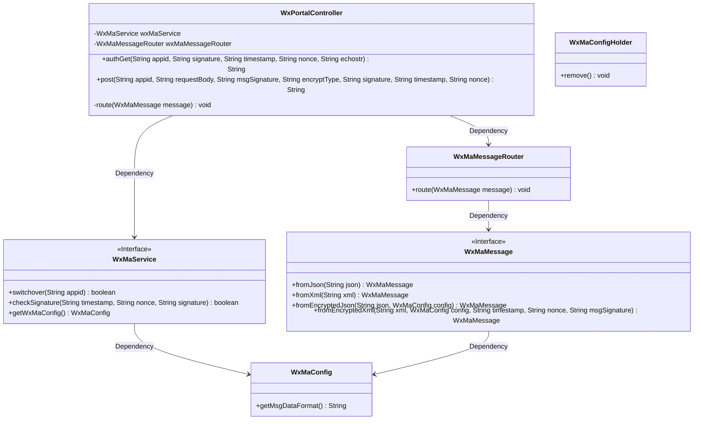
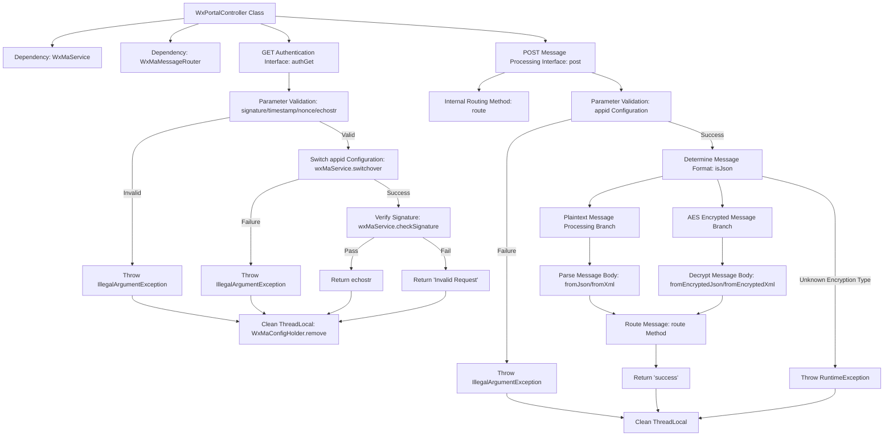

# Basic Information

|      |      |
|------|------|
| Name | WxPortalController |
| Language | .java |
| Code Path | weixin-java-miniapp-demo/src/main/java/com/github/binarywang/demo/wx/miniapp/controller/WxPortalController.java |
| Package Name | com.github.binarywang.demo.wx.miniapp.controller |
| Dependencies | ['cn.binarywang.wx.miniapp.api.WxMaService', 'cn.binarywang.wx.miniapp.bean.WxMaMessage', 'cn.binarywang.wx.miniapp.constant.WxMaConstants', 'cn.binarywang.wx.miniapp.message.WxMaMessageRouter', 'cn.binarywang.wx.miniapp.util.WxMaConfigHolder', 'lombok.AllArgsConstructor', 'lombok.extern.slf4j.Slf4j', 'org.apache.commons.lang3.StringUtils', 'org.springframework.web.bind.annotation', 'java.util.Objects'] |
| Brief Description | WeChat Mini Program Controller, handling GET/POST requests, verifying signatures and routing messages, supporting plaintext and AES-encrypted messages, returning success or error responses. |

# Description

This is a backend controller class for a WeChat Mini Program, containing two main interfaces. The GET interface is used for WeChat server authentication, receiving parameters such as signature, timestamp, nonce, and echostr, and returning the echostr after signature verification. The POST interface handles WeChat message push, supporting both plaintext and AES-encrypted formats. It automatically parses JSON or XML formatted message bodies based on configuration and processes messages through a message router. Both interfaces will clean up the configuration information stored in ThreadLocal at the end. The controller also includes logging and exception handling functionalities.

# Class Summary

| Name   | Type  | Description |
|-------|------|-------------|
| WxPortalController | class | WeChat Mini Program Controller, handling authentication and message requests, verifying signatures and routing messages, supporting plaintext and AES encryption, returning success or error messages. |

## Class WxPortalController

|      |      |
|------|------|
| Access Modifier | @RestController;@AllArgsConstructor;@RequestMapping("/wx/portal/{appid}");@Slf4j;public |
| Type | class |
| Name | WxPortalController |
| Description | WeChat Mini Program Controller, handling authentication and message requests, verifying signatures and routing messages, supporting plaintext and AES encryption, returning success or error messages. |

### UML Class Diagram

Class Diagram Description: This diagram illustrates the core structure of the WeChat Portal Controller (WxPortalController), which interacts with WeChat Service (WxMaService) and Message Router (WxMaMessageRouter) through dependency relationships. The controller contains two main methods: authentication (authGet) and request processing (post). When handling requests from the WeChat server, it verifies signatures, parses message formats (JSON/XML), and routes messages. The message processing involves encryption type determination and thread-local configuration cleanup, demonstrating a complete WeChat message handling workflow.

### Internal Method Call Graph

This flowchart illustrates the core processing logic of the WeChat portal controller, including two main interfaces: GET authentication and POST message processing. The GET interface validates the WeChat server signature through a three-layer verification process (non-empty parameter check, appid configuration check, and signature verification) before returning a response. The POST interface branches based on encryption type, supporting both plaintext and AES-encrypted message formats, ultimately distributing messages via a message router. Both interfaces include a ThreadLocal cleanup mechanism to ensure thread safety.

### Field List

| Name  | Type  | Description |
|-------|-------|------|
| wxMaMessageRouter | WxMaMessageRouter | WeChat Mini Program Message Routing Object |
| wxMaService | WxMaService | WeChat Mini Program service instance, private and immutable. |

### Method List

| Name  | Type  | Description |
|-------|-------|------|
| route | void | Route handling for WeChat Mini Program messages, logging error logs in case of exceptions. |
| authGet | String | This is a GET interface for handling WeChat server authentication requests, which verifies the signature parameters and returns the echostr or an error message. |
| post | String | POST interface for handling WeChat requests, supporting plaintext and AES-encrypted messages. After verifying the appid, it parses and routes messages based on their format (JSON/XML), then cleans up ThreadLocal before returning success or error responses. |

