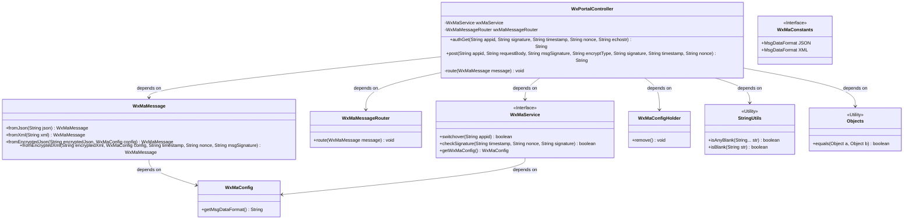
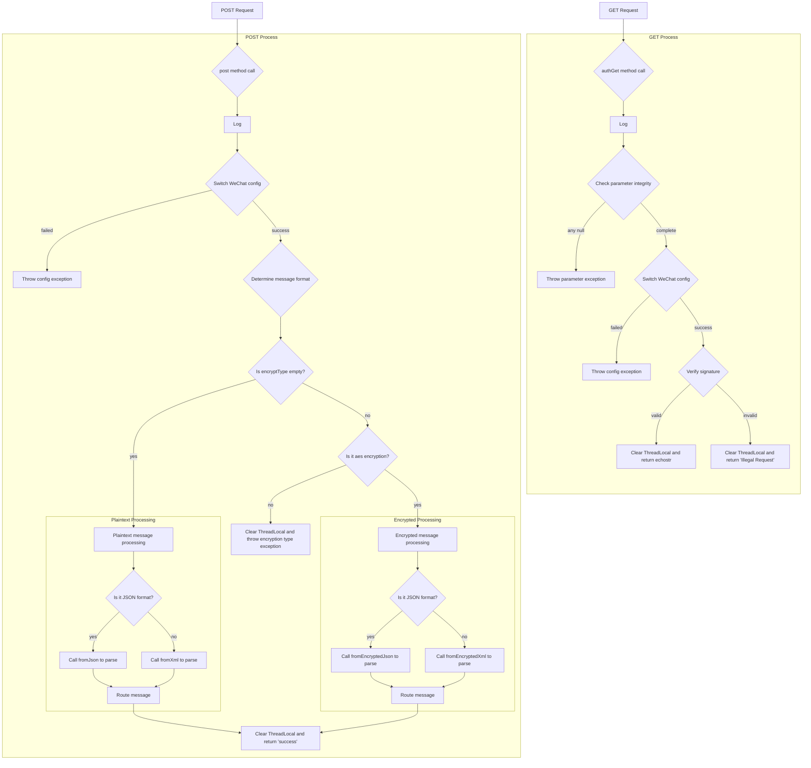
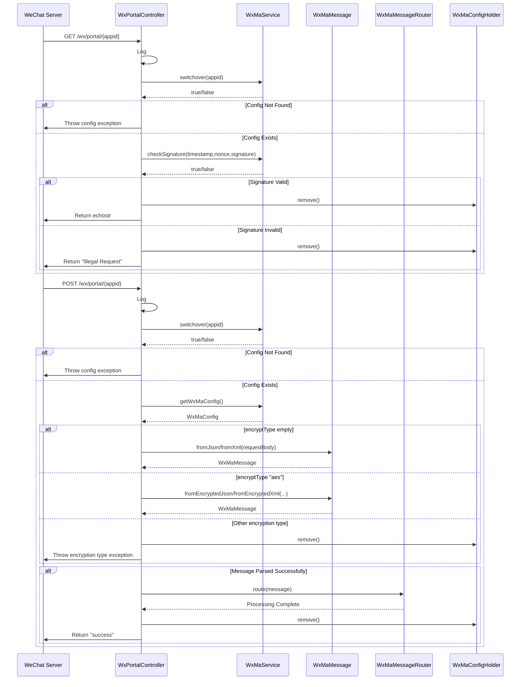
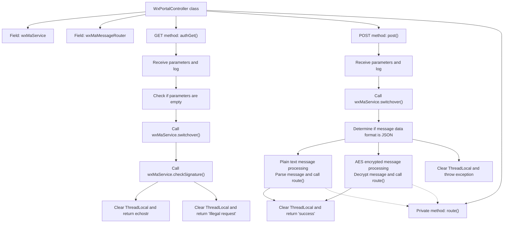

# Basic Information

|      |      |
|------|------|
| Name | WxPortalController |
| Language | .java |
| Code Path | weixin-java-miniapp-demo/src/main/java/com/github/binarywang/demo/wx/miniapp/controller/WxPortalController.java |
| Package Name | com.github.binarywang.demo.wx.miniapp.controller |
| Dependencies | ['cn.binarywang.wx.miniapp.api.WxMaService', 'cn.binarywang.wx.miniapp.bean.WxMaMessage', 'cn.binarywang.wx.miniapp.constant.WxMaConstants', 'cn.binarywang.wx.miniapp.message.WxMaMessageRouter', 'cn.binarywang.wx.miniapp.util.WxMaConfigHolder', 'lombok.AllArgsConstructor', 'lombok.extern.slf4j.Slf4j', 'org.apache.commons.lang3.StringUtils', 'org.springframework.web.bind.annotation', 'java.util.Objects'] |
| Brief Description | This is a controller class for handling server requests in WeChat Mini Programs. It includes two core interfaces: one for validating server configuration via a GET request, and another for processing user messages via a POST request. The controller handles message routing based on request parameters and message formats, and ensures the cleanup of thread-local storage after each request. |

# Description

This is a controller class for processing server messages from WeChat Mini Programs. It includes two core methods: one for handling verification requests from the WeChat server, which verifies the signature parameters and returns a specific string to complete server validation; the other for processing various types of messages sent by users, supporting both plaintext and AES encryption formats. The processing flow includes checking application ID configuration, parsing messages according to the encryption type, routing messages to corresponding processing logic, and cleaning up thread-local configuration after each request. The entire controller is responsible for communicating with the WeChat server, verifying message sources, and distributing and processing user messages.

# Class Summary

| Name   | Type  | Description |
|-------|------|-------------|
| WxPortalController | class | This is a backend controller for a WeChat Mini Program, containing two interfaces. The GET interface handles WeChat server verification, receiving parameters such as signature, timestamp, nonce, and echostr for validation. The POST interface processes user messages, supporting plaintext and AES encryption formats, routes the processing after parsing the messages, and cleans up thread-local storage. |

## Class WxPortalController

|      |      |
|------|------|
| Access Modifier | @RestController;@AllArgsConstructor;@RequestMapping("/wx/portal/{appid}");@Slf4j;public |
| Type | class |
| Name | WxPortalController |
| Description | This is a backend controller for a WeChat Mini Program, containing two interfaces. The GET interface handles WeChat server verification, receiving parameters such as signature, timestamp, nonce, and echostr for validation. The POST interface processes user messages, supporting plaintext and AES encryption formats, routes the processing after parsing the messages, and cleans up thread-local storage. |

### UML Class Diagram

**Flowchart:**

**Sequence Diagram:**

**Class Diagram Description:**
This is a class diagram of a WeChat Official Account message processing controller layer. It includes a core controller `WxPortalController`, which depends on the WeChat message service interface `WxMaService` for configuration switching and signature verification, and the message router `WxMaMessageRouter` for message distribution. The message entity class `WxMaMessage` provides multiple message parsing methods. The configuration class `WxMaConfig` stores message format settings. Utility classes `StringUtils` and `Objects` are used for parameter validation. The entire structure illustrates the complete processing flow of WeChat message reception, verification, parsing, and routing. Thread safety is ensured by the ThreadLocal configuration holder `WxMaConfigHolder`.

### Internal Method Call Graph

This is a flowchart of a WeChat Official Account/Mini Program backend server verification and message processing controller. The controller provides two main endpoints: the GET method is used for WeChat server URL verification. It receives parameters such as signature and timestamp. Upon successful verification, it returns the echostr to complete the configuration. The POST method is used to process messages sent by users. It parses the messages based on their format (JSON/XML) and encryption type (plain text/AES), then routes them via a message router. All operations conclude by clearing ThreadLocal resources to ensure thread safety.

### Field List

| Name  | Type  | Description |
|-------|-------|------|
| wxMaService | WxMaService | This is a private member variable in a Java class, declared as final, of type WxMaService, used to hold a reference to a WeChat Mini Program service. |
| wxMaMessageRouter | WxMaMessageRouter | The code defines a private constant variable for a WeChat Mini Program message router. |

### Method List

| Name  | Type  | Description |
|-------|-------|------|
| post | String | This is an HTTP interface that receives WeChat message push notifications. It handles requests in both plaintext and AES-encrypted formats, parses messages based on their format (JSON or XML), and routes the parsed messages to corresponding processors. After processing is completed, it returns "success" and clears thread-local storage. If the corresponding mini-program configuration cannot be found or the encryption type is unrecognizable, an exception will be thrown. |
| authGet | String | This is an interface for handling WeChat server authentication requests. It receives parameters such as signatures, verifies the completeness of the parameters, the AppID configuration, and the validity of the signature. If all checks pass, it returns a specified string to complete the verification; otherwise, it returns an error message or indicates an illegal request. |
| route | void | Private method `route` receives WeChat messages, processes them through `wxMaMessageRouter`, and logs error messages when exceptions occur. |

