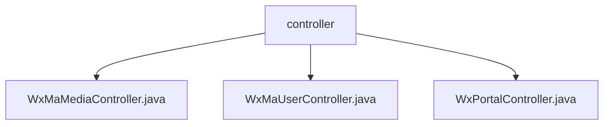

# Basic Information

|      |      |
|------|------|
| Name | controller |
| Language | .java |
| Code Path | weixin-java-miniapp-demo/src/main/java/com/github/binarywang/demo/wx/miniapp/controller |
| Package Name | docs.src.main.java.com.github.binarywang.demo.wx.miniapp.controller |
| Brief Description | Three controller classes in WeChat Mini Program: Media Controller handles file uploads and downloads; User Controller manages login, user information, and phone numbers; Backend Controller handles WeChat server authentication and message push. All include configuration cleanup functionality. |

# Description

## Overview  
This module is a collection of core backend controllers for WeChat Mini Programs, primarily responsible for media file management, user session handling, and interactions with the WeChat server. The interface specifications uniformly adopt the HTTP protocol, all incorporating configuration validation and ThreadLocal cleanup mechanisms, processing various requests from the WeChat ecosystem in a gateway-like manner. Key data structures include WeChat standard parameters such as `media_id`, `appid`, and `sessionKey`. External dependencies include the WeChat JSSDK, message encryption/decryption libraries, and HTTP components. For example, the media controller handles multi-file uploads, while the user controller implements session information decryption.  

## Core Business Scenarios  
The module fully supports the Mini Program development lifecycle: server validation (similar to a handshake protocol), user login authorization (OAuth 2.0 simplified flow), and media resource hosting (similar to CDN edge storage). The typical interaction pattern involves receiving WeChat parameters → validating configurations → executing business logic → returning encrypted/file data. For instance, the portal controller processes both GET/POST requests, while the user controller links the `code2session` and information decryption workflows. API types encompass RESTful interfaces and file transfers, with integration cases including standard WeChat scenarios such as message push handling and temporary media management.

### Package Internal Structure View

This flowchart illustrates the controller hierarchy in the WeChat Mini Program demo project. The root node is the controller folder, which contains three child nodes: WxMaMediaController, WxMaUserController, and WxPortalController—three controller class files. These files reside at the same directory level without deeper nesting relationships.

# File List

| Name   | Type  | Description |
|-------|------|-------------|
| [WxMaMediaController.java](WxMaMediaController.md) | file | WeChat Mini Program Material Controller, providing upload and download functions for temporary materials. Upload requires appid verification and handles multiple files, returning a media_id list; download requires appid verification and returns the material file. |
| [WxMaUserController.java](WxMaUserController.md) | file | WeChat Mini Program User Controller, providing interfaces for login, user information, and mobile number retrieval, verifying appid and user data, returning results in JSON format, and clearing ThreadLocal after each request. |
| [WxPortalController.java](WxPortalController.md) | file | WeChat Mini Program Controller, handling GET/POST requests, verifying signatures and routing messages, supporting plaintext and AES-encrypted messages, returning success or error responses. |

