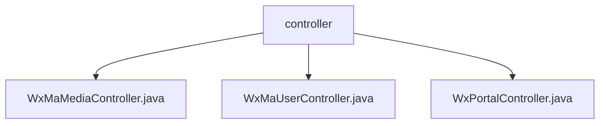

# Basic Information

|      |      |
|------|------|
| Name | controller |
| Language | .java |
| Code Path | weixin-java-miniapp-demo/src/main/java/com/github/binarywang/demo/wx/miniapp/controller |
| Package Name | docs.src.main.java.com.github.binarywang.demo.wx.miniapp.controller |
| Brief Description | WeChat Mini Program Spring Boot Demo includes three controllers. The WxMaMediaController handles the upload and download of media files. The WxMaUserController is responsible for user login, information retrieval, and phone number processing. The WxPortalController is used for WeChat server verification and user message handling. Each controller validates configurations before executing the corresponding business logic and clears thread data. |

# Description

## Overview
This is a backend service module for WeChat Mini Programs built on Spring Boot, providing unified WeChat API proxying and business logic encapsulation. Its core responsibilities are handling requests from the WeChat Mini Program or server, including media file management, user identity authentication and data retrieval, as well as server message verification and distribution. It acts as a bridge between business applications and official WeChat services.

The module adheres to RESTful interface specifications, exposing HTTP endpoints through a series of controllers. Its unified design pattern involves dynamically loading the corresponding configuration based on the incoming Mini Program identifier (appid) before processing each request, and clearing thread-local storage after execution to ensure data isolation. This resembles a configuration-aware request routing layer.

Key data structures include the Mini Program configuration object, media file identifiers (media_id) returned by WeChat services, user session information (containing openid and session_key), and encrypted user data packets. These structures flow between controllers for validation, decryption, and business processing.

External dependencies primarily include the Spring Boot Web framework, the WeChat Java SDK (weixin-java-miniapp) for invoking WeChat services, and potential configuration management services. For example, all controllers depend on `WxMaService` to execute specific WeChat API calls.

Concrete implementation examples are clear. For instance: `WxMaMediaController` receives form files via the `POST /media/upload` interface and uploads them to WeChat, returning a list of media_ids; `WxMaUserController` uses a code via the `GET /user/login` interface to exchange for a user session.

## Key Business Scenarios
The module's business processes mainly revolve around three types of interactions: file resource management, user identity and data management, and server-side message event handling. Together, these constitute the core support capabilities for the Mini Program backend, ensuring complete integration between the Mini Program and the WeChat ecosystem.

The interaction mode is uniformly "configuration validation → call WeChat service → process returned data → clean up environment". In the user login scenario, the frontend submits a code, and the backend calls the `jsCode2SessionInfo` method of `WxMaService` to retrieve the session. Similar to an event bus pattern, `WxPortalController` routes verified user messages to internal handlers.

Functional completeness is reflected in covering key backend interfaces required for Mini Program development, including temporary media upload/download, user login and information retrieval, as well as server configuration verification and message handling. This enables developers to quickly build a Mini Program server with standard WeChat capabilities.

A typical application pattern is: a Mini Program frontend calls the user login interface to complete authentication, after which it can call interfaces to get user information or phone numbers; meanwhile, developers can upload promotional materials on an admin backend; the WeChat server communicates with the backend through the verification interface and message interface.

All API types are HTTP interfaces, with clear integration examples. For instance, the media upload interface integrates file reception with WeChat API calls; the message handling interface integrates signature verification, message decryption, and content routing, supporting both plaintext and AES-encrypted message formats.

### Package Internal Structure View

This flowchart illustrates a folder named `controller`, which serves as the controller layer of the project. The folder directly contains three Java controller files: `WxMaMediaController.java`, `WxMaUserController.java`, and `WxPortalController.java`. These files are responsible for handling business logic related to media upload/download, user information, and request entry points within the WeChat Mini Program, respectively.

# File List

| Name   | Type  | Description |
|-------|------|-------------|
| [WxMaMediaController.java](WxMaMediaController.md) | file | This is a WeChat Mini Program temporary media management controller. It includes two interfaces for uploading and downloading media files. The upload interface handles multiple files and returns a list of media_ids; the download interface retrieves files based on the media_id. Before and after execution, the mini program configuration will be switched and cleaned up. |
| [WxMaUserController.java](WxMaUserController.md) | file | This is a controller that handles user-related requests for a WeChat Mini Program. It includes three main interfaces: user login, retrieving user information, and obtaining user phone numbers. All interfaces rely on WeChat services for authentication and data decryption, and clean up thread-local resources before and after operations. |
| [WxPortalController.java](WxPortalController.md) | file | This is a controller class that handles server requests for WeChat Mini Programs. It includes two core interfaces: one for a GET request to verify server configuration, and another for a POST request to handle user messages. The controller routes messages based on request parameters and message formats, and ensures that ThreadLocal storage is cleaned up after each request. |

