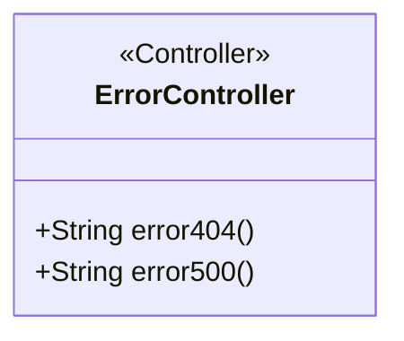
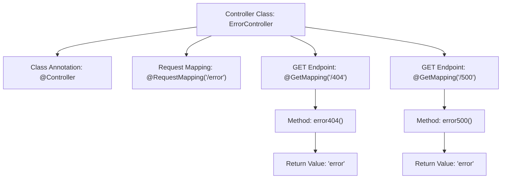

# Basic Information

|      |      |
|------|------|
| Name | ErrorController |
| Language | .java |
| Code Path | weixin-java-miniapp-demo/src/main/java/com/github/binarywang/demo/wx/miniapp/error/ErrorController.java |
| Package Name | com.github.binarywang.demo.wx.miniapp.error |
| Dependencies | ['org.springframework.stereotype.Controller', 'org.springframework.web.bind.annotation.GetMapping', 'org.springframework.web.bind.annotation.RequestMapping'] |
| Brief Description | This controller handles 404 and 500 errors by mapping to the corresponding paths using @GetMapping and returning the error view. |

# Description

This is a Java Spring MVC framework controller class named ErrorController. It is mapped to the Web application's "/error" path. This class contains two public handler methods. The first method, error404, handles HTTP GET requests to the "/error/404" path via the @GetMapping annotation. The second method, error500, handles HTTP GET requests to the "/error/500" path via the @GetMapping annotation. Both methods serve the same function: they return a string named "error," which typically points to a view page, such as an HTML page, used to display error information to the user. This controller is specifically designed to handle particular HTTP error status codes within the application, namely 404 (Not Found) and 500 (Internal Server Error).

# Class Summary

| Name   | Type  | Description |
|-------|------|-------------|
| ErrorController | class | Error Handling Controller defines endpoints for handling 404 and 500 errors, uniformly returning the error view. |

## Class ErrorController

|      |      |
|------|------|
| Access Modifier | @Controller;@RequestMapping("/error");public |
| Type | class |
| Name | ErrorController |
| Description | Error Handling Controller defines endpoints for handling 404 and 500 errors, uniformly returning the error view. |

### UML Class Diagram

This class diagram illustrates the structure of the ErrorController, which is a Spring MVC controller class. It contains two public methods: `error404()` and `error500()`, responsible for handling requests for 404 and 500 error pages respectively. Both methods return the string "error", corresponding to the name of the view template. The class is identified as a controller using the `@Controller` annotation and is mapped to the "/error" path via the `@RequestMapping` annotation. The overall design is concise, focusing on routing for error pages.

### Internal Method Call Graph

This code defines a Spring MVC error handling controller with two GET endpoints for handling 404 and 500 errors. When a user accesses the "/error/404" or "/error/500" paths, the controller calls the error404() and error500() methods respectively. Both methods return the view name "error" to display a unified error page. The code structure is concise, configuring route mappings via annotations, reflecting the declarative programming features of the Spring framework.

### Field List

| Name  | Type  | Description |
|-------|-------|------|

### Method List

| Name  | Type  | Description |
|-------|-------|------|
| error404 | String | Define GET request path 404 to return an error page string. |
| error500 | String | This is a Spring MVC controller method. It maps to the GET request path "/500", and when this path is accessed, it returns a view named "error". This method is typically used to handle the server internal error (500 error) page. |

