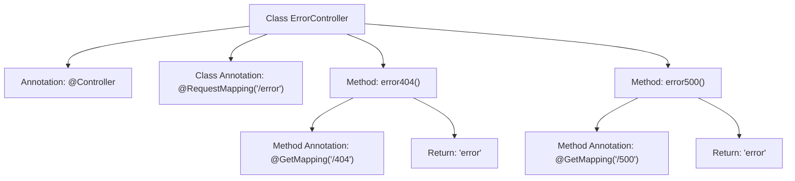

# Basic Information

|      |      |
|------|------|
| Name | ErrorController |
| Language | .java |
| Code Path | weixin-java-miniapp-demo/src/main/java/com/github/binarywang/demo/wx/miniapp/error/ErrorController.java |
| Package Name | com.github.binarywang.demo.wx.miniapp.error |
| Dependencies | ['org.springframework.stereotype.Controller', 'org.springframework.web.bind.annotation.GetMapping', 'org.springframework.web.bind.annotation.RequestMapping'] |
| Brief Description | The ErrorController handles 404 and 500 errors, returning a unified error page. |

# Description

This is a Spring MVC controller class specifically designed to handle error page requests. The class is named ErrorController and is mapped to the "/error" path via the @RequestMapping annotation. It contains two GET request handling methods: error404 for processing 404 errors at the "/error/404" path, and error500 for processing 500 errors at the "/error/500" path. Both methods return a view string named "error", indicating the use of the same error page template. This class provides basic HTTP error handling functionality but does not include specific error handling logic or custom error messages.

# Class Summary

| Name   | Type  | Description |
|-------|------|-------------|
| ErrorController | class | The ErrorController handles 404 and 500 errors, returning a unified error page. |


## Class ErrorController

|      |      |
|------|------|
| Access Modifier | @Controller;@RequestMapping("/error");public |
| Type | class |
| Name | ErrorController |
| Description | The ErrorController handles 404 and 500 errors, returning a unified error page. |


### UML Class Diagram

```mermaid
classDiagram
    class ErrorController {
        <<Controller>>
        +error404() String
        +error500() String
    }
    ErrorController --> SpringFramework : Dependency
    note for ErrorController "Controller for handling HTTP error pages"

    <<Interface>> SpringFramework {
        <<Spring MVC Framework Interface>>
    }
```

Class Diagram Description:
This diagram illustrates a Spring MVC ErrorController class annotated with @Controller, containing two GET request methods (404 and 500) for handling different error codes. The controller relies on Spring Framework infrastructure, with both methods returning the same error view name "error". This represents a typical Spring MVC error-handling controller structure for centralized management of error page routing in web applications.


### Internal Method Call Graph



This flowchart illustrates the structure of the ErrorController class in Spring MVC, containing two methods handling different error paths. The class is marked as a controller with the @Controller annotation and sets the root path to "/error". The error404() method handles "/404" path requests, while error500() processes "/500" path requests, both returning the "error" view name. The diagram clearly presents the annotation relationships between classes and methods, as well as the return value flow, conforming to the typical design pattern of Spring MVC controllers.

### Field List

| Name  | Type  | Description |
|-------|-------|------|

### Method List

| Name  | Type  | Description |
|-------|-------|------|
| error404 | String | This is a Spring MVC GET request handling method with the path "/404", which returns the string "error". |
| error500 | String | Spring MVC interface, the GET request path is /500, returning the string error. |


