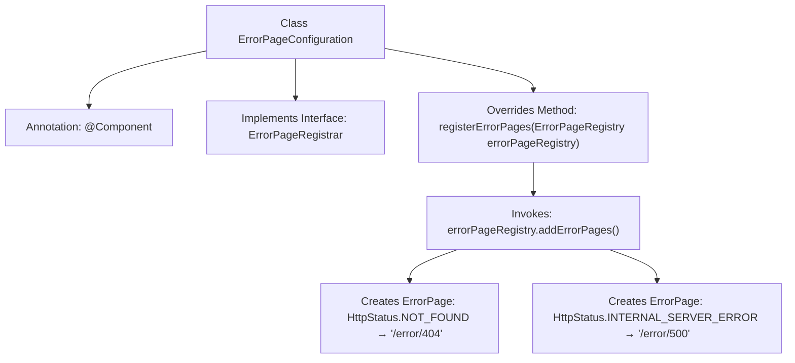

# Basic Information

|      |      |
|------|------|
| Name | ErrorPageConfiguration |
| Language | .java |
| Code Path | weixin-java-miniapp-demo/src/main/java/com/github/binarywang/demo/wx/miniapp/error/ErrorPageConfiguration.java |
| Package Name | com.github.binarywang.demo.wx.miniapp.error |
| Dependencies | ['org.springframework.boot.web.server.ErrorPage', 'org.springframework.boot.web.server.ErrorPageRegistrar', 'org.springframework.boot.web.server.ErrorPageRegistry', 'org.springframework.http.HttpStatus', 'org.springframework.stereotype.Component'] |
| Brief Description | The `ErrorPageConfiguration` class implements the `ErrorPageRegistrar` interface, registering 404 and 500 error pages mapped to the `/error/404` and `/error/500` paths respectively. |

# Description

This is a Spring component class used for configuring custom error pages. The class implements the ErrorPageRegistrar interface and overrides the registerErrorPages method to register two error pages: when a 404 status code occurs, it redirects to the /error/404 path, and when a 500 status code occurs, it redirects to the /error/500 path. This configuration adds error page mappings through the ErrorPageRegistry object.

# Class Summary

| Name   | Type  | Description |
|-------|------|-------------|
| ErrorPageConfiguration | class | The ErrorPageConfiguration class registers 404 and 500 error pages, mapping them to the /error/404 and /error/500 paths respectively. |


## Class ErrorPageConfiguration

|      |      |
|------|------|
| Access Modifier | @Component;public |
| Type | class |
| Name | ErrorPageConfiguration |
| Description | The ErrorPageConfiguration class registers 404 and 500 error pages, mapping them to the /error/404 and /error/500 paths respectively. |


### UML Class Diagram

```mermaid
classDiagram
    class ErrorPageConfiguration {
        +registerErrorPages(ErrorPageRegistry errorPageRegistry) void
    }
    <<Interface>> ErrorPageRegistrar {
        +registerErrorPages(ErrorPageRegistry errorPageRegistry) void
    }
    class ErrorPageRegistry {
        +addErrorPages(ErrorPage... errorPages) void
    }
    class ErrorPage {
        +ErrorPage(HttpStatus status, String path)
    }
    class HttpStatus {
        <<enumeration>>
        NOT_FOUND
        INTERNAL_SERVER_ERROR
        // other status codes...
    }

    ErrorPageConfiguration --> ErrorPageRegistrar : implements
    ErrorPageConfiguration --> ErrorPageRegistry : depends on
    ErrorPageConfiguration --> ErrorPage : creates
    ErrorPage --> HttpStatus : uses
```

Class diagram description: This diagram illustrates the core structure of Spring Boot's error page configuration. The ErrorPageConfiguration class implements the ErrorPageRegistrar interface and registers error pages by depending on ErrorPageRegistry. It creates ErrorPage objects containing HTTP status codes and paths, where HttpStatus is an enumeration class. This design enables the mapping of specific HTTP error states to custom error pages.


### Internal Method Call Graph



This code represents a configuration class in the Spring framework for customizing error pages. By implementing the `ErrorPageRegistrar` interface and overriding the `registerErrorPages` method, it maps HTTP status codes 404 and 500 to the paths `/error/404` and `/error/500` respectively. When the application encounters corresponding errors, it automatically redirects to the specified paths for error response handling. The flowchart illustrates the complete call chain from class declaration to specific error page registration, demonstrating Spring Boot's error handling mechanism.

### Field List

| Name  | Type  | Description |
|-------|-------|------|

### Method List

| Name  | Type  | Description |
|-------|-------|------|
| registerErrorPages | void | This method registers two error pages: a 404 error redirects to "/error/404", and a 500 error redirects to "/error/500". |


