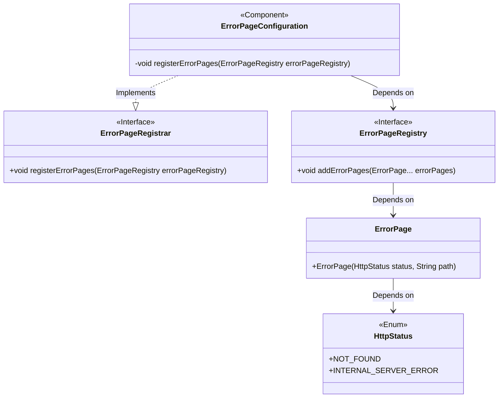
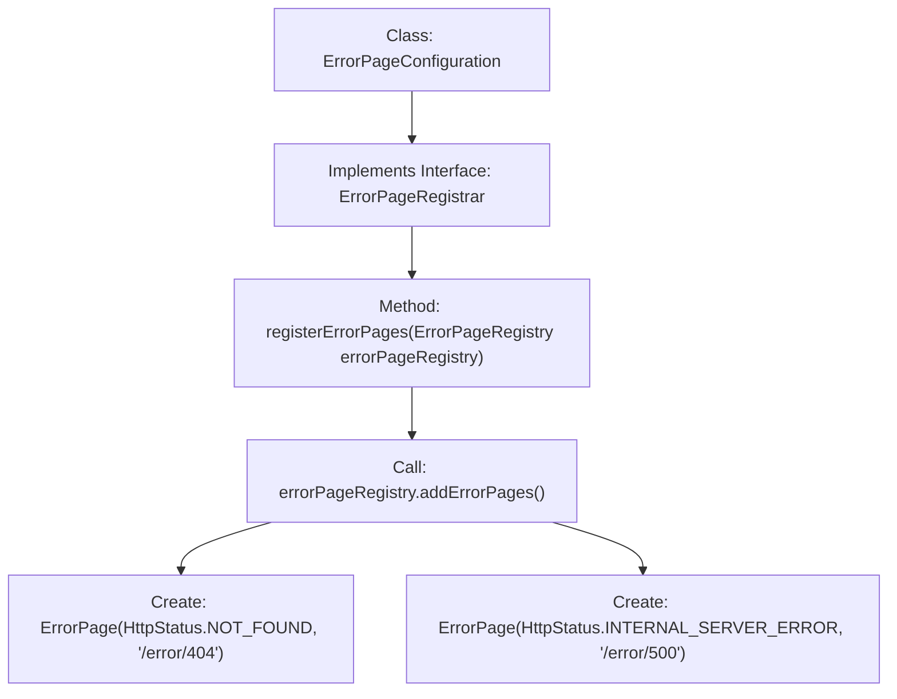

# Basic Information

|      |      |
|------|------|
| Name | ErrorPageConfiguration |
| Language | .java |
| Code Path | weixin-java-miniapp-demo/src/main/java/com/github/binarywang/demo/wx/miniapp/error/ErrorPageConfiguration.java |
| Package Name | com.github.binarywang.demo.wx.miniapp.error |
| Dependencies | ['org.springframework.boot.web.server.ErrorPage', 'org.springframework.boot.web.server.ErrorPageRegistrar', 'org.springframework.boot.web.server.ErrorPageRegistry', 'org.springframework.http.HttpStatus', 'org.springframework.stereotype.Component'] |
| Brief Description | This component registers custom error pages, which will redirect to specified paths for handling 404 or 500 errors, respectively. |

# Description

This code snippet defines a Spring framework component class for configuring custom error pages. The class, named ErrorPageConfiguration, implements the ErrorPageRegistrar interface. In its core method, it adds mappings for two specific HTTP status codes to corresponding handling paths into the error page registry. The specific configuration is that when the application encounters a 404 status code (resource not found), the request will be directed to the "/error/404" path; when encountering a 500 status code (internal server error), the request will be directed to the "/error/500" path. This enables centralized custom handling for these two common HTTP errors.

# Class Summary

| Name   | Type  | Description |
|-------|------|-------------|
| ErrorPageConfiguration | class | Spring Boot component registers 404 and 500 error pages, mapping them to the /error/404 and /error/500 paths respectively. |

## Class ErrorPageConfiguration

|      |      |
|------|------|
| Access Modifier | @Component;public |
| Type | class |
| Name | ErrorPageConfiguration |
| Description | Spring Boot component registers 404 and 500 error pages, mapping them to the /error/404 and /error/500 paths respectively. |

### UML Class Diagram

This code represents a Spring Boot error page configuration class, which implements the ErrorPageRegistrar interface to register custom error pages. When the application encounters a 404 or 500 error, it redirects to the "/error/404" and "/error/500" paths respectively. The ErrorPageConfiguration class is annotated with @Component, making it a Spring-managed Bean, and automatically executes the error page registration logic upon startup, ensuring a unified error handling mechanism.

### Internal Method Call Graph

This flowchart illustrates the structure and workflow of the ErrorPageConfiguration class. The class implements the ErrorPageRegistrar interface, with the core method being registerErrorPages. Within this method, the addErrorPages method is called using the passed-in ErrorPageRegistry object, registering two error pages: a 404 error pointing to "/error/404" and a 500 error pointing to "/error/500". The entire process clearly demonstrates the complete call chain from class definition to error page registration.

### Field List

| Name  | Type  | Description |
|-------|-------|------|

### Method List

| Name  | Type  | Description |
|-------|-------|------|
| registerErrorPages | void | Register custom error pages, including 404 Not Found and 500 Internal Server Error, pointing to /error/404 and /error/500 paths respectively. |

