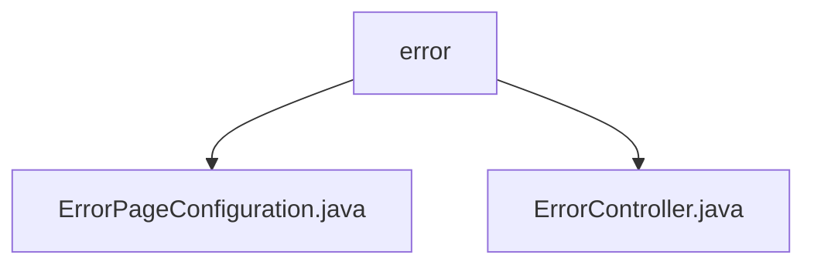

# Basic Information

|      |      |
|------|------|
| Name | error |
| Language | .java |
| Code Path | weixin-java-miniapp-demo/src/main/java/com/github/binarywang/demo/wx/miniapp/error |
| Package Name | docs.src.main.java.com.github.binarywang.demo.wx.miniapp.error |
| Brief Description | The code defines two Spring components. ErrorPageConfiguration configures 404 and 500 errors to point to custom paths. ErrorController provides endpoints to handle these error paths and returns error views. Implements custom HTTP error handling. |

# Description

## Overview
This module is responsible for providing a custom HTTP error page handling mechanism for web applications. Its core responsibility is to centrally configure and respond to specific HTTP error status codes. The interface specification involves implementing Spring's `ErrorPageRegistrar` to register error path mappings and providing an `ErrorController` to handle the mapped requests. Key data structures include Spring MVC's `ErrorPage` and the `ErrorPageRegistry` used for registration. The primary external dependency is the Spring Framework.

For example, `ErrorPageConfiguration` maps status codes 404 and 500 to the paths `/error/404` and `/error/500`, respectively.

## Primary Business Scenarios
The module implements a complete process from error capture to error page display. When the application throws a 404 or 500 error, the process resembles an event bus pattern. The request is automatically directed to the configured path and handled by the corresponding method in the `ErrorController`. This provides a unified error interaction pattern.

Its functionality fully covers the custom handling of these two common errors. The typical application pattern is integration into a Spring Boot web application to replace default error pages. The API types are Spring configuration classes and REST controllers. The integration example is the aforementioned error page configuration and response controller.

### Package Internal Structure View

This flowchart shows two Java files under the `error` directory: `ErrorPageConfiguration.java` and `ErrorController.java`. Both files are located directly within the `error` directory, forming a simple two-level structure. This reflects the basic code organization of the project's error handling module, with `error` as the parent node and the two controller files as its children.

# File List

| Name   | Type  | Description |
|-------|------|-------------|
| [ErrorPageConfiguration.java](ErrorPageConfiguration.md) | file | This component registers custom error pages, redirecting to specified paths for handling 404 or 500 errors respectively. |
| [ErrorController.java](ErrorController.md) | file | This controller handles 404 and 500 errors, mapping them to the corresponding paths via @GetMapping and returning the error view. |

