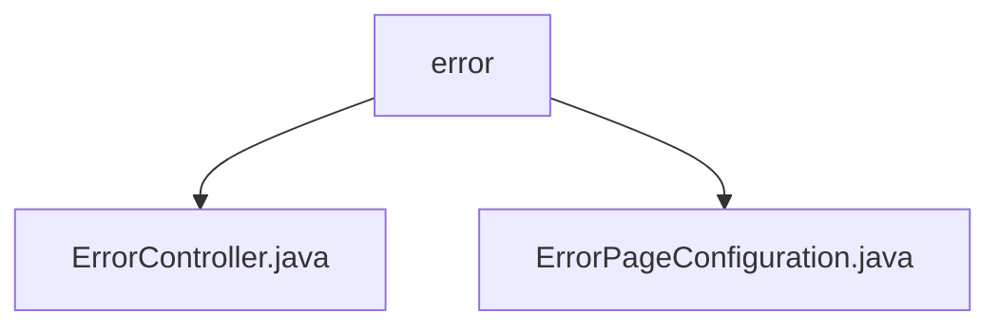

# Basic Information

|      |      |
|------|------|
| Name | error |
| Language | .java |
| Code Path | weixin-java-miniapp-demo/src/main/java/com/github/binarywang/demo/wx/miniapp/error |
| Package Name | docs.src.main.java.com.github.binarywang.demo.wx.miniapp.error |
| Brief Description | The ErrorController class handles 404 and 500 errors under the /error path, returning a unified error page. The ErrorPageConfiguration class implements error page configuration, mapping the 404 and 500 status codes to their corresponding paths. |

# Description

## Overview  
The core responsibility of this module is to uniformly handle HTTP error responses by implementing page redirection for 404/500 errors through controllers and configuration classes. The interface specification includes two GET endpoints: `/error/404` and `/error/500`, both returning the "error" view template. The key data structure is Spring's `ErrorPageRegistry`, used for registering error path mappings. The only external dependency is the Spring MVC framework. For example, `ErrorController` handles path mapping, while `ErrorPageConfiguration` implements error redirection configuration.  

## Key Business Scenarios  
The module adopts a frontend-backend collaboration model, similar to a gateway error interception mechanism. When a 404/500 error occurs in the system, it automatically routes to predefined paths and renders a unified error page. Functional completeness is reflected in the closed-loop handling of error capture and view return, such as a missing 404 resource triggering a redirect to `/error/404`. Typical application scenarios include API request exceptions or missing static resources, where standardized error pages enhance user experience.

### Package Internal Structure View

This flowchart illustrates the hierarchical structure of the error handling module in the WeChat Mini Program demo project. The root node is the error directory, which contains two sub-files: ErrorController.java handles error requests, and ErrorPageConfiguration.java configures error pages. The structure is concise and clear, reflecting the basic components of the error handling module.

# File List

| Name   | Type  | Description |
|-------|------|-------------|
| [ErrorController.java](ErrorController.md) | file | The ErrorController handles 404 and 500 errors, returning a unified error page. |
| [ErrorPageConfiguration.java](ErrorPageConfiguration.md) | file | The `ErrorPageConfiguration` class implements the `ErrorPageRegistrar` interface, registering error pages for 404 and 500, which are mapped to the `/error/404` and `/error/500` paths respectively. |

