# Basic Information

|      |      |
|------|------|
| Name | FileUploadUtils |
| Language | .java |
| Code Path | weixin-java-miniapp-demo/src/main/java/com/github/binarywang/demo/wx/miniapp/utils/FileUploadUtils.java |
| Package Name | com.leaniss.file.utils |
| Dependencies | ['java.io.File', 'java.io.IOException', 'java.nio.file.Paths', 'java.security.InvalidKeyException', 'java.security.NoSuchAlgorithmException', 'java.util.Objects', 'com.leaniss.file.bean.MinioBucket', 'io.minio.BucketExistsArgs', 'io.minio.GetBucketPolicyArgs', 'io.minio.MakeBucketArgs', 'io.minio.SetBucketPolicyArgs', 'io.minio.errors', 'lombok.SneakyThrows', 'org.apache.commons.io.FilenameUtils', 'org.springframework.web.multipart.MultipartFile', 'com.leaniss.common.core.exception.file.FileException', 'com.leaniss.common.core.exception.file.FileNameLengthLimitExceededException', 'com.leaniss.common.core.exception.file.FileSizeLimitExceededException', 'com.leaniss.common.core.exception.file.InvalidExtensionException', 'com.leaniss.common.core.utils.DateUtils', 'com.leaniss.common.core.utils.StringUtils', 'com.leaniss.common.core.utils.file.FileTypeUtils', 'com.leaniss.common.core.utils.file.MimeTypeUtils', 'com.leaniss.common.core.utils.uuid.Seq'] |
| Brief Description | The FileUploadUtils class provides file upload functionality, including default configurations such as a file size limit of 50MB and a filename length limit of 100 characters. It supports uploading to specified directories and validating file types; if limits are exceeded, an exception is thrown. It also includes MinIO bucket management features, enabling the checking, creation, and configuration of bucket policies. |

# Description

This is a Java file upload utility class. It defines a default maximum file size of 50MB and a default maximum filename length of 100 characters. The core functionality includes uploading by specifying a base directory and a file, with the option to allow specific file extensions. The upload process includes filename length validation, file size and extension validation, then generating a new filename that includes a date path and sequence number and saving it to the specified location. Additionally, it contains a set of methods for interacting with the MinIO object storage service, used to create buckets, check if a bucket exists, and set a bucket's access policy. When creating a bucket, it first checks if it already exists, then sets a default policy allowing operations such as public object retrieval, uploads, and deletions.

# Class Summary

| Name   | Type  | Description |
|-------|------|-------------|
| FileUploadUtils | class | The FileUploadUtils class provides file upload and MinIO bucket management functionalities, supporting validation of file size, type, and name length, as well as creation and configuration of storage bucket policies. |

## Class FileUploadUtils

|      |      |
|------|------|
| Access Modifier | public |
| Type | class |
| Name | FileUploadUtils |
| Description | The FileUploadUtils class provides file upload and MinIO bucket management functionalities, supporting validation of file size, type, and name length, as well as creation and configuration of storage bucket policies. |

### UML Class Diagram

```mermaid
classDiagram
    class FileUploadUtils {
        +long DEFAULT_MAX_SIZE
        +int DEFAULT_FILE_NAME_LENGTH
        +String upload(String baseDir, MultipartFile file) IOException
        +String upload(String baseDir, MultipartFile file, String[] allowedExtension) FileSizeLimitExceededException, IOException, FileNameLengthLimitExceededException, InvalidExtensionException
        +String extractFilename(MultipartFile file)
        -File getAbsoluteFile(String uploadDir, String fileName) IOException
        -String getPathFileName(String fileName) IOException
        +void assertAllowed(MultipartFile file, String[] allowedExtension) FileSizeLimitExceededException, InvalidExtensionException
        +boolean isAllowedExtension(String extension, String[] allowedExtension)
        +void createBucket(MinioBucket minioBucket) IOException, InvalidKeyException, InvalidResponseException, InsufficientDataException, NoSuchAlgorithmException, ServerException, InternalException, XmlParserException, ErrorResponseException
        +boolean bucketExist(MinioBucket minioBucket) IOException, InvalidKeyException, InvalidResponseException, InsufficientDataException, NoSuchAlgorithmException, ServerException, InternalException, XmlParserException, ErrorResponseException
        +StringBuilder queryBucketPolicy(MinioBucket minioBucket)
        +void createBucketPolicy(MinioBucket minioBucket)
        +void createBucketPolicy(StringBuilder builder, MinioBucket minioBucket)
        -StringBuilder defaultBucketPolicy(String bucketName)
    }
    
    class MultipartFile {
        <<Interface>>
        +String getOriginalFilename()
        +long getSize()
        +void transferTo(Path dest) IOException, IllegalStateException
    }
    
    class FileSizeLimitExceededException {
        +FileSizeLimitExceededException(long maxSize)
    }
    
    class FileNameLengthLimitExceededException {
        +FileNameLengthLimitExceededException(int maxLength)
    }
    
    class InvalidExtensionException {
        <<Interface>>
    }
    
    class InvalidImageExtensionException {
        +InvalidImageExtensionException(String[] allowedExtension, String extension, String fileName)
    }
    
    class InvalidFlashExtensionException {
        +InvalidFlashExtensionException(String[] allowedExtension, String extension, String fileName)
    }
    
    class InvalidMediaExtensionException {
        +InvalidMediaExtensionException(String[] allowedExtension, String extension, String fileName)
    }
    
    class InvalidVideoExtensionException {
        +InvalidVideoExtensionException(String[] allowedExtension, String extension, String fileName)
    }
    
    class MinioBucket {
        +String getBucketName()
        +String getRegion()
        +MinioClient getMinioClient()
    }
    
    class MinioClient {
        +void makeBucket(MakeBucketArgs args) IOException, InvalidKeyException, InvalidResponseException, InsufficientDataException, NoSuchAlgorithmException, ServerException, InternalException, XmlParserException, ErrorResponseException
        +boolean bucketExists(BucketExistsArgs args) IOException, InvalidKeyException, InvalidResponseException, InsufficientDataException, NoSuchAlgorithmException, ServerException, InternalException, XmlParserException, ErrorResponseException
        +String getBucketPolicy(GetBucketPolicyArgs args) IOException, InvalidKeyException, InvalidResponseException, InsufficientDataException, NoSuchAlgorithmException, ServerException, InternalException, XmlParserException, ErrorResponseException
        +void setBucketPolicy(SetBucketPolicyArgs args) IOException, InvalidKeyException, InvalidResponseException, InsufficientDataException, NoSuchAlgorithmException, ServerException, InternalException, XmlParserException, ErrorResponseException
    }
    
    class FileException {
        +String getDefaultMessage()
    }
    
    class File {
        +File(String pathname)
        +boolean exists()
        +File getParentFile()
        +boolean mkdirs()
        +boolean isAbsolute()
        +File getAbsoluteFile()
    }
    
    class MimeTypeUtils {
        +String[] DEFAULT_ALLOWED_EXTENSION
        +String[] IMAGE_EXTENSION
        +String[] FLASH_EXTENSION
        +String[] MEDIA_EXTENSION
        +String[] VIDEO_EXTENSION
    }
    
    class DateUtils {
        +String datePath()
    }
    
    class FilenameUtils {
        +String getBaseName(String filename)
    }
    
    class FileTypeUtils {
        +String getExtension(MultipartFile file)
    }
    
    class Seq {
        +String getId(String seqType)
        +String uploadSeqType
    }
    
    FileUploadUtils ..> MultipartFile : Dependency
    FileUploadUtils ..> FileSizeLimitExceededException : Dependency
    FileUploadUtils ..> FileNameLengthLimitExceededException : Dependency
    FileUploadUtils ..> InvalidExtensionException : Dependency
    FileUploadUtils ..> MinioBucket : Dependency
    FileUploadUtils ..> FileException : Dependency
    FileUploadUtils ..> File : Dependency
    FileUploadUtils ..> MimeTypeUtils : Dependency
    FileUploadUtils ..> DateUtils : Dependency
    FileUploadUtils ..> FilenameUtils : Dependency
    FileUploadUtils ..> FileTypeUtils : Dependency
    FileUploadUtils ..> Seq : Dependency
    
    InvalidExtensionException <|.. InvalidImageExtensionException
    InvalidExtensionException <|.. InvalidFlashExtensionException
    InvalidExtensionException <|.. InvalidMediaExtensionException
    InvalidExtensionException <|.. InvalidVideoExtensionException
```

This code defines a file upload utility class `FileUploadUtils`. Its main functionalities include uploading files to the local disk and managing MinIO object storage. It first checks the file name length, file size, and extension validity. Then it generates a unique file name and saves it to the specified directory. For MinIO operations, it provides functions for bucket creation, existence checking, and policy configuration. The utility class relies on several helper classes for tasks like generating date paths, handling file extensions, and generating sequence numbers. It can also throw various custom exceptions to handle different error conditions.

### Internal Method Call Graph

```mermaid
graph TD
    A["Class FileUploadUtils"]
    B["Constant: long DEFAULT_MAX_SIZE"]
    C["Constant: int DEFAULT_FILE_NAME_LENGTH"]
    D["Method: upload(baseDir, file)"]
    E["Method: upload(baseDir, file, allowedExtension)"]
    F["Method: extractFilename(file)"]
    G["Method: getAbsoluteFile(uploadDir, fileName)"]
    H["Method: getPathFileName(fileName)"]
    I["Method: assertAllowed(file, allowedExtension)"]
    J["Method: isAllowedExtension(extension, allowedExtension)"]
    K["Method: createBucket(minioBucket)"]
    L["Method: bucketExist(minioBucket)"]
    M["Method: queryBucketPolicy(minioBucket)"]
    N["Method: createBucketPolicy(minioBucket)"]
    O["Method: createBucketPolicy(builder, minioBucket)"]
    P["Private Method: defaultBucketPolicy(bucketName)"]

    A --> B
    A --> C
    A --> D
    A --> E
    A --> F
    A --> G
    A --> H
    A --> I
    A --> J
    A --> K
    A --> L
    A --> M
    A --> N
    A --> O
    A -.-> P
```

**Flowchart Description:**
This flowchart illustrates the structure and main methods of the `FileUploadUtils` class. The class contains two constants that define file size and filename length limits, along with multiple static methods for file upload and processing. Key methods include the file upload process `upload`, filename extraction `extractFilename`, file validation `assertAllowed`, and bucket operations related to MinIO storage such as `createBucket` and `bucketExist`. These methods work together to ensure the security and legality of file uploads and support integration with object storage services.

### Field List

| Name  | Type  | Description |
|-------|-------|------|
| DEFAULT_MAX_SIZE = 50 * 1024 * 1024 | long | This code defines a public static constant DEFAULT_MAX_SIZE, whose default value is 50 MB. |
| DEFAULT_FILE_NAME_LENGTH = 100 | int | Define the constant DEFAULT_FILE_NAME_LENGTH, with a value of 100, to specify the maximum length of the default file name. |

### Method List

| Name  | Type  | Description |
|-------|-------|------|
| isAllowedExtension | boolean | A static method checks whether the file extension is within the allowed list. It iterates through the array, performing case-insensitive comparisons. Returns true if a match exists; otherwise, returns false. |
| getAbsoluteFile | File | This method is used to obtain an absolute path file object based on the upload directory and file name. If the parent directory does not exist, it will be created, and finally returns the absolute path object of the file. |
| defaultBucketPolicy | StringBuilder | This Java method is used to generate a default policy JSON string for an AWS S3 bucket. This policy allows all AWS principals to perform specific operations on the specified bucket, including getting the bucket location, listing multipart uploads, as well as uploading, deleting, and reading objects within the bucket. |
| createBucket | void | This method checks whether a MinIO bucket exists and returns if it does. Otherwise, it creates a bucket based on the name and region and sets the default access rules. |
| upload | String | This is a Java file upload method that receives directory and file parameters. It calls another upload method, captures and handles any potential exceptions, and finally throws an IOException uniformly. |
| upload | String | This is a Java file upload method. It checks the filename length and extension, generates a unique filename, and saves the file. The method returns the file access path and may throw exceptions for file size, filename length, or invalid extensions. |
| extractFilename | String | This method is used to extract and format file names from a MultipartFile. It generates a string containing a date path, the base part of the original file name, a sequence number, and the file extension, formatted as "date path/original file name_sequence number.extension". |
| bucketExist | boolean | Check if the Minio bucket exists, return a boolean value. Call the bucketExists method of the Minio client, passing the bucket name parameter. The method declares multiple possible exceptions. |
| queryBucketPolicy | StringBuilder | This method is used to query the policy configuration of a specified bucket. It receives a MinioBucket object, calls the client to get the policy, and returns a result of type StringBuilder. It includes exception handling and declares that it throws an Exception class exception. |
| createBucketPolicy | void | The method createBucketPolicy declares an exception, calling an overloaded method to create a Minio bucket policy. |
| getPathFileName | String | This method converts file names into paths by adding a forward slash prefix, ensuring the correct path format. |
| assertAllowed | void | This method is used to validate uploaded files. First, it checks whether the file size exceeds the default limit; if it does, an exception is thrown. Then, it validates whether the file extension is in the allowed list. If it is not, a corresponding invalid extension exception is thrown based on the type of allowed list. |
| createBucketPolicy | void | This method uses the SneakyThrows annotation to handle exceptions. It determines whether to use the default policy or a custom policy based on whether the input StringBuilder is empty, and then calls the MinIO client to set the final bucket policy for the specified bucket. |

