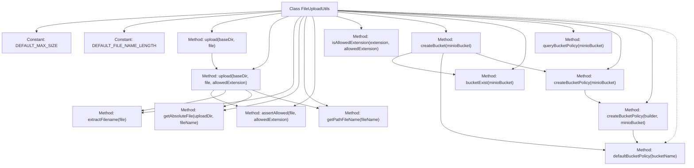

# Basic Information

|      |      |
|------|------|
| Name | FileUploadUtils |
| Language | .java |
| Code Path | weixin-java-miniapp-demo/src/main/java/com/github/binarywang/demo/wx/miniapp/utils/FileUploadUtils.java |
| Package Name | com.leaniss.file.utils |
| Dependencies | ['java.io.File', 'java.io.IOException', 'java.nio.file.Paths', 'java.security.InvalidKeyException', 'java.security.NoSuchAlgorithmException', 'java.util.Objects', 'com.leaniss.file.bean.MinioBucket', 'io.minio.BucketExistsArgs', 'io.minio.GetBucketPolicyArgs', 'io.minio.MakeBucketArgs', 'io.minio.SetBucketPolicyArgs', 'io.minio.errors', 'lombok.SneakyThrows', 'org.apache.commons.io.FilenameUtils', 'org.springframework.web.multipart.MultipartFile', 'com.leaniss.common.core.exception.file.FileException', 'com.leaniss.common.core.exception.file.FileNameLengthLimitExceededException', 'com.leaniss.common.core.exception.file.FileSizeLimitExceededException', 'com.leaniss.common.core.exception.file.InvalidExtensionException', 'com.leaniss.common.core.utils.DateUtils', 'com.leaniss.common.core.utils.StringUtils', 'com.leaniss.common.core.utils.file.FileTypeUtils', 'com.leaniss.common.core.utils.file.MimeTypeUtils', 'com.leaniss.common.core.utils.uuid.Seq'] |
| Brief Description | The FileUploadUtils class provides file upload functionality, supporting size and type validation. By default, it limits files to 50MB and filenames to 100 characters. It also includes MinIO bucket management methods such as creating buckets, checking existence, and setting policies. |

# Description

FileUploadUtils is a file upload utility class that provides functionalities such as file uploading, size validation, and filename processing. The default file size limit is 50M, and the filename length is restricted to 100 characters. It supports uploading based on file paths, validating file types and sizes, and handling filename encoding. Additionally, it includes MinIO bucket management features, such as creating buckets, checking bucket existence, and setting or querying bucket policies. The default bucket policy allows public read and write operations.

# Class Summary

| Name   | Type  | Description |
|-------|------|-------------|
| FileUploadUtils | class | The FileUploadUtils class provides file upload functionality, supporting size validation, filename length restrictions, and type validation, with a default size of 50M and filename length of 100. It also includes MinIO bucket management methods such as creating buckets, checking existence, setting policies, etc. |

## Class FileUploadUtils

|      |      |
|------|------|
| Access Modifier | public |
| Type | class |
| Name | FileUploadUtils |
| Description | The FileUploadUtils class provides file upload functionality, supporting size validation, filename length restrictions, and type validation, with a default size of 50M and filename length of 100. It also includes MinIO bucket management methods such as creating buckets, checking existence, setting policies, etc. |

### UML Class Diagram

```mermaid
classDiagram
    class FileUploadUtils {
        +long DEFAULT_MAX_SIZE
        +int DEFAULT_FILE_NAME_LENGTH
        +String upload(String baseDir, MultipartFile file) throws IOException
        +String upload(String baseDir, MultipartFile file, String[] allowedExtension) throws FileSizeLimitExceededException, IOException, FileNameLengthLimitExceededException, InvalidExtensionException
        +String extractFilename(MultipartFile file)
        -File getAbsoluteFile(String uploadDir, String fileName) throws IOException
        -String getPathFileName(String fileName) throws IOException
        +void assertAllowed(MultipartFile file, String[] allowedExtension) throws FileSizeLimitExceededException, InvalidExtensionException
        +boolean isAllowedExtension(String extension, String[] allowedExtension)
        +void createBucket(MinioBucket minioBucket) throws IOException, InvalidKeyException, InvalidResponseException, InsufficientDataException, NoSuchAlgorithmException, ServerException, InternalException, XmlParserException, ErrorResponseException
        +boolean bucketExist(MinioBucket minioBucket) throws IOException, InvalidKeyException, InvalidResponseException, InsufficientDataException, NoSuchAlgorithmException, ServerException, InternalException, XmlParserException, ErrorResponseException
        +StringBuilder queryBucketPolicy(MinioBucket minioBucket)
        +void createBucketPolicy(MinioBucket minioBucket)
        +void createBucketPolicy(StringBuilder builder, MinioBucket minioBucket)
        -StringBuilder defaultBucketPolicy(String bucketName)
    }

    class MultipartFile {
        <<Interface>>
        +String getOriginalFilename()
        +long getSize()
        +void transferTo(Path dest) throws IOException, IllegalStateException
    }

    class FileException {
        +String getDefaultMessage()
    }

    class FileSizeLimitExceededException {
        +FileSizeLimitExceededException(long maxSize)
    }

    class FileNameLengthLimitExceededException {
        +FileNameLengthLimitExceededException(int maxLength)
    }

    class InvalidExtensionException {
        <<Interface>>
        +InvalidImageExtensionException(String[] allowedExtension, String extension, String fileName)
        +InvalidFlashExtensionException(String[] allowedExtension, String extension, String fileName)
        +InvalidMediaExtensionException(String[] allowedExtension, String extension, String fileName)
        +InvalidVideoExtensionException(String[] allowedExtension, String extension, String fileName)
    }

    class MinioBucket {
        +String getBucketName()
        +String getRegion()
        +MinioClient getMinioClient()
    }

    FileUploadUtils --> MultipartFile : Uses
    FileUploadUtils --> FileException : Throws
    FileUploadUtils --> FileSizeLimitExceededException : Throws
    FileUploadUtils --> FileNameLengthLimitExceededException : Throws
    FileUploadUtils --> InvalidExtensionException : Throws
    FileUploadUtils --> MinioBucket : Uses
```

Class diagram description: FileUploadUtils is a file upload utility class that provides functionalities such as file uploading, filename encoding, file size validation, and file type validation. It relies on the MultipartFile interface to handle uploaded files and may throw exceptions such as FileException, FileSizeLimitExceededException, FileNameLengthLimitExceededException, and InvalidExtensionException. Additionally, it offers operations related to MinIO buckets, such as creating a bucket, checking bucket existence, querying and setting bucket policies, etc.

### Internal Method Call Graph

This code represents a file upload utility class, which includes core functionalities such as file size validation, filename processing, and path generation, while integrating MinIO bucket creation and management logic. Key workflows involve: validating filename length and file type, generating unique filenames, saving files to specified paths, and configuring MinIO bucket policies. Exception handling covers scenarios like oversized files, excessive filename lengths, and type mismatches to ensure a secure and reliable upload process.

### Field List

| Name  | Type  | Description |
|-------|-------|------|
| DEFAULT_FILE_NAME_LENGTH = 100 | int | Define the constant DEFAULT_FILE_NAME_LENGTH, with a default file name length limit of 100 characters. |
| DEFAULT_MAX_SIZE = 50 * 1024 * 1024 | long | Define a static constant with a default maximum size of 50MB. |

### Method List

| Name  | Type  | Description |
|-------|-------|------|
| isAllowedExtension | boolean | Check if the file extension is in the allowed list, ignoring case. Return true if it exists, otherwise return false. |
| createBucket | void | Methods for creating a MinIO bucket, checking if the bucket exists, and creating it with default policies if it does not exist based on the configuration. Handling various exceptional cases. |
| getPathFileName | String | The method takes a filename parameter and returns a path string starting with a slash. It contains no complex logic, simply concatenating the path format. |
| bucketExist | boolean | Check if a Minio bucket exists, returns a boolean value, may throw various exceptions. |
| assertAllowed | void | Check whether the file size and extension comply with regulations, and throw corresponding exceptions if they exceed limits or have illegal extensions. |
| extractFilename | String | Method for extracting file names: Generate a unique file name based on the date path, original file base name, sequence ID, and file extension. |
| queryBucketPolicy | StringBuilder | Using the `@SneakyThrows` annotation to handle exceptions, query the policy of a specified bucket via `MinioClient` and return the result as a `StringBuilder`. |
| createBucketPolicy | void | Create a Minio bucket policy using the @SneakyThrows annotation and invoke overloaded methods for processing. |
| createBucketPolicy | void | The method `createBucketPolicy` is used to configure the MinIO bucket policy. If the input policy is empty, the default policy is applied, and then the policy is set via the MinIO client. |
| getAbsoluteFile | File | This method creates an absolute path file object based on the upload directory and file name. If the directory does not exist, it will be created, and finally returns the absolute path file object. |
| upload | String | The static method `upload` accepts directory and file parameters, invokes the overloaded method to upload the file, handles exceptions, and throws an `IOException`. |
| upload | String | Methods for uploading files, checking filename length and extension, saving the file, and returning the path. Exceptions include file too large, filename too long, and invalid extension. |
| defaultBucketPolicy | StringBuilder | Generate a default S3 bucket policy that allows public access to specific operations such as getting location, listing multipart uploads, uploading/deleting objects, etc., with resources pointing to the specified bucket and its contents. |

