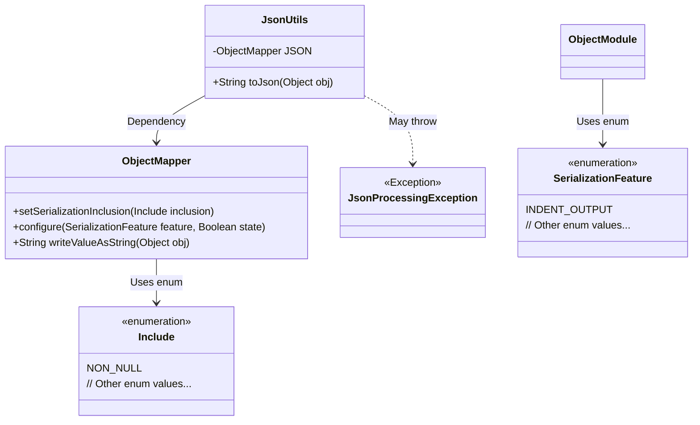
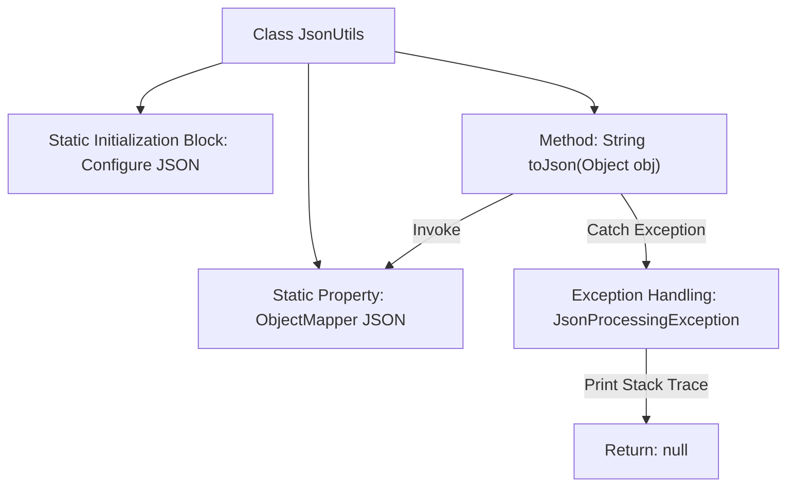

# Basic Information

|      |      |
|------|------|
| Name | JsonUtils |
| Language | .java |
| Code Path | weixin-java-miniapp-demo/src/main/java/com/github/binarywang/demo/wx/miniapp/utils/JsonUtils.java |
| Package Name | com.github.binarywang.demo.wx.miniapp.utils |
| Dependencies | ['com.fasterxml.jackson.annotation.JsonInclude.Include', 'com.fasterxml.jackson.core.JsonProcessingException', 'com.fasterxml.jackson.databind.ObjectMapper', 'com.fasterxml.jackson.databind.SerializationFeature'] |
| Brief Description | The JsonUtils class provides a static method `toJson`, which uses ObjectMapper to convert an object into a JSON string, automatically ignoring null values and formatting the output. Returns null if an exception occurs. |

# Description

This is a utility class named JsonUtils, primarily used for handling JSON data conversion. The class contains a static ObjectMapper instance named JSON, which is configured in the static initialization block to ignore null values during serialization and enable indented formatting for output. It provides a toJson method that converts any object into a JSON string, printing an exception and returning null if the conversion fails. The entire class encapsulates basic JSON serialization functionality for easy invocation by other code.

# Class Summary

| Name   | Type  | Description |
|-------|------|-------------|
| JsonUtils | class | The JsonUtils class provides a static method `toJson` that converts an object to a JSON string using ObjectMapper, automatically ignoring null values and formatting the output. |

## Class JsonUtils

|      |      |
|------|------|
| Access Modifier | public |
| Type | class |
| Name | JsonUtils |
| Description | The JsonUtils class provides a static method `toJson` that converts an object to a JSON string using ObjectMapper, automatically ignoring null values and formatting the output. |

### UML Class Diagram

This class diagram illustrates the structure of the JsonUtils utility class and its related dependencies. JsonUtils utilizes ObjectMapper for JSON serialization operations, configuring features such as ignoring null values and indented output through a static initialization block. The diagram includes ObjectMapper, the Include enum, SerializationFeature enum, and the potentially thrown JsonProcessingException, clearly presenting the core components and exception handling mechanism in the JSON serialization process.

### Internal Method Call Graph

The flowchart describes the structure and workflow of the JsonUtils class. This class contains a static ObjectMapper instance JSON, configured in the static initialization block for non-null value serialization and indented output. The core method toJson converts an object to a string using the JSON instance, printing the stack trace and returning null on exception. The process clearly illustrates the complete path from method invocation to result return/exception handling.

### Field List

| Name  | Type  | Description |
|-------|-------|------|
| JSON = new ObjectMapper() | ObjectMapper | Create a static immutable JSON object mapper instance. |

### Method List

| Name  | Type  | Description |
|-------|-------|------|
| toJson | String | The static method `toJson` converts an object into a JSON string, prints an error in case of an exception, and returns null. |

