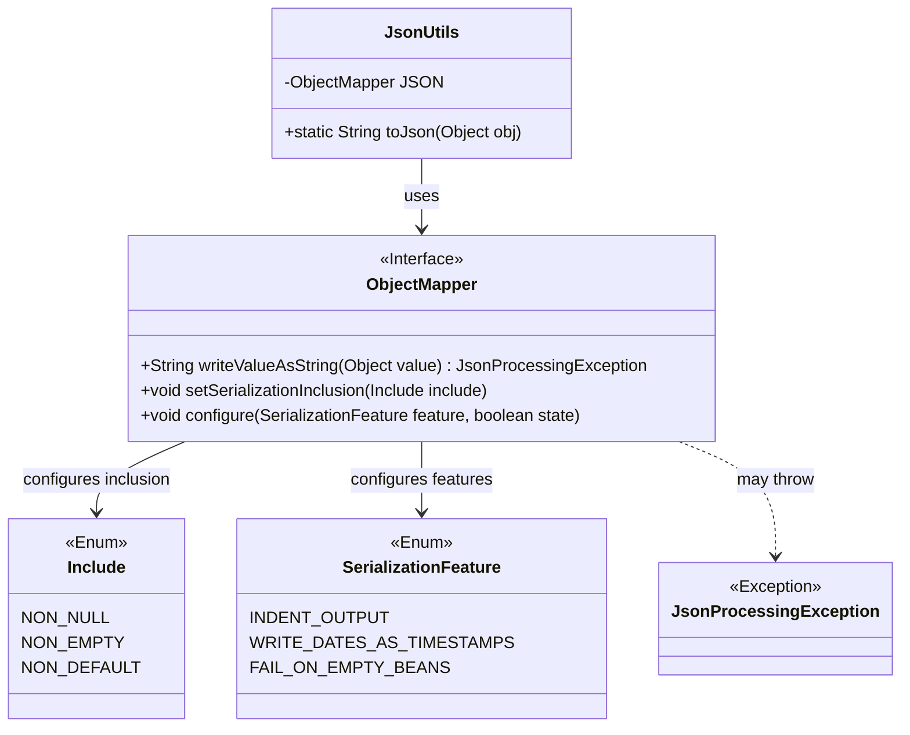
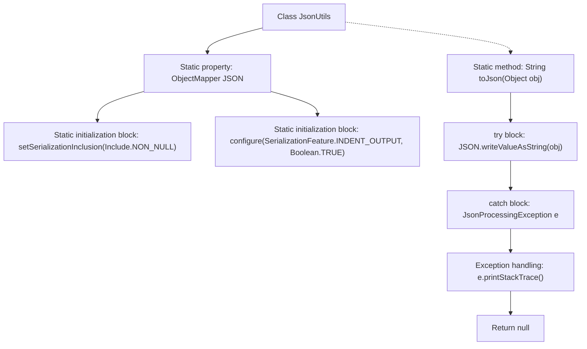

# Basic Information

|      |      |
|------|------|
| Name | JsonUtils |
| Language | .java |
| Code Path | weixin-java-miniapp-demo/src/main/java/com/github/binarywang/demo/wx/miniapp/utils/JsonUtils.java |
| Package Name | com.github.binarywang.demo.wx.miniapp.utils |
| Dependencies | ['com.fasterxml.jackson.annotation.JsonInclude.Include', 'com.fasterxml.jackson.core.JsonProcessingException', 'com.fasterxml.jackson.databind.ObjectMapper', 'com.fasterxml.jackson.databind.SerializationFeature'] |
| Brief Description | The JsonUtils class provides static methods for JSON serialization. It utilizes Jackson's ObjectMapper, configured to ignore null values and format the output. The `toJson` method converts an object into a JSON string, printing an error and returning null in case of an exception. |

# Description

This is a Java utility class named JsonUtils, primarily used for converting Java objects into JSON-formatted strings. Internally, it utilizes a static ObjectMapper instance that has been initialized with a configuration to ignore null-valued fields in objects and to generate JSON strings with indented formatting for improved readability. The class provides a public static method `toJson`, which takes an object as a parameter and returns its JSON string representation. If an exception occurs during the conversion process, the method prints the exception stack trace and returns a null value.

# Class Summary

| Name   | Type  | Description |
|-------|------|-------------|
| JsonUtils | class | The utility class JsonUtils, using ObjectMapper configuration to ignore null values and beautify output, provides the toJson method to convert objects to JSON strings. In case of an exception, it prints the error and returns null. |

## Class JsonUtils

|      |      |
|------|------|
| Access Modifier | public |
| Type | class |
| Name | JsonUtils |
| Description | The utility class JsonUtils, using ObjectMapper configuration to ignore null values and beautify output, provides the toJson method to convert objects to JSON strings. In case of an exception, it prints the error and returns null. |

### UML Class Diagram

This class diagram describes the structure of the JsonUtils utility class. JsonUtils is the core utility class, holding a static ObjectMapper instance and providing a static `toJson` method for object serialization. ObjectMapper, as the core interface of the Jackson library, is responsible for JSON serialization operations. Its configuration relies on the Include enum (controlling serialization inclusion strategy) and the SerializationFeature enum (controlling serialization features). The methods of ObjectMapper may throw a JsonProcessingException during execution to handle JSON processing failures. The overall design demonstrates how the utility class provides a concise JSON serialization function by configuring the third-party library.

### Internal Method Call Graph

This code represents a JSON utility class that uses Jackson's ObjectMapper for object serialization. The static initialization blocks configure JSON serialization to ignore null values and enable formatted output. The toJson method converts an object into a JSON string. If a JsonProcessingException occurs during serialization, the exception stack trace is printed and null is returned.

### Field List

| Name  | Type  | Description |
|-------|-------|------|
| JSON = new ObjectMapper() | ObjectMapper | Define an instance of ObjectMapper JSON for serialization and deserialization of JSON data. |

### Method List

| Name  | Type  | Description |
|-------|-------|------|
| toJson | String | This is a Java method used to convert an object into a JSON string. If the conversion fails, it prints the exception stack trace and returns null. |

