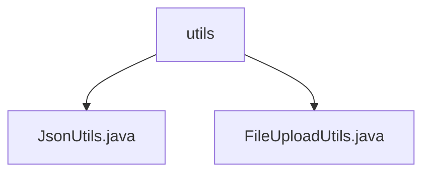

# Basic Information

|      |      |
|------|------|
| Name | utils |
| Language | .java |
| Code Path | weixin-java-miniapp-demo/src/main/java/com/github/binarywang/demo/wx/miniapp/utils |
| Package Name | docs.src.main.java.com.github.binarywang.demo.wx.miniapp.utils |
| Brief Description | The JsonUtils tool class provides a static toJson method to convert Java objects into formatted JSON strings, ignoring null values. The FileUploadUtils tool class handles file uploads, supports size and extension validation, generates new file names, and also includes methods for MinIO bucket management. |

# Description

## Overview
This is a Java module primarily composed of utility classes, with the core responsibility of providing basic services for data formatting and file storage to upper-layer applications. The module's interface specification mainly revolves around static method calls. For instance, JsonUtils provides object conversion via `toJson`, while FileUploadUtils offers file upload methods such as `upload`, which includes validation.

Key data structures include the internally configured ObjectMapper instance within JsonUtils and constraint constants defined in FileUploadUtils, such as file size and filename length. External dependencies include the Jackson library for JSON processing and the MinIO client for object storage interactions.

Specific implementation examples include JsonUtils configuring ObjectMapper to ignore null values and beautify output, and FileUploadUtils validating file extensions and generating new filenames with date-based paths before upload.

## Primary Business Scenarios
The module supports two main types of business processes: first, serializing Java objects into formatted JSON strings for data exchange or log output; second, handling file uploads, including local path saving and MinIO object storage integration, with a complete flow encompassing validation, renaming, and storage operations.

The interaction mode is uniformly static method calls on utility classes. Functional completeness is demonstrated by JsonUtils having exception handling, while FileUploadUtils integrates both local and cloud storage paths. A typical application pattern is calling the corresponding utility for processing after the backend of a web application receives data or files.

The integrated API types are mainly utility class methods. Integration examples include creating storage buckets and setting access policies via the MinIO SDK, analogous to configuring management rules for a file repository.

### Package Internal Structure View

This flowchart illustrates the structural relationship of the project utility class directory. The `utils` folder serves as the root node and directly contains two utility class files: `JsonUtils.java` and `FileUploadUtils.java`. These two files are at the same level, both located under the `utils` directory. Together, they provide JSON processing and file upload functional support for the project, representing a typical utility class module organization.

# File List

| Name   | Type  | Description |
|-------|------|-------------|
| [JsonUtils.java](JsonUtils.md) | file | The JsonUtils class provides static JSON serialization methods. It uses a Jackson ObjectMapper configured to ignore null values and format the output. The toJson method converts an object into a JSON string; on error, it prints the error and returns null. |
| [FileUploadUtils.java](FileUploadUtils.md) | file | The FileUploadUtils class provides file upload functionality, featuring default configurations such as a 50MB file size limit and a 100-character filename length limit. It supports uploading to specified directories and validating file types, throwing exceptions if limits are exceeded. It also includes MinIO bucket management capabilities, allowing for checking, creating, and configuring bucket policies. |

