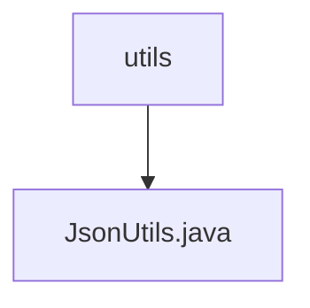

# Basic Information

|      |      |
|------|------|
| Name | utils |
| Language | .java |
| Code Path | weixin-java-miniapp-demo/src/main/java/com/github/binarywang/demo/wx/miniapp/utils |
| Package Name | docs.src.main.java.com.github.binarywang.demo.wx.miniapp.utils |
| Brief Description | The JsonUtils class provides a static method `toJson`, which uses ObjectMapper to convert an object into a JSON string, automatically ignoring null values and formatting the output. Returns null if an exception occurs. |

# Description

This is a utility class named JsonUtils, primarily used for handling JSON data conversion. The class contains a static ObjectMapper instance named JSON, which is configured in the static initialization block to ignore null values during serialization and enable indented formatting for output. It provides a toJson method to convert any object into a JSON string, printing the exception and returning null if the conversion fails. The entire class encapsulates basic JSON serialization functionality, making it convenient for other code to call.

### Package Internal Structure View

This flowchart illustrates the structural relationship within the utils directory of the WeChat Mini Program demo project. The top-level node is the utils folder, which contains only one utility class file, JsonUtils.java. This is a typical utility directory structure where JsonUtils.java serves as the sole utility class file, dedicated to handling JSON-related utility methods. The entire structure is concise and clear, adhering to the design norms of utility directories.

# File List

| Name   | Type  | Description |
|-------|------|-------------|
| [JsonUtils.java](JsonUtils.md) | file | The JsonUtils class provides a static method `toJson`, which uses ObjectMapper to convert an object into a JSON string, automatically ignoring null values and formatting the output. Returns null in case of an exception. |

