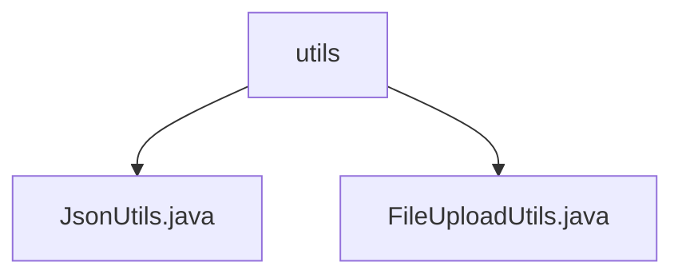

# Basic Information

|      |      |
|------|------|
| Name | utils |
| Language | .java |
| Code Path | weixin-java-miniapp-demo/src/main/java/com/github/binarywang/demo/wx/miniapp/utils |
| Package Name | docs.src.main.java.com.github.binarywang.demo.wx.miniapp.utils |
| Brief Description | The JsonUtils utility class handles JSON data conversion, configured to ignore null values and format output, providing a toJson method. The FileUploadUtils utility class manages file uploads, with default limits of 50MB file size and 100-character filenames, supporting MinIO bucket management and policy configuration. |

# Description

## Overview  
This module provides two core functionalities: JSON data processing and file upload management. JsonUtils encapsulates Jackson-based JSON serialization capabilities, supporting null value ignoring and formatted output, such as converting objects into human-readable JSON strings. FileUploadUtils implements end-to-end file upload management, similar to a cloud storage upload middleware, including features like size validation and MinIO bucket policy configuration, for example, limiting file size to 50MB.  

Key data structures include ObjectMapper (JSON serialization configuration) and MinIO bucket policies (read-write permission control). External dependencies are the Jackson library and MinIO storage service.  

## Primary Business Scenarios  
Typical applications include data interaction scenarios in WeChat Mini Program backend services. JSON serialization is used for API response encapsulation, such as converting Java objects into the JSON format required by the frontend. The file upload process involves validation-transcoding-storage, for example, triggering size validation and MinIO storage when a user uploads a profile picture. Integration examples demonstrate simplified calls via static utility methods, such as JsonUtils.toJson() for one-click object serialization.

### Package Internal Structure View

This flowchart illustrates the file structure within the utils directory of the WeChat Mini Program demo project. The top-level node represents the utils folder, which contains two utility class files: JsonUtils.java for JSON data processing and FileUploadUtils.java for handling file upload functionality. This concise hierarchical relationship exemplifies the typical organization of utility class modules, enabling developers to quickly locate commonly used utility methods.

# File List

| Name   | Type  | Description |
|-------|------|-------------|
| [JsonUtils.java](JsonUtils.md) | file | The JsonUtils class provides a static method `toJson`, which uses ObjectMapper to convert an object into a JSON string, automatically ignoring null values and formatting the output. Returns null if an exception occurs. |
| [FileUploadUtils.java](FileUploadUtils.md) | file | The FileUploadUtils class provides file upload functionality, supporting size and type validation. By default, it limits files to 50MB and filenames to 100 characters in length. It also includes MinIO bucket management methods such as creating buckets, checking existence, and setting policies. |

