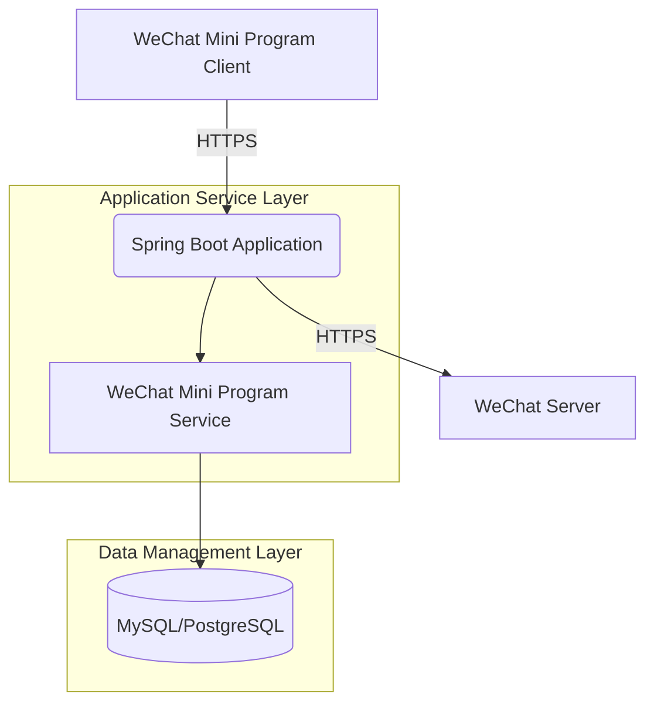

## System Architecture

## System Overview

This section outlines the core functionalities, business domains, and architectural patterns of the WeChat Mini Program Java backend project.

* **Core Functionalities and Business Domains:** This project serves as the backend service for a WeChat Mini Program, with core functionalities including processing API requests from the mini program, configuring message servers, and integrating with the WeChat ecosystem. The business domain primarily revolves around the development and support of WeChat Mini Programs, encompassing user authentication, message handling, and proxy functionalities for WeChat APIs.
* **Architectural Pattern:** The project adopts a **monolithic application** architectural pattern.
* **Supporting Evidence for Architectural Pattern:**
    * The `Dockerfile` indicates only one executable JAR file, suggesting all functionalities are packaged within a single application.
    * The project root directory lacks independent service directories such as `services/` or `features/`.
    * Deployment configurations (e.g., `.travis.yml`) involve only a single build and packaging command, with no signs of multi-service builds.
    * The `application.yml.template` file centralizes configurations, with no independent configurations for separate services.

## Core Components and Functional Diagram

This section details the system's main components and their responsibilities, supplemented with industry best practices.

* **Traffic Entry Layer:**
    * **Components and Responsibilities:** Likely uses the embedded Tomcat server in Spring Boot as the HTTP traffic entry point to handle all API requests from the WeChat Mini Program. Nginx may be deployed as a reverse proxy and load balancer at the front end.
    * **Implementation Considerations:** In a monolithic architecture, the traffic entry typically points directly to the application server, eliminating the need for complex API gateways.
* **Application Service Layer:**
    * **Service Inventory and Core Functionalities:**
        * **WeChat Mini Program Service:** Core responsibilities include processing API requests from the mini program, configuring message servers, and integrating with the WeChat ecosystem.
            * **Primary Responsibilities:** Handles user authentication, message推送, and proxying WeChat APIs.
            * **Technical Foundation:** Java/Spring Boot, leveraging the `wx-java-miniapp` SDK for encapsulating and invoking WeChat APIs.
            * **Internal Structure Insights:** Likely includes modules such as `controller` (API entry), `service` (business logic), and `config` (WeChat configurations).
    * **Asynchronous Tasks and Background Processing:** No explicit asynchronous task handling is shown, but WeChat message推送 may involve asynchronous processing needs. Future implementations could introduce message queues (e.g., RabbitMQ) for decoupling.
* **Data Management Layer:**
    * **Data Storage Components and Responsibilities:** No explicit database configuration is shown, but WeChat Mini Program backends typically require storage for user sessions and configurations, possibly using MySQL or PostgreSQL as the primary database.
    * **Data Responsibilities and Selection Considerations:** WeChat Mini Program backends often need persistent storage for user data and configurations, making relational databases suitable for such structured data storage.

## Container Configuration Overview

This section lists key configuration information for containerized services identified through analysis of `Dockerfile` and `.travis.yml`.

| Service Name | Container Image | Exposed Ports | Volumes | Key Environment Variables | Startup Command/Entrypoint |
| :----------- | :-------------- | :------------ | :------ | :------------------------ | :-------------------------- |
| `weixin-java-miniapp` | `openjdk:8-jdk-alpine` (built from `Dockerfile`) | Not explicitly specified (typically `8080`) | `/tmp` | `wx.miniapp.configs` related configurations | `java -jar /app.jar` |

## Service Collaboration and Data Flow

This section depicts the data flow paths and interaction patterns between internal components and external users.

* **Core Communication Paths:** The WeChat Mini Program client directly accesses the backend service via HTTPS requests, while the backend interacts with WeChat servers (e.g., fetching user information, sending template messages).
* **Interaction Patterns and Protocols:** Primarily uses RESTful HTTP APIs for synchronous communication, with WeChat message server configurations potentially involving XML or JSON data exchange.
* **Sharing and Isolation:** In a monolithic architecture, all functionalities share the same database and configurations, eliminating the need for inter-service isolation.

## Overall Architecture Diagram (Mermaid Syntax)



## Architect's Key Insights and Future Outlook

This section provides an in-depth analysis of the architecture's critical considerations and prospects for future evolution.

* **Elasticity and Scalability Strategies:** The current monolithic architecture can handle load increases through vertical scaling (adding instance resources). For future horizontal scaling, consider stateless design and load balancing.
* **High Availability and Resilience Design:** Deploy multiple instances with health checks and automatic recovery mechanisms to ensure high availability.
* **Security Defense System:** Ensure HTTPS encrypted communication, secure storage of WeChat configurations (e.g., using Vault or KMS), and strict API authentication and authorization.
* **Operational Observability and Automation:** Integrate Prometheus and Grafana for metrics monitoring, use the ELK stack for log aggregation, and refine CI/CD processes.
* **Performance Optimization Potential:** Introduce Redis to cache frequently accessed WeChat API tokens and data, and optimize database query performance.
* **Technology Stack Rationale Assessment:** Java/Spring Boot is suitable for enterprise-level application development, and the `wx-java-miniapp` SDK simplifies WeChat API integration, making the technology stack choice reasonable.
* **Future Evolution Path and Technology Introduction:** As business complexity grows, consider transitioning to a microservices architecture, introducing message queues for asynchronous tasks, and exploring serverless architectures to reduce costs.

You are a professional translation assistant. Please accurately translate the following content into the target language.  
Strictly adhere to the following guidelines:  
1. Maintain consistency with the original text in terms of semantics, context, and style.  
2. Preserve the original hierarchical structure and numbering system in full.  
3. Strictly retain all formatting elements from the original text, such as code block identifiers (```text/```, ```mermaid/```), etc.  
4. Only translate natural language content; do not perform format adjustments, content additions, or explanatory processing.  
5. Output only the translated result of the original text, without any additional prompt information.  

Content to be translated:  

Target language code: en

