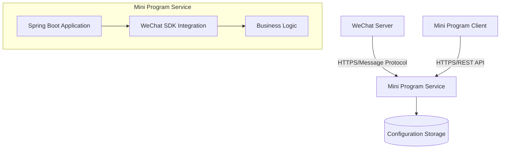

## System Architecture

## System Overview

This project is a WeChat Mini Program backend service based on Java and Spring Boot, focused on providing core API support for WeChat Mini Programs. The system adopts a monolithic architecture pattern, primarily handling identity authentication, message processing, and business logic integration within the WeChat ecosystem.

* **Core Functions & Business Domains:**
    - WeChat Mini Program identity authentication and session management
    - WeChat message server configuration and event handling
    - Mini Program business logic API services
    - Integration capabilities with the WeChat ecosystem

* **Architecture Pattern:**
    - **Monolithic application architecture**, built on the Spring Boot framework

* **Architecture Pattern Supporting Evidence:**
    - Single Dockerfile builds a single executable JAR file
    - Uses Spring Boot's embedded Tomcat server
    - Project structure follows traditional Maven monolithic project layout
    - Application configuration centralized in a single application.yml file
    - No microservice-specific service discovery or API gateway configurations

## Core Components & Functional Diagram

The system employs a layered architecture design, with core components built around WeChat Mini Program API services.

* **Traffic Entry Layer:**
    - **Embedded Tomcat Server**: Serves as the single entry point for HTTP requests, handling all API requests
    - **Responsibilities**: Routes requests to appropriate controllers, handles SSL termination (if configured)
    - **Implementation Considerations**: Directly exposes service ports or through external load balancers/API gateways

* **Application Service Layer:**
    - **WeChat Mini Program Service**:
        - **Primary Responsibilities**: Handles WeChat server verification, message encryption/decryption, API calls
        - **Technical Foundation**: Java 8 + Spring Boot + wx-java-miniapp SDK
        - **Internal Structure**:
            - Controller layer manages HTTP endpoints
            - Service layer implements business logic
            - WeChat SDK integration layer
    - **Configuration Service**:
        - **Primary Responsibilities**: Manages multiple mini program configurations (appid/secret, etc.)
        - **Technical Foundation**: Spring configuration property binding
    - **Logging & Monitoring Service**:
        - **Primary Responsibilities**: Records request logs and WeChat SDK debugging information

* **Data Management Layer:**
    - **Potential In-Memory Database Usage**: May use H2 or similar embedded databases based on Spring Boot convenience
    - **Configuration Storage**: Mini program configurations managed via YAML files
    - **Cache Layer**: May implement access token caching using Spring Cache abstraction

## Container Configuration Overview

| Service Name | Container Image | Exposed Ports | Mounted Volumes | Key Environment Variables | Startup Command/Entry Point |
|-------------|----------------|--------------|----------------|--------------------------|-----------------------------|
| Mini Program Service | JAR built with openjdk:8-jdk-alpine | 8080 (default) | /tmp | Java security random number configuration | java -jar /app.jar |

## Service Collaboration & Data Flow

* **Core Communication Paths**:
    1. WeChat Server → Mini Program Service (HTTPS)
    2. Mini Program Client → Mini Program Service (HTTPS)
    3. Internal service components collaborate via Spring dependency injection

* **Interaction Patterns & Protocols**:
    - Pure synchronous HTTP RESTful interactions
    - WeChat Server uses specific message protocols
    - Internal components communicate via Java method calls

* **Sharing & Isolation**:
    - All components share the same JVM and process space
    - Configurations centrally managed via Spring environment abstraction

## Overall Architecture Diagram



## Architect's Key Insights & Future Outlook

* **Resilience & Scalability Strategies**:
    - Current monolithic architecture suits initial scale, can scale horizontally by adding instances
    - Stateless design supports simple load balancing

* **High Availability & Resilience Design**:
    - Requires external load balancer for multi-instance deployment
    - Recommends adding health check endpoints

* **Security Defense System**:
    - WeChat's built-in security mechanisms protect communications
    - Needs enhanced configuration management (e.g., secret storage)

* **Operational Observability**:
    - Currently has basic logging level configuration
    - Recommends adding metrics monitoring and centralized logging

* **Performance Optimization Potential**:
    - WeChat access token caching strategy optimization
    - Database access optimization (if added)

* **Technology Stack Rationality Assessment**:
    - Java 8 is outdated, recommends upgrading to LTS version
    - Spring Boot remains the preferred choice for Java microservices

* **Future Evolution Path**:
    - Multi-mini program management could be split into independent services
    - Consider adding message queues for asynchronous event processing
    - Gradual evolution toward microservices architecture

You are a professional translation assistant. Please accurately translate the following content into the target language.  
Please strictly adhere to the following guidelines:  
1. Maintain consistency with the original text's semantics, context, and style.  
2. Preserve the original hierarchical structure and numbering system in full.  
3. Strictly retain all formatting elements from the original text, such as code block identifiers (```text/```, ```mermaid/```), etc.  
4. Translate only the natural language content, without making any format adjustments, content additions, or explanatory processing.  
5. Output only the translation of the original text, without any additional prompt information.  

Content to be translated:  

Target language code: en

