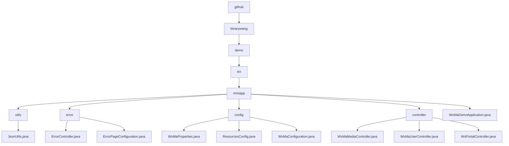

# 基础信息

|      |      |
|------|------|
| 名称 | github |
| 编码语言 | .java |
| 代码路径 | weixin-java-miniapp-demo/src/main/java/com/github |
| 包名 | docs.src.main.java.com.github |
| 概述说明 | JsonUtils工具类处理JSON转换，配置忽略null值并格式化输出。错误处理模块统一管理404/500错误跳转。微信小程序配置模块整合基础属性和消息处理。控制器模块处理媒体文件、用户会话和微信交互。应用入口类WxMaDemoApplication启动Spring Boot应用。 |

# 说明

## 概述  
该模块是微信小程序后端综合系统，核心职责包括JSON数据处理、错误统一处理、多账号配置管理和微信生态交互（如媒体/会话处理）。采用分层架构设计，类似微服务配置中心与网关模式的结合。接口规范涵盖RESTful端点（如/error/404）、微信标准API（如code2session）和文件传输协议。关键数据结构包含WxMaProperties.Config（凭证存储）、ErrorPageRegistry（错误映射）和微信标准参数（media_id等）。外部依赖Spring Boot框架、微信SDK、JSSDK及消息加解密库。例如JsonUtils实现对象序列化，ErrorController处理错误跳转。

## 主要业务场景  
模块支持小程序全生命周期管理：初始化阶段加载多账号配置（类似配置中心），运行时处理用户授权（OAuth2.0简化流程）、媒体资源托管（类似CDN）和异常拦截（统一错误页）。采用责任链模式处理微信消息（如文本/图片），类似事件总线的分发机制。典型场景包括服务器验证握手、临时素材管理及异步消息响应。例如门户控制器同时处理GET/POST请求，WxMaConfiguration动态路由消息类型。API集成案例覆盖从凭证校验到文件上传的微信标准场景。

### 包内部结构视图

该流程图展示了微信小程序Demo项目的目录结构，从根目录github开始，逐级展开到binarywang、demo、wx和miniapp层级。miniapp下包含utils工具类、error错误处理、config配置、controller控制器等子目录，以及WxMaDemoApplication.java主程序文件。每个子目录下又包含具体的实现类文件，如JsonUtils.java、ErrorController.java等，形成完整的项目结构树。

# 文件列表

| 名称   | 类型  | 说明 |
|-------|------|-------------|
| [binarywang](binarywang/_module.md) | package | JsonUtils工具类处理JSON转换，配置忽略null值并格式化输出。错误处理模块统一管理404/500错误跳转。微信小程序配置模块整合基础属性和消息处理。控制器模块处理媒体文件、用户会话和微信交互。应用入口类WxMaDemoApplication启动Spring Boot应用。 |

