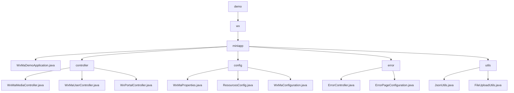

# 基础信息

|      |      |
|------|------|
| 名称 | demo |
| 编码语言 | .java |
| 代码路径 | weixin-java-miniapp-demo/src/main/java/com/github/binarywang/demo |
| 包名 | docs.src.main.java.com.github.binarywang.demo |
| 概述说明 | Spring Boot微信小程序Demo，包含启动类、控制器、配置、错误处理和工具模块。控制器处理微信交互，配置管理多账号，工具模块提供JSON和文件处理功能。 |

# 说明

## 概述  
该模块是微信小程序后端服务集合，整合了微信生态交互、配置管理、错误处理和工具类功能。采用Spring Boot框架，通过RESTful接口和文件传输实现微信服务器通信，类似网关模式处理验证、授权和媒体管理。关键数据结构包括微信标准参数（media_id/appid）、配置属性（WxMaProperties.Config）和MinIO存储策略。外部依赖微信JSSDK、Jackson库、MinIO服务和Spring MVC。例如媒体控制器处理多文件上传，JsonUtils实现对象序列化。

## 主要业务场景  
模块覆盖小程序全生命周期：服务器验证（类似握手协议）、用户登录（OAuth2.0简化流程）、媒体托管（类似CDN）和错误拦截。典型流程为接收参数→验证配置→执行业务→返回数据，例如用户控制器串联code2session与信息解密。功能完整性体现在多账号配置加载、错误页自动跳转（如404触发/error/404）和文件上传校验（限制50MB）。集成案例包括消息推送处理、临时素材管理和JSON数据交互。

### 包内部结构视图

该流程图展示了微信小程序Demo项目的目录结构，从根目录demo开始，逐级展开到wx和miniapp目录。miniapp目录下包含主应用文件WxMaDemoApplication.java和四个子目录：controller(包含三个控制器文件)、config(包含三个配置类文件)、error(包含两个错误处理文件)和utils(包含两个工具类文件)。完整呈现了项目的主要组件及其层级关系。

# 文件列表

| 名称   | 类型  | 说明 |
|-------|------|-------------|
| [wx](wx/_module.md) | package | Spring Boot微信小程序Demo，包含启动类、控制器、配置、错误处理和工具模块。控制器处理微信交互，配置管理多账号，工具模块提供JSON和文件处理功能。 |

