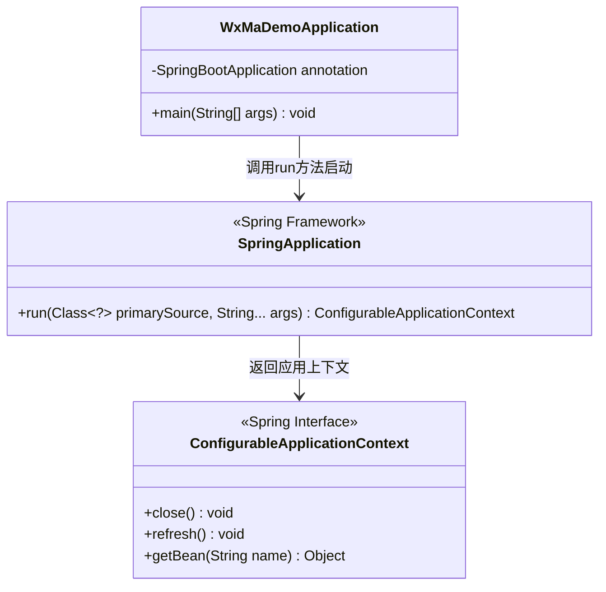
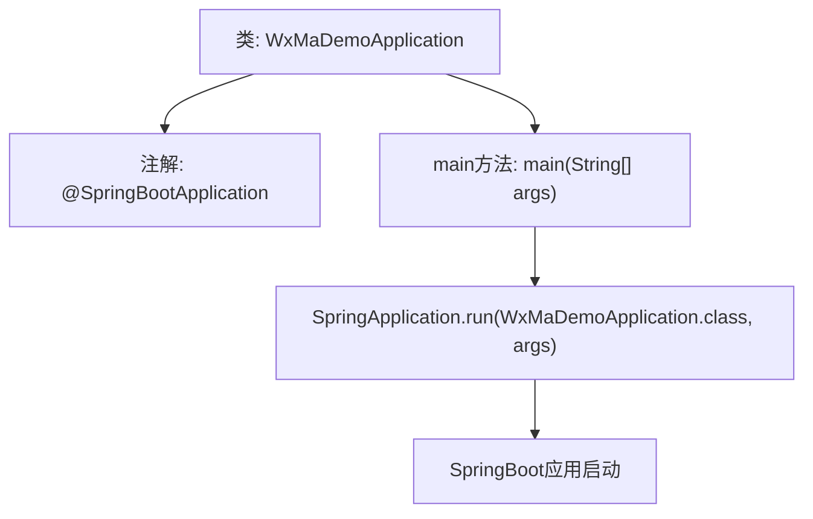

# 基础信息

|      |      |
|------|------|
| 名称 | WxMaDemoApplication |
| 编码语言 | .java |
| 代码路径 | weixin-java-miniapp-demo/src/main/java/com/github/binarywang/demo/wx/miniapp/WxMaDemoApplication.java |
| 包名 | com.github.binarywang.demo.wx.miniapp |
| 依赖项 | ['org.springframework.boot.SpringApplication', 'org.springframework.boot.autoconfigure.SpringBootApplication'] |
| 概述说明 | 这是一个Spring Boot应用程序的主类，使用@SpringBootApplication注解并定义了main方法作为入口点来启动应用。 |

# 说明

这是一个名为WxMaDemoApplication的Java应用主启动类。它使用了Spring Boot框架的@SpringBootApplication注解，该注解组合了配置、组件扫描和启用自动配置的功能。类中定义了一个标准的main方法作为应用入口点，该方法通过调用SpringApplication.run来启动整个Spring Boot应用程序，并传入当前类WxMaDemoApplication和main方法的参数args。这个简单的结构是启动一个基于Spring Boot的微信小程序相关演示项目的典型方式。

# 类列表 Class Summary

| 名称   | 类型  | 说明 |
|-------|------|-------------|
| WxMaDemoApplication | class | 这是一个Spring Boot应用的主入口类。它使用@SpringBootApplication注解标记为启动类。main方法通过SpringApplication.run启动应用程序。 |

## 类 WxMaDemoApplication

|      |      |
|------|------|
| 访问范围 | @SpringBootApplication;public |
| 类型 | class |
| 名称 | WxMaDemoApplication |
| 说明 | 这是一个Spring Boot应用的主入口类。它使用@SpringBootApplication注解标记为启动类。main方法通过SpringApplication.run启动应用程序。 |

### UML类图

这段代码是Spring Boot应用程序的启动类，使用@SpringBootApplication注解标记主类。它通过SpringApplication.run()方法启动应用程序，该方法会创建Spring应用上下文并初始化所有配置的Bean。这个启动过程包含了自动配置、组件扫描和嵌入式Web服务器启动等核心功能，是整个Spring Boot应用的入口点。

### 内部方法调用关系图

这是一个使用Spring Boot框架的微信小程序演示应用启动类。代码通过@SpringBootApplication注解标记主类，在main方法中调用SpringApplication.run()启动Spring Boot应用。该注解组合了@Configuration、@EnableAutoConfiguration和@ComponentScan，实现自动配置和组件扫描，启动过程会初始化Spring容器、加载配置并启动内嵌Web服务器。

### 字段列表 Field List

| 名称  | 类型  | 说明 |
|-------|-------|------|

### 方法列表

| 名称  | 类型  | 说明 |
|-------|-------|------|
| main | void | 该代码是Java程序的主入口方法，通过调用SpringApplication.run启动基于Spring框架的微信小程序示例应用。 |

