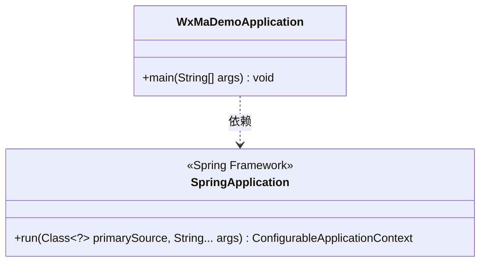
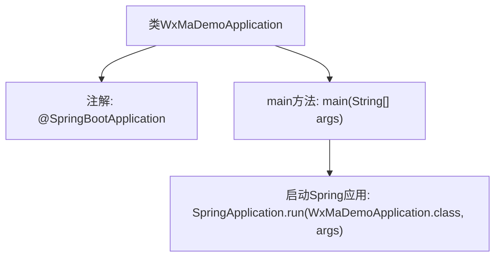

# 基础信息

|      |      |
|------|------|
| 名称 | WxMaDemoApplication |
| 编码语言 | .java |
| 代码路径 | weixin-java-miniapp-demo/src/main/java/com/github/binarywang/demo/wx/miniapp/WxMaDemoApplication.java |
| 包名 | com.github.binarywang.demo.wx.miniapp |
| 依赖项 | ['org.springframework.boot.SpringApplication', 'org.springframework.boot.autoconfigure.SpringBootApplication'] |
| 概述说明 | 这是一个Spring Boot应用的主类，使用@SpringBootApplication注解标记，通过main方法启动应用。 |

# 说明

这是一个基于Spring Boot框架的微信小程序Demo应用入口类。类名为WxMaDemoApplication，使用@SpringBootApplication注解标记，表明这是一个Spring Boot应用的主配置类。该类包含一个标准的main方法，通过调用SpringApplication.run来启动整个Spring Boot应用，传入的参数是当前类名和命令行参数。这个类作为应用的启动入口，负责初始化Spring容器并启动嵌入式服务器。

# 类列表 Class Summary

| 名称   | 类型  | 说明 |
|-------|------|-------------|
| WxMaDemoApplication | class | SpringBoot应用启动类，包含主方法运行Spring应用。 |

## 类 WxMaDemoApplication

|      |      |
|------|------|
| 访问范围 | @SpringBootApplication;public |
| 类型 | class |
| 名称 | WxMaDemoApplication |
| 说明 | SpringBoot应用启动类，包含主方法运行Spring应用。 |

### UML类图

这段类图展示了WxMaDemoApplication与SpringApplication的依赖关系。WxMaDemoApplication是一个Spring Boot应用启动类，通过main方法调用SpringApplication.run()来启动应用。SpringApplication是Spring框架的核心启动类，提供run方法用于引导和启动Spring应用上下文。图中清晰体现了Spring Boot应用的典型启动流程和核心组件依赖关系。

### 内部方法调用关系图

这段代码是一个标准的Spring Boot应用启动类，通过@SpringBootApplication注解标记主配置类，并在main方法中调用SpringApplication.run()启动嵌入式Web服务器和Spring应用上下文。流程图展示了类结构、注解与启动逻辑的调用关系，核心是Spring Boot的自动化配置和启动流程。

### 字段列表 Field List

| 名称  | 类型  | 说明 |
|-------|-------|------|

### 方法列表

| 名称  | 类型  | 说明 |
|-------|-------|------|
| main | void | Java主方法，启动Spring Boot应用WxMaDemoApplication。 |

