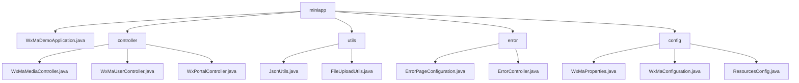

# 基础信息

|      |      |
|------|------|
| 名称 | miniapp |
| 编码语言 | .java |
| 代码路径 | weixin-java-miniapp-demo/src/main/java/com/github/binarywang/demo/wx/miniapp |
| 包名 | docs.src.main.java.com.github.binarywang.demo.wx.miniapp |
| 概述说明 | 这是一个基于Spring Boot的微信小程序后端演示项目。项目包含主启动类、控制器、工具类、错误处理和配置模块。控制器处理微信API请求，如用户登录和文件上传。工具类提供JSON处理和文件存储功能。错误处理模块定制HTTP错误页面。配置模块集中管理小程序设置和消息路由。整体架构清晰，覆盖小程序后端核心功能。 |

# 说明

## 概述
这是一个基于Spring Boot的微信小程序后端服务模块，核心职责是提供与微信官方服务交互的统一API代理，并封装关键业务逻辑如媒体文件管理、用户身份认证与消息事件处理。它充当业务应用与微信生态之间的桥梁。

模块遵循RESTful接口规范，提供一系列HTTP端点，设计模式上会在每个请求处理前根据`appid`动态加载对应配置。其关键数据结构包括封装小程序连接属性的配置对象、微信返回的`media_id`、包含`openid`的会话信息以及加密数据包，这些数据在控制器间流转。外部依赖主要包括Spring Boot Web框架、微信Java SDK（`weixin-java-miniapp`）以及Jackson和MinIO等库。

具体实现案例丰富，例如：通过`POST /media/upload`接口接收并上传文件至微信服务器；通过`GET /user/login`使用code换取用户会话；工具类`JsonUtils`配置`ObjectMapper`进行JSON序列化；`FileUploadUtils`上传文件前校验扩展名并重命名。

## 主要业务场景
模块业务覆盖文件资源管理、用户身份数据管理和服务器消息事件处理三大流程，形成了从接收请求到调用微信服务并返回响应的完整视图。其交互模式统一为“动态加载配置→调用微信API→处理返回数据→清理线程上下文”，类似一个配置感知的路由层。

功能完整性体现在提供了小程序开发所需的核心后端接口，包括临时素材上传、用户登录信息解密、服务器配置验证与消息分发。典型应用模式是：小程序前端完成用户登录后，可获取用户信息；管理后台可上传素材；微信服务器通过验证接口与后端进行事件通信。

API类型主要为HTTP接口和工具类静态方法，集成案例如：`WxMaMessageRouter`根据消息类型自动路由至处理器；错误处理模块将404/500错误映射到定制页面；配置模块集中管理多小程序属性并初始化核心服务Bean。

### 包内部结构视图

此流程图展示了一个微信小程序后端项目的核心Java源码结构。根节点`miniapp`代表主包，包含应用启动类、控制器、工具类、错误处理及配置四大子模块。控制器模块下有三个处理不同业务（媒体、用户、入口）的控制器；工具模块包含JSON处理和文件上传工具；错误处理模块有错误页面和错误控制器；配置模块则管理微信配置、主配置和资源配置。

# 文件列表

| 名称   | 类型  | 说明 |
|-------|------|-------------|
| [config](config/_module.md) | package | 微信小程序后端配置类：WxMaProperties存储小程序核心配置如appid和secret；WxMaConfiguration初始化多配置小程序服务及消息路由，处理日志记录及各类消息响应；ResourcesConfig映射本地资源访问路径并支持跨域。 |
| [error](error/_module.md) | package | 代码定义了两个Spring组件。ErrorPageConfiguration配置404和500错误指向自定义路径。ErrorController提供处理这些错误路径的端点并返回错误视图。实现自定义HTTP错误处理。 |
| [utils](utils/_module.md) | package | JsonUtils工具类提供静态toJson方法将Java对象转为格式化的JSON字符串，忽略空值。FileUploadUtils工具类处理文件上传，支持大小、扩展名校验并生成新文件名，还包含MinIO存储桶管理方法。 |
| [controller](controller/_module.md) | package | 微信小程序Spring Boot Demo包含三个控制器。WxMaMediaController处理媒体文件上传下载。WxMaUserController负责用户登录、获取信息和手机号。WxPortalController用于微信服务器验证和用户消息处理。每个控制器都会在校验配置后执行对应业务并清理线程数据。 |
| [WxMaDemoApplication.java](WxMaDemoApplication.md) | file | 这是一个Spring Boot应用程序的主类，使用@SpringBootApplication注解并定义了main方法作为入口点来启动应用。 |

