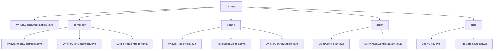

# 基础信息

|      |      |
|------|------|
| 名称 | miniapp |
| 编码语言 | .java |
| 代码路径 | weixin-java-miniapp-demo/src/main/java/com/github/binarywang/demo/wx/miniapp |
| 包名 | docs.src.main.java.com.github.binarywang.demo.wx.miniapp |
| 概述说明 | Spring Boot微信小程序Demo，包含启动类、控制器、配置、错误处理和工具模块。控制器处理微信交互，配置管理多账号，工具模块提供JSON和文件处理功能。 |

# 说明

## 概述  
该模块是微信小程序后端服务集合，整合了微信生态交互、配置管理、错误处理和工具类功能。采用Spring Boot框架，通过RESTful接口和文件传输实现微信服务器通信，类似网关模式处理验证、授权和媒体管理。关键数据结构包括微信标准参数（media_id/appid）、配置属性（WxMaProperties.Config）和MinIO存储策略。外部依赖微信JSSDK、Jackson库、MinIO服务和Spring MVC。例如媒体控制器处理多文件上传，JsonUtils实现对象序列化。

## 主要业务场景  
模块覆盖小程序全生命周期：服务器验证（类似握手协议）、用户登录（OAuth2.0简化流程）、媒体托管（类似CDN）和错误拦截。典型流程为接收参数→验证配置→执行业务→返回数据，例如用户控制器串联code2session与信息解密。功能完整性体现在多账号配置加载、错误页自动跳转（如404触发/error/404）和文件上传校验（限制50MB）。集成案例包括消息推送处理、临时素材管理和JSON数据交互。

### 包内部结构视图

该流程图展示了微信小程序Demo项目的目录结构，根节点为miniapp，包含主应用文件、控制器、配置、错误处理和工具类五个子模块。控制器模块包含三个微信相关控制器，配置模块有三个配置类文件，错误处理模块有两个错误相关类，工具模块包含JSON处理和文件上传工具类。整个结构清晰展现了典型Spring Boot项目的分层架构。

# 文件列表

| 名称   | 类型  | 说明 |
|-------|------|-------------|
| [WxMaDemoApplication.java](WxMaDemoApplication.md) | file | 这是一个Spring Boot应用的主类，使用@SpringBootApplication注解标记，通过main方法启动应用。 |
| [controller](controller/_module.md) | package | 微信小程序三个控制器类：媒体控制器处理文件上传下载；用户控制器管理登录、用户信息和手机号；后台控制器处理微信服务器认证和消息推送。均含配置清理功能。 |
| [config](config/_module.md) | package | 微信小程序Java配置类：WxMaProperties绑定小程序配置项；ResourcesConfig处理文件上传和跨域；WxMaConfiguration初始化服务并配置消息处理器。 |
| [error](error/_module.md) | package | ErrorController类处理/error路径下的404和500错误，返回统一错误页面。ErrorPageConfiguration类实现错误页面配置，将404和500状态码映射到对应路径。 |
| [utils](utils/_module.md) | package | JsonUtils工具类处理JSON数据转换，配置忽略null值并格式化输出，提供toJson方法。FileUploadUtils工具类管理文件上传，默认限制50M大小和100字符文件名，支持MinIO桶管理及策略设置。 |

