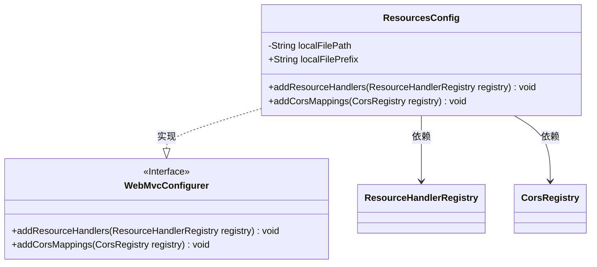
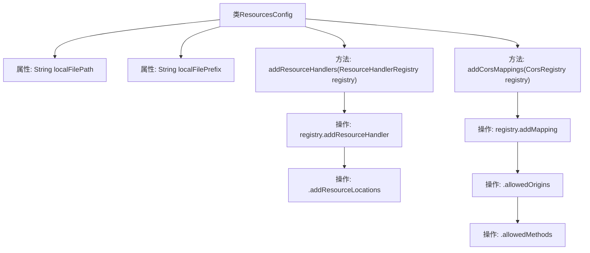

# 基础信息

|      |      |
|------|------|
| 名称 | ResourcesConfig |
| 编码语言 | .java |
| 代码路径 | weixin-java-miniapp-demo/src/main/java/com/github/binarywang/demo/wx/miniapp/config/ResourcesConfig.java |
| 包名 | com.leaniss.file.config |
| 依赖项 | ['java.io.File', 'org.springframework.beans.factory.annotation.Value', 'org.springframework.context.annotation.Configuration', 'org.springframework.web.servlet.config.annotation.CorsRegistry', 'org.springframework.web.servlet.config.annotation.ResourceHandlerRegistry', 'org.springframework.web.servlet.config.annotation.WebMvcConfigurer'] |
| 概述说明 | Java配置类实现本地文件路径映射与跨域支持，设置文件存储路径、前缀，并允许GET请求跨域访问。 |

# 说明

这是一个Spring Boot配置类，用于处理文件上传和跨域请求。类中定义了两个配置属性：文件存储根路径和资源映射路径前缀。通过重写addResourceHandlers方法，将本地文件路径映射为Web可访问的资源路径。同时重写addCorsMappings方法，为文件资源路径配置跨域访问权限，允许所有域名通过GET方法访问该路径下的资源。整个配置实现了文件上传存储和Web访问的基础功能。

# 类列表 Class Summary

| 名称   | 类型  | 说明 |
|-------|------|-------------|
| ResourcesConfig | class | Java配置类实现文件资源映射与跨域支持，设置本地存储路径和URL前缀，允许GET请求跨域访问。 |

## 类 ResourcesConfig

|      |      |
|------|------|
| 访问范围 | @Configuration;public |
| 类型 | class |
| 名称 | ResourcesConfig |
| 说明 | Java配置类实现文件资源映射与跨域支持，设置本地存储路径和URL前缀，允许GET请求跨域访问。 |

### UML类图

类图描述：
ResourcesConfig类是一个Spring配置类，实现了WebMvcConfigurer接口，主要用于配置资源处理和跨域请求。它包含两个主要方法：addResourceHandlers用于映射本地文件路径到URL前缀，addCorsMappings用于配置跨域访问规则。类中包含从配置文件注入的路径前缀(localFilePrefix)和本地文件路径(localFilePath)两个属性。

### 内部方法调用关系图

这段代码是一个Spring Boot配置类，主要实现两个功能：1) 配置本地文件上传路径和资源映射规则，通过`addResourceHandlers`方法将指定前缀的URL请求映射到本地文件系统路径；2) 配置跨域访问规则，通过`addCorsMappings`方法允许特定路由的GET请求跨域访问。流程图清晰展示了类结构、属性注入和方法调用关系，其中资源处理器和跨域配置形成独立分支，通过Spring的Registry机制实现功能配置。

### 字段列表 Field List

| 名称  | 类型  | 说明 |
|-------|-------|------|
| localFilePath | String | 代码片段定义了一个私有字符串变量localFilePath，其值通过@Value注解从配置属性file.path注入。 |
| localFilePrefix | String | 代码定义了一个字符串变量localFilePrefix，其值由配置文件中的file.prefix属性注入。 |

### 方法列表

| 名称  | 类型  | 说明 |
|-------|-------|------|
| addResourceHandlers | void | 该方法用于配置本地文件上传路径，将指定URL模式映射到本地文件系统路径。 |
| addCorsMappings | void | 该方法配置跨域请求，允许所有域名通过GET方法访问指定路由。 |

