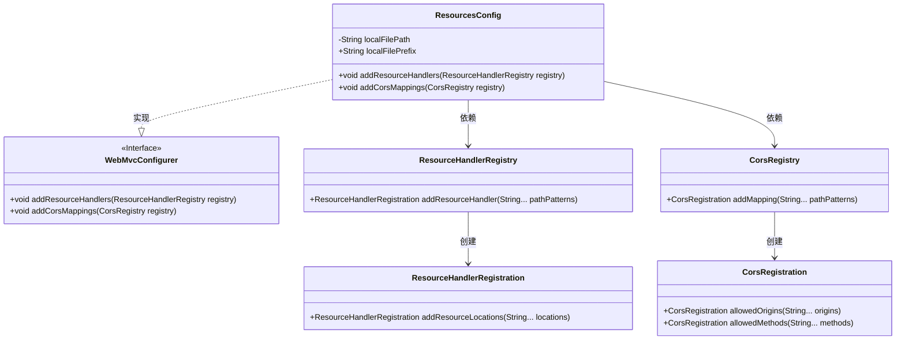
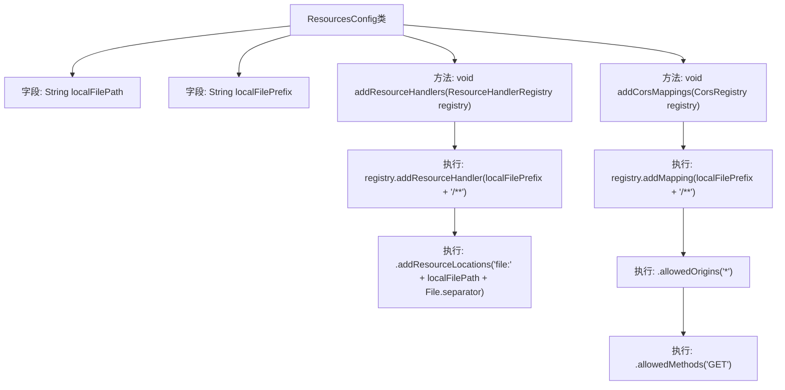

# 基础信息

|      |      |
|------|------|
| 名称 | ResourcesConfig |
| 编码语言 | .java |
| 代码路径 | weixin-java-miniapp-demo/src/main/java/com/github/binarywang/demo/wx/miniapp/config/ResourcesConfig.java |
| 包名 | com.leaniss.file.config |
| 依赖项 | ['java.io.File', 'org.springframework.beans.factory.annotation.Value', 'org.springframework.context.annotation.Configuration', 'org.springframework.web.servlet.config.annotation.CorsRegistry', 'org.springframework.web.servlet.config.annotation.ResourceHandlerRegistry', 'org.springframework.web.servlet.config.annotation.WebMvcConfigurer'] |
| 概述说明 | 配置文件类实现WebMvc配置，映射本地文件上传路径为静态资源，并开启跨域支持，允许所有域名通过GET方法访问该路径下的资源。 |

# 说明

ResourcesConfig类是一个Spring Boot配置类，实现了WebMvcConfigurer接口。它主要完成两项任务：一是配置本地文件上传资源的访问路径映射，通过读取配置文件中的路径前缀和本地存储根路径，将特定URL请求映射到服务器的本地文件系统目录；二是为上述资源路径配置跨域访问支持，允许所有来源的域名通过GET方法进行跨域访问，从而使得前端能够顺利获取服务器上的上传文件。

# 类列表 Class Summary

| 名称   | 类型  | 说明 |
|-------|------|-------------|
| ResourcesConfig | class | 这是一个Spring Boot配置类，实现了WebMvcConfigurer接口。它通过读取配置文件中的路径和前缀，将指定的本地目录映射为Web可访问的静态资源路径。同时，对该资源路径配置了允许所有来源域名进行GET请求的跨域访问规则。 |

## 类 ResourcesConfig

|      |      |
|------|------|
| 访问范围 | @Configuration;public |
| 类型 | class |
| 名称 | ResourcesConfig |
| 说明 | 这是一个Spring Boot配置类，实现了WebMvcConfigurer接口。它通过读取配置文件中的路径和前缀，将指定的本地目录映射为Web可访问的静态资源路径。同时，对该资源路径配置了允许所有来源域名进行GET请求的跨域访问规则。 |

### UML类图

**类图描述**：  
该代码定义了一个Spring Boot配置类`ResourcesConfig`，它实现了`WebMvcConfigurer`接口。类中包含两个从配置文件注入的属性：`localFilePath`（本地文件存储路径）和`localFilePrefix`（资源映射前缀）。通过重写`addResourceHandlers`方法，它将特定的URL路径映射到本地文件系统，实现静态资源的访问。同时，通过重写`addCorsMappings`方法，为这些资源路径配置了跨域访问策略，允许所有域名的GET请求。整个设计实现了资源路径的灵活配置与跨域支持。

### 内部方法调用关系图

这段代码是一个Spring Boot配置类，用于配置静态资源处理和跨域设置。它通过注入配置文件中的路径和前缀参数，将本地文件系统的指定目录映射为Web可访问的静态资源路径，同时对该路径开启GET请求的跨域访问权限。这样的配置常用于文件上传后的展示功能，确保前端能够正常加载和显示服务器上的文件资源。

### 字段列表 Field List

| 名称  | 类型  | 说明 |
|-------|-------|------|
| localFilePath | String | 代码注解 @Value 从配置文件读取 file.path 属性，并将其赋值给字符串变量 localFilePath。 |
| localFilePrefix | String | 代码片段使用@Value注解注入配置属性file.prefix，并将其值赋给字符串类型变量localFilePrefix。 |

### 方法列表

| 名称  | 类型  | 说明 |
|-------|-------|------|
| addResourceHandlers | void | 该方法配置了本地文件上传路径，通过资源处理器将特定URL前缀映射到服务器的本地文件目录，以便直接访问上传的文件。 |
| addCorsMappings | void | 此代码段为Spring Boot应用配置跨域资源访问，允许所有域名通过GET方法访问特定本地文件路径前缀下的资源。 |

